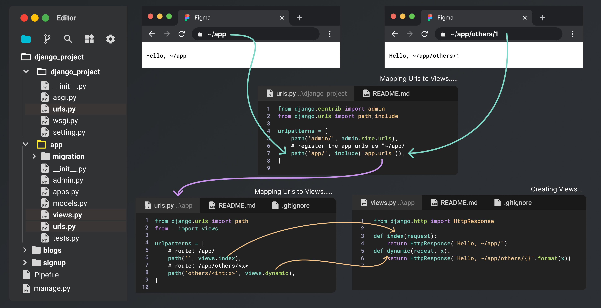

# Django

## Setup

```bash

### ~Desktop
mkdir <project_name>
cd <project_name>
### ~Desktop/<project_name>
pipenv install django
### activate venv
pipenv shell
### create django project
django-admin startproject <project_name>. # . means current directory
### start development server
python manage.py runserver
# Starting development server at http://127.0.0.1:8000/
### create App
python manage.py startapp <app_name>
```

## Django Project Structure

<div align="center">

</div>