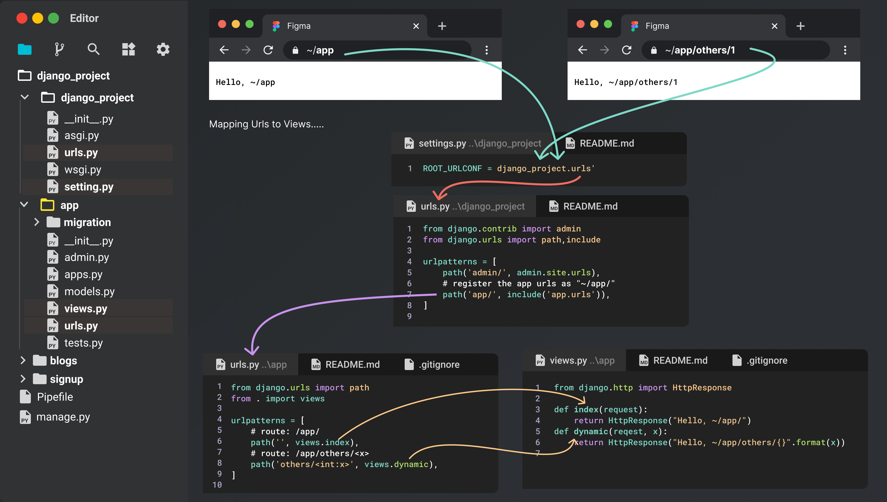
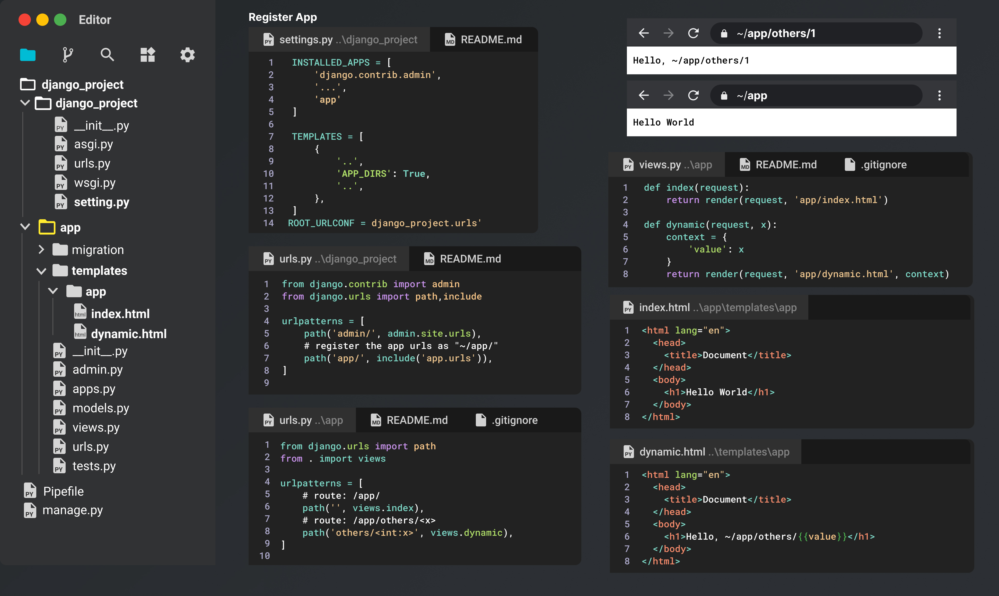
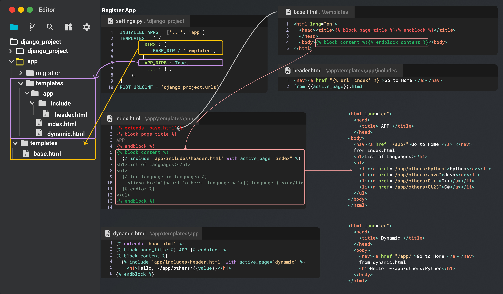

# Django Fundamentals

- [Django Fundamentals](#django-fundamentals)
	- [Setup](#setup)
	- [Django Project Structure: Urls and Views](#django-project-structure-urls-and-views)
	- [Template Basics](#template-basics)
		- [Templates: Inheritance](#templates-inheritance)
			- [extends – Django Template Tags](#extends--django-template-tags)
			- [Including templates using include tag](#including-templates-using-include-tag)

## Setup

```bash

### ~Desktop
mkdir <project_name>
cd <project_name>
### ~Desktop/<project_name>
pipenv install django
### activate venv
pipenv shell
### create django project
django-admin startproject <project_name>. # . means current directory
### start development server
python manage.py runserver
# Starting development server at http://127.0.0.1:8000/
### create App
python manage.py startapp <app_name>
```

## Django Project Structure: Urls and Views

<div align="center">

</div>

## Template Basics

A Django page template is a block of HTML that can contain any number of replacement tokens called "variables" that are delineated by `{{ and }}`, as in `{{ content }}`. Django's templating module then replaces variables with dynamic content that you provide in code.

The following steps demonstrate the use of page templates:

1. Under the `DjangoProject` folder, which contains the Django project, open `settings.py` file and add the app name, `"app"`, to the `INSTALLED_APPS` list. Adding the app to the list tells the Django project that there's a folder of that name containing an app:

```python
INSTALLED_APPS = [
    `'app'`,
    # Other entries...
]
```

Also in `settings.py`, make sure the `TEMPLATES` object contains the following line (included by default), which instructs Django to look for templates in an installed app's `templates` folder:

```python
TEMPLATES = [
    {
   	'..':""
        'APP_DIRS': True,
    },
]
```

In the `app` folder, open the `templates/app/index.html` page template file ), to observe that it contains one variable, {{ content }}:


```html
<html>
<head><title></title></head>
<body>

{{ content }}

</body>
</html>
```

In the `app` folder, open `views.py` and replace the `index` function with the following code that uses the django.shortcuts.render helper function. The render helper provides a simplified interface for working with page templates. Be sure to keep all existing from statements.

```python
def index(request):
    return render(request, 'app/index.html',)
```

<div align="center">

</div>

### Templates: Inheritance

#### extends – Django Template Tags

extends tag is used for inheritance of templates in django. One needs to repeat the same code again and again. Using extends we can inherit templates as well as variables.

```python

```
Example: assume the following directory structure:

```bash
dir1/
    template.html
    base2.html
    my/
        base3.html
base1.html
```

In `template.html`, the following paths would be valid:

```python



```

#### Including templates using include tag

The `include` tag allows us to include the contents of a template inside another template. Here is the syntax of the include tag:

```python

```

Create a new file named `nav.html` for the blog app in the directory `blog/templates/blog` and add the following code to it:

`TGDB/django_project/blog/templates/blog/nav.html`

```html
<nav>
    <a href="#">Home</a>
    <a href="#">blog</a>
    <a href="#">Contact</a>
    <a href="#">Career</a>
</nav>
```

Say you want to include the contents of `nav.html` in the `datetime.html` file. To do this, add `` tag to the `datetime.html` as follows:

`TGDB/django_project/blog/templates/blog/datetime.html`

```html
<!DOCTYPE html>
<html lang="en">
<head>
    <meta charset="UTF-8">
    <title>Title</title>
</head>
<body>
    

    Current date and time is {{ now }}</p>

</body>
</html>
```

<div align="center">

</div>
