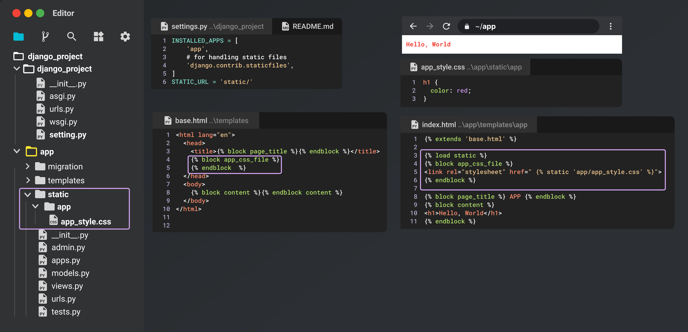
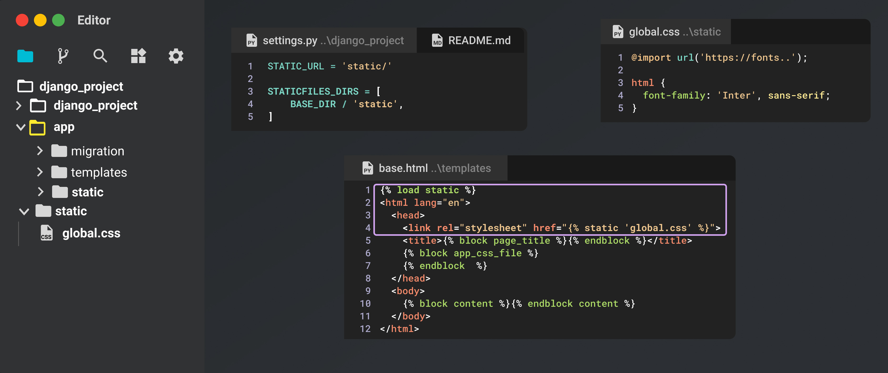

# Django Fundamentals

- [Django Fundamentals](#django-fundamentals)
  - [Setup](#setup)
  - [Django Project Structure: Urls and Views](#django-project-structure-urls-and-views)
  - [Template Basics](#template-basics)
    - [Templates: Inheritance](#templates-inheritance)
      - [extends – Django Template Tags](#extends--django-template-tags)
      - [Including templates using include tag](#including-templates-using-include-tag)
  - [Adding Statics Files](#adding-statics-files)
    - [Adding App Level Statics Files](#adding-app-level-statics-files)
    - [Adding Global Statics Files](#adding-global-statics-files)
    - [Configuring Tailwind CSS](#configuring-tailwind-css)

## Setup

```bash

### ~Desktop
mkdir <project_name>
cd <project_name>
### ~Desktop/<project_name>
pipenv install django
### activate venv
pipenv shell
### create django project
django-admin startproject <project_name>. # . means current directory
### start development server
python manage.py runserver
# Starting development server at http://127.0.0.1:8000/
### create App
python manage.py startapp <app_name>
```

## Django Project Structure: Urls and Views

<div align="center">

</div>

## Template Basics

A Django page template is a block of HTML that can contain any number of replacement tokens called "variables" that are delineated by `{{ and }}`, as in `{{ content }}`. Django's templating module then replaces variables with dynamic content that you provide in code.

The following steps demonstrate the use of page templates:

1. Under the `DjangoProject` folder, which contains the Django project, open `settings.py` file and add the app name, `"app"`, to the `INSTALLED_APPS` list. Adding the app to the list tells the Django project that there's a folder of that name containing an app:

```python
INSTALLED_APPS = [
    `'app'`,
    # Other entries...
]
```

Also in `settings.py`, make sure the `TEMPLATES` object contains the following line (included by default), which instructs Django to look for templates in an installed app's `templates` folder:

```python
TEMPLATES = [
    {
    '..':""
        'APP_DIRS': True,
    },
]
```

In the `app` folder, open the `templates/app/index.html` page template file ), to observe that it contains one variable, {{ content }}:

```html
<html>
<head><title></title></head>
<body>

{{ content }}

</body>
</html>
```

In the `app` folder, open `views.py` and replace the `index` function with the following code that uses the django.shortcuts.render helper function. The render helper provides a simplified interface for working with page templates. Be sure to keep all existing from statements.

```python
def index(request):
    return render(request, 'app/index.html',)
```

<div align="center">

</div>

### Templates: Inheritance

Instead of rewriting the same code in every html file, Django allows us to create a base template which they will both inherit from. This prevents us from having to write a lot of repeated code in our templates when we need to modify anything that is shared.

#### extends – Django Template Tags

extends tag is used for inheritance of templates in django. One needs to repeat the same code again and again. Using extends we can inherit templates as well as variables.

```python

```

Example: assume the following directory structure:

```bash
dir1/
    template.html
    base2.html
    my/
        base3.html
base1.html
```

In `template.html`, the following paths would be valid:

```python



```

#### Including templates using include tag

The `include` tag allows us to include the contents of a template inside another template. Here is the syntax of the include tag:

```python

```

Create a new file named `nav.html` for the blog app in the directory `blog/templates/blog` and add the following code to it:

`TGDB/django_project/blog/templates/blog/nav.html`

```html
<nav>
    <a href="#">Home</a>
    <a href="#">blog</a>
    <a href="#">Contact</a>
    <a href="#">Career</a>
</nav>
```

Say you want to include the contents of `nav.html` in the `datetime.html` file. To do this, add `` tag to the `datetime.html` as follows:

`TGDB/django_project/blog/templates/blog/datetime.html`

```html
<!DOCTYPE html>
<html lang="en">
<head>
    <meta charset="UTF-8">
    <title>Title</title>
</head>
<body>
    

    Current date and time is {{ now }}</p>

</body>
</html>
```

<div align="center">

</div>

## Adding Statics Files

Static files include stuff like CSS, JavaScript and images that you may want to serve alongside your site. Django is very opinionated about how you should include your static files. Open the `settings.py` file inside the inner django folder. At the very bottom of the file you should see these lines:

```bash
# Static files (CSS, JavaScript, Images)
# https://docs.djangoproject.com/en/4.0/howto/static-files/

STATIC_URL = 'static/'
```

This line tells Django to append static to the base url (in our case localhost:8000) when searching for static files. In Django, you could have a static folder almost anywhere you want. You can even have more than one static folder e.g. one in each app or as Global Static folder in the root of our project folder..

### Adding App Level Statics Files

<div align="center">

</div>

### Adding Global Statics Files

Your project will probably also have static assets that aren’t tied to a particular app. In addition to using a `static/` directory inside your apps, you can define a list of directories (`STATICFILES_DIRS`) in your settings file where Django will also look for static files. For example:

```python
STATICFILES_DIRS = [
    BASE_DIR / "static",
]
```

<div align="center">

</div>

We can also add static file to folder `css` by creating a folder named `css` in the `static` folder: `static/css/global.css`

- It does not require any change in the `STATICFILES_DIRS` variable.

```python
STATICFILES_DIRS = [
    BASE_DIR / 'static',
]
```

- But we need to change import path in the `template/base.html` file to ``

```html

<html lang="en">
 <head>
  <link rel="stylesheet" href="">
 </head>
 <body>
  
 </body>
</html>
```

### Configuring Tailwind CSS

Install Tailwind CSS:

```bash
npm init -y
npm install -D tailwindcss postcss autoprefixer
npx tailwindcss init -p
```

Add following line to `tailwind.config.js` file:

```javascript
module.exports = {
 content: ['templates/**/*.html', './**/templates/**/*.html'],
 darkMode: 'class', // or 'media' or 'class'
 theme: {
  extend: {}
 },
 variants: {
  extend: {}
 },
 plugins: []
};
```

Create  a input file `static/css/tailwind.css` and add the following code:

```css
@tailwind base;
@tailwind components;
@tailwind utilities;
```

Also, create `static/css/global.css` for outputting global styles.

Now, load in `template/base.html`

```html

<!DOCTYPE html>
<html lang="en">
 <head>
  <link rel="stylesheet" href="">
 </head>
 <body>
  
 </body>
</html>
```

```json
 "scripts": {
  "theme:dev": "npx tailwindcss -i ./static/css/tailwind.css -o ./static/css/global.css --minify -w",
  "theme:build": "NODE_ENV=production npx tailwindcss -i ./static/css/tailwind.css -o ./static/css/global.css --minify"
 },
```
