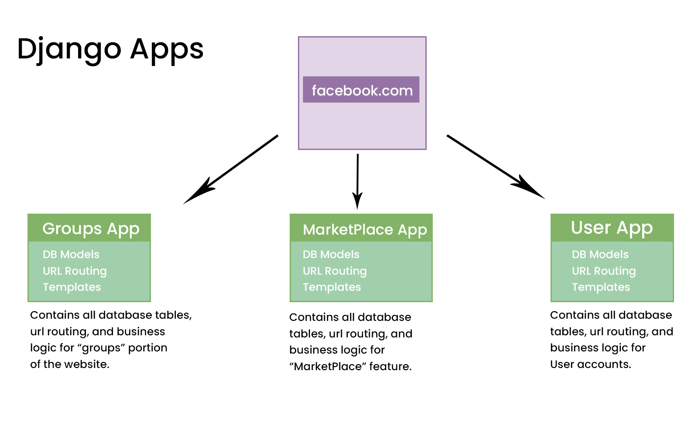
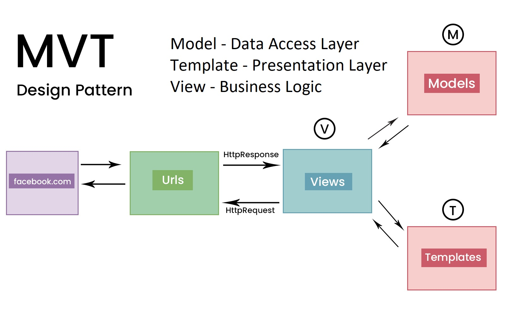

# Django Introduction

- [Django Introduction](#django-introduction)
  - [Django App](#django-app)
    - [URLs, Views, Models, Templates](#urls-views-models-templates)
    - [Minimal Workflow](#minimal-workflow)
  - [URLs \& Views](#urls--views)
    - [Dynamic Path Segments and Path Converter](#dynamic-path-segments-and-path-converter)
    - [Redirect using The Reverse Function \& Named URLs](#redirect-using-the-reverse-function--named-urls)
  - [Templates](#templates)
    - [Placing and rendering templates](#placing-and-rendering-templates)
    - [Django’s template language](#djangos-template-language)
      - [Template variables](#template-variables)
      - [Template tags](#template-tags)
        - [`forloop` object](#forloop-object)
        - [Lorem tag](#lorem-tag)
      - [Comments](#comments)
      - [Filters](#filters)
      - [example](#example)
    - [Template inheritance](#template-inheritance)
    - [URL Tag : Referencing URLs](#url-tag--referencing-urls)
      - [Passing parameters to URL tag](#passing-parameters-to-url-tag)
    - [Including Partial Template Snippets](#including-partial-template-snippets)

## Django App

Django uses the concept of **projects** and **apps** to keep code clean and readable. A single Django project contains one or more apps within it that all work together to power a web application.

For example, Facebook might have one app for user authentication, another app for groups, and a third app for marketplace: each focuses on an isolated piece of functionality. That’s three distinct apps
that all live within one top-level project.

<p align="center">

</p>

### URLs, Views, Models, Templates

A common design pattern in application design is the **Model View Controller (MVC)**, where the **model** of an application (its data) is displayed in one or more **views**, and a **controller** marshals interaction between the **model** and **view**. Django follows a different, yet similar, paradigm called the **Model-View-Template (MVT)**. Like MVC, **MVT** also uses **models** for storing data. *However, with **MVT**, a **view** will query a **model** and then render it with a **template**.*

In Django, at least three (often four) separate files are required to power one single page. Within an app these are the `urls.py` file, the `views.py` file, the `models.py` file, and finally an HTML template such as `index.html`.

When you type in a `URL`, such as <https://yourwebapp.com>, the first thing that happens within our Django project is a `URLpattern` is found that matches the homepage. The `URLpattern` specifies a `view` which then determines the content for the page (usually from a database `model`) and then ultimately a `template` for styling and basic logic. The end
result is sent back to the user as an HTTP response. The complete flow looks something like this:

Django request/response cycle: **URL -> View -> Model (typically) -> Template**

<p align="center">

</p>

### Minimal Workflow

1. Create new app: `python manage.py startapp app1`
2. Register app in `settings.py` file

`core\settings.py`:

```python
INSTALLED_APPS = [
    #...,
    "app1"
]
```

3. Create `views.py` file in app folder

`app1\views.py`:

```python
from django.http import HttpResponse

def index(request):
    return HttpResponse('Hello, World!')
```

4. Create `urls.py` file in app folder

`app1\urls.py`:

```python
from django.urls import path
from . import views

urlpatterns = [
    path('', views.index, name='index'),
]
```

5. Register app's `urls.py` file in project's `urls.py` file

`core\urls.py`:

```python
from django.contrib import admin
from django.urls import path, include

urlpatterns = [
 path('admin/', admin.site.urls),
 path('', include('app1.urls')),
]
```

## URLs & Views

The url defined in apps `urls.py` file is concatenated to the project's `urls.py`. For example, if we define `route1/` in `core/urls.py`

```python
urlpatterns = [
    path("admin/", admin.site.urls),
    path("route1/", include('app1.urls')),
]
```

then in `app1/urls.py` we define `route2`:

```python
urlpatterns = [
    path('route2', view.index),
]
```

The final url will be `route1/route2`.

### Dynamic Path Segments and Path Converter

1. Defining dynamic path segments with or without path converter:

```py
from django.urls import path
from . import views

urlpatterns = [
    path('id/<int:no>', views.dynamic_int), #i.e. id/1, id/2, ...
    path('name/<str:name>', views.dynamic_str), #i.e. name/John, name/Mary, ...
    path('any/<any1>/x/<any2>', views.dynamic_any), #i.e. any/1/x/2, any/John/x/Mary, any/1/x/Mary, ...
]
```

2. Capturing dynamic path segments in views:

```py
from django.http import HttpResponse, JsonResponse

def dynamic_int(request, no):
    return HttpResponse(no)

def dynamic_str(request, name):
    return HttpResponse(name)

def dynamic_any(request, any1, any2):
    return JsonResponse({
        "any1": any1,
        "any2": any2
    })

```

### Redirect using The Reverse Function & Named URLs

Using explicit URLs in our code is not a good idea. If we change the URL in the `urls.py` file, we would also need to change it in the `views.py` file. Instead, we can use the `reverse` function to redirect to a URL by name.

1. Naming URLs:

```py
urlpatterns = [
    path('id/<int:no>', views.dynamic_int, name='by_id'),
    path('name/<str:name>', views.dynamic_str, name='by_name'),
]
```

2. Redirecting to named URLs using `reverse` function:

```py
students_data = {
    1: 'John',
    2: 'Alice',
    3: 'Bob',
}

def dynamic_int(request, no):
    name = students_data.get(no)
    if name:
        # Redirect to the dynamic_str view using the reverse function and named URL
        redirect_url = reverse('by_name', args=[name])
        return HttpResponseRedirect(redirect_url)
    else:
        return HttpResponse("No student found with this ID")

def dynamic_str(request, name):
    return HttpResponse(name)
```

Now if we visit `route1/id/1`, we will be redirected to `route1/name/John`

## Templates

Every web framework needs a convenient way to generate HTML files and in Django the approach is to use templates: individual HTML files that can be linked together and also include basic logic. The first consideration is where to place templates within the structure of a Django project.

### Placing and rendering templates

**There are two options**. By default, Django’s template loader will look **within each app** for related templates. However the structure is somewhat confusing: each app needs a new `templates` directory, **another directory with the same name as the app**, and **then the template file**.

Therefore in our pages app, Django would expect the following layout:
Layout

```text
├── app
| ├──templates
| | ├──app
| | | ├──index.html
```

`app1\templates\app1\index.html`

```html
<h1>Home</h1>
```

There is, however, another approach which is to instead create a single **project-level templates directory** and place all templates within there. By making a small tweak to our `settings.py` file we can tell Django the location of our new `templates` directory.

`core/setting.py`

```python
TEMPLATES = [
    {
        "DIRS": [BASE_DIR / "templates"],
    },
]
```

`templates\app1\index.html`

```html
<h1>Home</h1>
```

2. **Rendering templates:**

Once the templates are in place, we need to tell Django to render them.

`app1\views.py`

```py
from django.shortcuts import render
def index(request):
    return render(request, "app1/index.html")
```

### Django’s template language

Django templates not only return static HTML templates but can also add dynamic application data
while generating the templates. Along with data, we can also include some programmatic elements in
the templates. All of these put together form the basics of Django’s template language. The following
few sections look at some of the basic parts of the Django template language, such as

1. **Template Variable Interpolation** through matched **double braces**: {{ name }}
2. **Template tags** for script actions like **conditionals and loop** using **tags**: 
3. Comments: {# a comment #}
4. **Filters**: Output modification through filtering data: {{ name | upper }}

#### Template variables

A template variable is represented between two curly braces, as shown here: `{{ variable }}`

```html
<p>My name is {{ name }}</p>
```

#### Template tags

A `tag` is similar to a programmatic control flow, such as an if `condition` or a `for` loop. A `tag` is represented between **two curly braces and percentage signs**, as shown. Here is an example of a for
loop iterating over a list using template tags:

```html
<!-- for loop -->


<!-- if condition -->


```

##### `forloop` object

In addition to the loop variable that you define in ``, there is an implicit variable as well: forloop. This is an object that contains attributes with information about the state of the loop as it is being iterated. The `forloop.counter` attribute is a 1-based count of the loop iteration. The `forloop.counter0` attribute is a 0-based count of the loop iteration. The boolean values `forloop.first` and `forloop.last` indicate whether it is the first or last iteration of the loop, respectively:

```html
Students:

    
        <span>and</span>
    
    {{ forloop.counter0 }}. {{student.name}}
    
        .
    
        <span>, </span>
    

```

Here is a complete list of the attributes available in the internal `forloop` object:

- `forloop.counter`: the iteration count of the loop, starting at 1
- `forloop.counter0`: the iteration count of the loop, starting at 0
- `forloop.revcounter`: the number of iterations remaining in the loop,
with the last being 1
- `forloop.revcounter0`: the number of iterations remaining in the loop,
with the last being 0
- `forloop.first`: a boolean that is True for the first iteration
- `forloop.last`: a boolean that is True for the last iteration
- `forloop.parentloop`: in the case of nested loops, this is the forloop
value for the surrounding loop

##### Lorem tag

The lorem tag is a special tag that generates random text for testing purposes. It is used as follows:
``

- `count`: the number of paragraphs to be generated
- `method`: the method of generating the text. It can be `w` for words, `p` for HTML paragraphs, or `b` for HTML paragraphs with bold text
- `random`: a boolean value that indicates whether the text should be random or not

Example

```html

```

#### Comments

Comments in the Django template language can be written as shown here; anything in between
`` and `` will be commented out:

```html

<p>This text has been commented out</p>

```

#### Filters

Filters can be used to modify a variable to represent it in a different format. The syntax for a filter is
a variable separated from the filter name using a pipe (|) symbol:
{{ variable|filter }}

#### example

Passing data to template from view:

`app1\views.py`

```python
students_data = [
    {
        "id": 1,
        "name": "Jhon",
    },
    {
        "id": 2,
        "name": "Doe",
    },
]

def index(request):
    context = {
        "name": "dhaka university",
        "students": students_data,
        "isOpen": True,
    }

    return render(request, 'app1/index.html', context)
```

`templates\app1\index.html`

```html
<p>University: {{ name|title }}</p>


<p>Open</p>

<p>Closed</p>


<!-- student list -->

<ul>
 
 <li>{{ student.id }} - {{student.name}}</li>
 
</ul>
```

### Template inheritance

As we build the project, the number of templates will increase. It is highly probable that when we
design the application, some of the pages will look similar and have common HTML code for certain
features. Using template inheritance, other HTML files can inherit the common HTML code. This is
similar to class inheritance in Python, where the parent class has all the common code, and the child
class has those extras that are unique to the child’s requirements.
For example, let’s consider the following to be a parent template that is named `_base.html`:

`templates\_base_.html`

```html
<!doctype html>
<html lang="en">
 <head>
  <title>
  Default Title
  </title>
 </head>
 <body>
  
  
 </body>
</html>
```

To use your new `_base.html` you create a **child** page containing the `` tag. This tag takes a single argument: the name of the template it is extending. Inside the child file you override the blocks declared in the parent and insert the corresponding content.

The following is an example of a child template. This file declares two blocks: one to override the title, the other to override the content.

`templates\app1\index.html`

```html


    {{block.super}}: Child


    <main>
        <h1>Main child component</h1>
    </main>

```

Inside a block there is a handy context variable named `{{ block.super }}`. This variable contains the content of the parent block. This is useful if you want to add to the parent block rather than completely replacing it. For above example the title will be `Default Title: Child`.

In the preceding snippet, the  line extends the template from `base.html`, which is the parent template. After extending from the parent template, any HTML code in between the `block content` will be displayed along with the parent template.

So the full html will be:

```html
<!doctype html>
<html lang="en">
 <head>
  <title>
  Default Title: News
  </title>
 </head>
 <body>
    <main>
        <h1>Main child component</h1>
    </main>
 </body>
 </html>
 ```

### URL Tag : Referencing URLs

There are many situations where URLs appear inside of HTML. You may be linking to another page, referencing a CSS file, or showing an image. In most of these cases your URL will be pointing to another Django view, or an asset
under Django’s control. You can hard-code the URL in your HTML, but if you decide to refactor your URL mapping, you’ll end up with a lot of work, or worse, some broken links.

To help solve this problem, Django provides a way of naming URL mappings.Inside `urls.py` that map a URL to a view, we have an optional argument to `name` the path. You can reference a URL in your **code** using this `name` , [see Redirect using The Reverse Function \& Named URLs](#redirect-using-the-reverse-function--named-urls), or in a **template** through the `` tag.

For example:

`core\urls.py`

```python
urlpatterns = [
    path("route1/", include('app1.urls')),
]
```

`app1\urls.py`

```python
urlpatterns = [
    path('', views.index, name='index'),
]
```

Since, we have named the path `index` in `app1/urls.py`, instead of hard-coding the URL `route1/` in our template, we can reference it in our template using the `` tag:

`templates\app1\index.html`

```html
<a href="">Home</a>
```

**Always name your routes**

#### Passing parameters to URL tag

If the URL mapping requires parameters, you can pass them to the URL tag as well. For example, if you have a URL mapping that looks like this:

```py
urlpatterns = [
    path('id/<int:no>', views.dynamic_int, name='by_id'),
    path('name/<str:name>', views.dynamic_str, name='by_name'),
    path('any/<any1>/x/<any2>', views.dynamic_any, name='any'),
]

```

We can pass the parameters to the URL tag as follows:

```html
Students:
<ul class="pl-5 text-indigo-500">
    
        <li class='underline cursor-pointer'>
            <a href="">{{ student.id }}</a>
            <span class='px-3'></span>
            <a href="">{{ student.name }}</a>
            <span class='px-3'></span>
            <a href="">{{ student.id }}-{{ student.name }}</a>
        </li>
    
</ul>
```

### Including Partial Template Snippets

HTML files have a tendency to get overly long. If you want to organize them in pieces you can compose a page from a series of included
sub-templates. There are two common uses for this: organizing your template files and reusable components. The simplest use `` takes a single argument: the name of the template to be included.

Let's create a navbar template:

`templates\includes\nav\main_nav.html`

```html
<nav class='h-10 bg-indigo-400 flex items-center justify-center space-x-4'>
 <a
        href=""
        class="text-white underline"
        >
        Home
    </a>
 <a
        href=""
        class="text-white underline">
        App1Route1
    </a>
</nav>
```

Include the navbar template in `base.html`:

`templates\_base_.html`

```html
 

<!DOCTYPE html>
<html lang="en">
 <head>
  ...
 </head>
 <body>
  
  ...
 </body>
</html>
```

Example 2:

`templates\app1\student_details.html`

```html
<li >
    {{ student.id }} - {{student.name}}
</li>
```

`templates\app1\index.html`

```html
Students:
<ul class="pl-5 text-indigo-500">
    
        
    
</ul>
```

> More...

We can also pass data to the included template: Let's create a pagination template:

```html

    <a href="?page={{prev}}">Prev</a>


    <a href="?page={{next}}">Next</a>

```

The preceding sub-template can be reused in any web page through ``. To populate the values, the tag uses the `with` format providing numbers for `prev` and `next`.

```html
<h3> More Content </h3>

```

Normally the first argument to `` is a string containing the name of the sub-template to include. The tag also supports the use of variables to specify the sub-template name. If you’re doing something particularly dynamic, you can get the sub-template name from the data context. That means you can include different sub-templates based on the context set in your view.

For example:

Sub-templates:

```html
<!-- sub_template2.html -->
<p>This is Sub-Template 2</p>
```

```html
<!-- sub_template1.html -->
<p>This is Sub-Template 1</p>
```

`templates\index.html`

```html


<main>
 
</main>

```

`core/view.py`

```python
from django.shortcuts import render

def index(request):
    context = {'sub_template_name': 'sub_template1.html'}
    return render(request, 'index.html', context)
```
