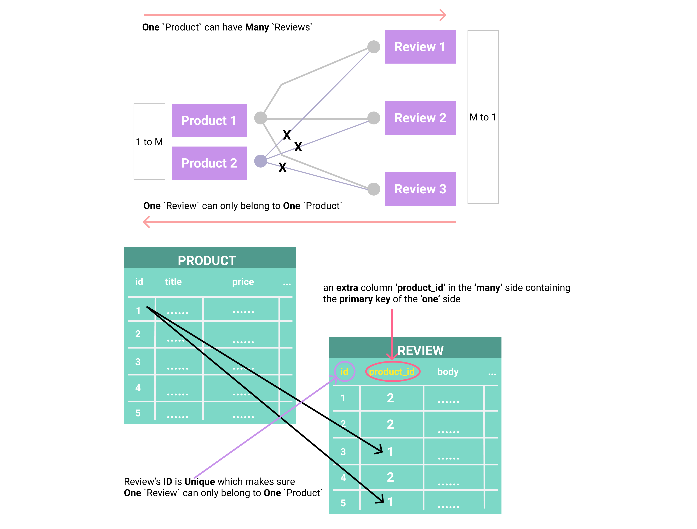
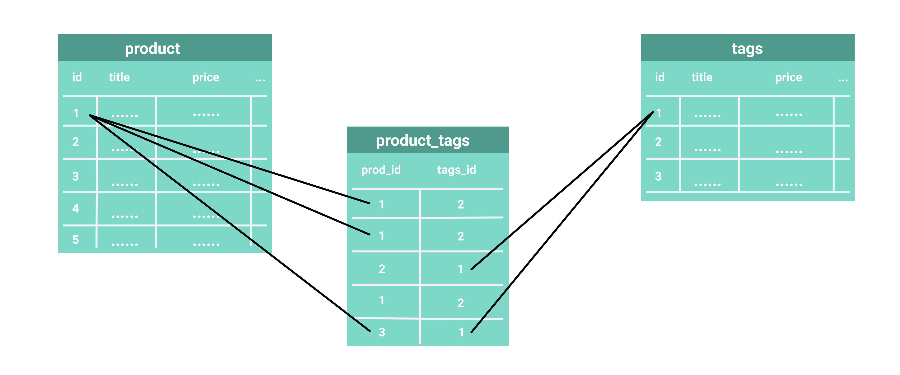
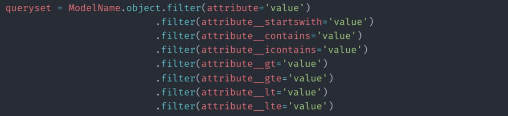
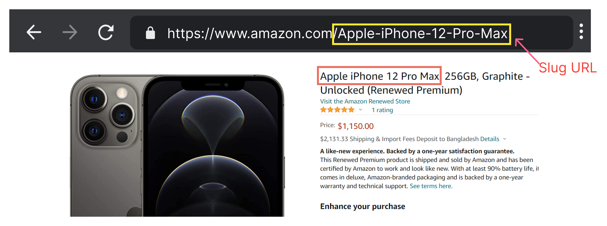

# Django ORM

- [Django ORM](#django-orm)
  - [Database configuration](#database-configuration)
  - [ORM-Models](#orm-models)
    - [Creating Django models](#creating-django-models)
  - [Relationships](#relationships)
    - [One-to-Many](#one-to-many)
    - [Many-to-Many](#many-to-many)
  - [CRUD operations](#crud-operations)
    - [Inserting Data - `save()`](#inserting-data---save)
    - [Retrieving Data](#retrieving-data)
      - [Retrieving all objects - `all()`](#retrieving-all-objects---all)
      - [Retrieving a single object with `get(attribute='value')`](#retrieving-a-single-object-with-getattributevalue)
      - [Limiting QuerySets `all()[offset:offset+limit]`](#limiting-querysets-alloffsetoffsetlimit)
      - [Field lookups - mimic `WHERE` clause](#field-lookups---mimic-where-clause)
        - [`Or` condition with `Q` objects](#or-condition-with-q-objects)
        - [`exclude()`](#exclude)
    - [Updating Data](#updating-data)
    - [Deleting Data](#deleting-data)
    - [Aggregation \& Ordering](#aggregation--ordering)
  - [Rendering Queried Data in the Template](#rendering-queried-data-in-the-template)
    - [Model Urls](#model-urls)
      - [Manually](#manually)
      - [Using `reverse`](#using-reverse)
  - [Slugify before saving](#slugify-before-saving)
    - [Using the Slug in the URL](#using-the-slug-in-the-url)
  - [Querying Relationships](#querying-relationships)
    - [One to Many](#one-to-many-1)
      - [query `Many` side of `One to Many` relation](#query-many-side-of-one-to-many-relation)
      - [query `One` side of `One to Many` relation](#query-one-side-of-one-to-many-relation)
    - [Many to Many](#many-to-many-1)
      - [Query Many to Many fields](#query-many-to-many-fields)
      - [Add Many to Many Field](#add-many-to-many-field)

## Database configuration

The default database configuration present in this file when a Django
project is created is as follows:

```python
DATABASES = {
    'default': {
    'ENGINE': 'django.db.backends.sqlite3',
    'NAME': BASE_DIR / 'db.sqlite3',
    }
}
```

If you are using other databases, such as PostgreSQL, MySQL, and so on..

- [https://www.geeksforgeeks.org/how-to-use-postgresql-database-in-django/](https://www.geeksforgeeks.org/how-to-use-postgresql-database-in-django/)

To get Python working with Postgres, you will need to install the “psycopg2” module.

```bash
pipenv install psycopg2
```

```python
DATABASES = {
    'default': {
    'ENGINE': 'django.db.backends.postgresql',
    'NAME': <db_name>,
    'USER': postgres,
    'PASSWORD': <password>,
    'HOST': 'localhost',
    'PORT': '5432',
    }
}
```

## ORM-Models

Object Relational Mapping (ORM) is a programming technique that maps content in a relational database to object-oriented code. Instead of thinking in terms of tables, you write classes representing the data in project.

### Creating Django models

A Django model is essentially a Python class that holds the blueprint for creating a table in a database. The `models.py` file can have many such models, and each model is transformed into a database table. The attributes of the class form the fields and relationships of the database table as per the model definitions.

Here is an blueprint of a model:

```python
from django.db import models
class ModelName(models.Model):
    field_name = models.CharField(field_options)
```

Example:

```python
from django.db import models
class Product(models.Model):
    title = models.CharField(max_length=200)
    description = models.TextField()
    price = models.DecimalField(max_digits=6, decimal_places=2)
```

Common field types, representing database column types:

- `🟠CharField(max_length=None, **options)` : Text field for short to medium-sized strings.
- `🟠TextField(**options)` : Suitable for longer text content.
- `🟠IntegerField` : Holds integer values.
- `🟠DecimalField(max_digits=None, decimal_places=None, **options)` : Stores decimal numbers with fixed precision.
- `🟠BooleanField` : Represents True/False values.
- `DateField(auto_now=False, auto_now_add=False, **options)` : Stores date values.
- `TimeField(auto_now=False, auto_now_add=False, **options)` : Holds time values.
- `🟠DateTimeField(auto_now=False, auto_now_add=False, **options)` : Combines date and time in a single field.
- `🟠EmailField(max_length=254, **options)` : Ensures a valid email format.
- `🟠ImageField(upload_to=None, height_field=None, width_field=None, max_length=100, **options)` : For uploading and storing image files.
- `🟠FileField(upload_to='', storage=None, max_length=100, **options)` : Handles file uploads.
- `🟠SlugField(max_length=50, **options)` : Used for URL-friendly representations of text.
- `URLField(max_length=200, **options)` : Ensures a valid URL format.

For primary keys, Django provides the following field types:

- `AutoField/BigAutoField(primary_key=True,editable=False, unique=True, **options)` : An IntegerField that automatically increments according to available IDs.
- `🟠UUIDField(primary_key=True, default=uuid.uuid4, editable=False, unique=True, **options)` - Primary key field, which stores a universally unique identifier (UUID) value.

> Note that by default, Django will automatically add a `id` AutoField to serve as the primary key.

For relationships, Django provides the following field types:

- `🟠ForeignKey(to, on_delete, **options)` : Establishes a many-to-one relationship with another model.
- `🟠ManyToManyField(to, **options)` : Creates a many-to-many relationship with another model.

There are some **field options** that can be used to customize the field behavior:

**Database Specific:**

1. `unique`: Ensures each value is unique.
2. `primary_key`: Designates the field as the primary key.
3. `related_name`: Sets the reverse relation name for ForeignKey and ManyToManyField. **Naming should follow the name of the model that contains the field.**
4. `on_delete`: Defines the behavior when the referenced object is deleted.
5. `db_index`: Creates an index for the field.
6. `null`: If `True`, Django will store empty values as NULL in the database. Default is False.
7. `default`: The default value for the field.
8. `auto_now`: Automatically set the field to now every time the object is saved. Useful for “last-modified” timestamps. The default value is False.
9. `auto_now_add`: Automatically set the field to now when the object is first created. Useful for creation of timestamps. The default value is False.


**Not Database Specific:**

1. `blank`: Determines if the field is required in forms. If `True`, the field is allowed to be blank. Default is False.*Note that this is different than null. **null is purely database-related, whereas blank is validation-related.***
2. `verbose_name`: Provides a human-readable name for the field.
3. `help_text`: Offers additional information for forms.
4. `editable`: Determines if the field is displayed in forms.
5. `upload_to`: Specifies the directory path for file uploads.
6. `error_messages`: Customizes error messages for validation failures.
7. `validators`: Specifies a list of validators to run for the field. [/5.0/ref/validators](https://docs.djangoproject.com/en/5.0/ref/validators/#)
8. `choices` : Provides choices for the field. i.e `choices=VOTE_CHOICES` where `VOTE_CHOICES = (('up', 'UP VOTE'),('down', 'DOWN VOTE'),)`

While all fields and options affect the database in some way, the ones listed as "Database Specific" have a more direct impact on the database structure and queries. The ones listed as "Admin UI" are more related to how the field is presented and controlled in the Django Admin interface.

- [More on field-types](https://docs.djangoproject.com/en/5.0/ref/models/fields/#field-types)
- [More on field-options](https://docs.djangoproject.com/en/5.0/ref/models/fields/#field-options)

Simple complete example:

```python
from django.db import models
import uuid
from django.core.validators import MinValueValidator, MaxValueValidator

class Product(models.Model):
    id = models.UUIDField(primary_key=True, default=uuid.uuid4, editable=False, unique=True)
    title = models.CharField(max_length=200,  verbose_name="Product name", help_text="Name of the product",)
    description = models.TextField(null=True, blank=True)
    price = models.DecimalField(max_digits=10, decimal_places=2, validators=[MinValueValidator(0)])
    created_at = models.DateTimeField(auto_now_add=True)
    updated_at = models.DateTimeField(auto_now=True)

    class Status(models.TextChoices):
        # first value is stored in db and second value is displayed in admin
        ACTIVE = 'active', 'Active'
        INACTIVE = 'inactive', 'Inactive'

    status = models.CharField(max_length=10, choices=Status.choices, default=Status.ACTIVE)

    def __str__(self):
        return f'{self.title}'
```


> Make migrations and migrate

```bash
python manage.py makemigrations
python manage.py migrate
```

> Register Model for Admin site

`app/model.py`

```python
from django.contrib import admin
from .models import Project
admin.site.register(Project)
```

With `django_extensions` lib, this can be done automatically with `python manage.py admin_generator <<app_name>>`

> How to delete a single table:

- Remove `<YourDeleteTable>` model from `models.py` file
- Remove `<YourDeleteTable>` class from `admin.py` file and ALL other instances of wherever this class is used.
- python `manage.py makemigrations <<your app>>`
- python `manage.py migrate`

## Relationships

### One-to-Many

In this type of relationship, a single object of one class can be associated with multiple objects of another class. For example, a single product can have multiple reviews. We know that is SQL we can create a one-to-many relationship **by adding a foreign key in the table of the many side.**

<div align="center">

</div>

```sql
-- Product Table
CREATE TABLE Product (
    ProductID INT PRIMARY KEY,
    ProductName VARCHAR(255),
    Price DECIMAL(10, 2)
);

-- Review Table
CREATE TABLE Review (
    ReviewID INT PRIMARY KEY,
    ProductID INT,
    Rating INT,
    Comment TEXT,
    FOREIGN KEY (ProductID) REFERENCES Product(ProductID)
);

-- Insert Product Data
INSERT INTO Product (ProductID, ProductName, Price) VALUES
(1, 'iPhon 15 pro', 999.99),
(2, 'Samsung A50', 499.99);

-- Insert Review Data
INSERT INTO Review (ReviewID, ProductID, Rating, Comment) VALUES
(101, 1, 5, 'Great laptop!'),
(102, 1, 4, 'Good performance'),
(103, 2, 3, 'Decent smartphone');
```

Similarly in Django, we can create a one-to-many relationship by adding a `ForeignKey` field **to the model of the many side**.


```python
class Product(models.Model):
    #...

class Review(models.Model):
    product = models.ForeignKey("Product", on_delete=models.CASCADE, related_name='reviews')
    body = models.TextField()
    rating = models.IntegerField()
```

### Many-to-Many

<div align="center">

</div>

In this type of relationship, a single object of one class can be associated with multiple objects of another class, and vice versa. For example, a product can have multiple tags, and a tag can be associated with multiple products.

In SQL, we can create a many-to-many relationship by creating a third table that holds the primary keys of both the tables.

```sql
-- Product Table
CREATE TABLE Product (
    ProductID INT PRIMARY KEY,
    ProductName VARCHAR(255),
    Price DECIMAL(10, 2)
);

-- Tag Table
CREATE TABLE Tag (
    TagID INT PRIMARY KEY,
    TagName VARCHAR(255)
);

-- ProductTag Table
CREATE TABLE ProductTag (
    ProductID INT,
    TagID INT,
    PRIMARY KEY (ProductID, TagID),
    FOREIGN KEY (ProductID) REFERENCES Product(ProductID),
    FOREIGN KEY (TagID) REFERENCES Tag(TagID)
);

-- Insert Product Data
INSERT INTO Product (ProductID, ProductName, Price) VALUES
(1, 'iPhon 15 pro', 999.99),
(2, 'Samsung A50', 499.99);

-- Insert Tag Data
INSERT INTO Tag (TagID, TagName) VALUES
(1, 'SmartPhone'),
(2, 'Mobile');

-- Insert ProductTag Data
INSERT INTO ProductTag (ProductID, TagID) VALUES
(1, 1),
(1, 2),
(2, 2);
```

But in Django, we don't need to create a third table. We can create a many-to-many relationship by adding a `ManyToManyField` field **to the model of either side** (follow the logic).

```python
class Product(models.Model):
    #...
    tags = models.ManyToManyField("Tag", related_name='products')

class Tag(models.Model):
    name = models.CharField(max_length=200)
```

This says that a product can have multiple tags, and a tag can be associated with multiple products.

In quiring `ManyToManyField` fields:

```python
# A product can have multiple tags
p = Product.objects.get(id=1)
p.tags.all()

# A tag can be associated with multiple products
t = Tag.objects.get(id=1)
t.`products`.all() # as we used `related_name='products'` otherwise `t.product_set.all()`
```

## CRUD operations

Once you’ve created your data models, Django automatically gives you a database-abstraction API that lets you create, retrieve, update and delete objects.

- [https://docs.djangoproject.com/en/5.0/topics/db/queries/#](https://docs.djangoproject.com/en/5.0/topics/db/queries/#)

Overview:

<div align="center">

</div>

For running queries, we can use the `python manage.py shell` or better use `django_extensions` lib and run `python manage.py runscript <script_name>` to run a script.

`app\scripts\run_orm.py`

```python
from app.models import Product

def run(*arg):
    products = Product.objects.all()
    print(list(products))
```

### Inserting Data - `save()`

```python
from app.models import Product

product = Product()
product.title = "Product 1"
product.description = "Product 1 description"
product.price = 100
product.save()
```

### Retrieving Data

#### Retrieving all objects - `all()`

The `all()` method returns a `QuerySet` of all the objects in the database.

```python
from app.models import Product

products = Product.objects.all()
print(list(products))
```

#### Retrieving a single object with `get(attribute='value')`

If you know there is only one object that matches your query, you can use the `get()` method on a Manager which returns the object directly:

syntax:

```python
from app.models import Model
Model.objects.get(attribute="value")
```

```python
from app.models import Product

product = Product.objects.get(id=1) # or pk=1
print(product)
```

`get()` will raise a `DoesNotExist` exception. This exception is an attribute of the model class that the query is being performed on - so in the code above, if there is no `Entry` object with a primary key of 20, Django will raise `Entry.DoesNotExist`.

```python
pprint(Product.objects.get(pk=10))
# Traceback (most recent call last):
#   File "<console>", line 1, in <module>
#   File ...
#     raise self.model.DoesNotExist(
# app.models.Product.DoesNotExist: Product matching query does not exist.
```

#### Limiting QuerySets `all()[offset:offset+limit]`

Use a subset of Python’s array-slicing syntax to limit your QuerySet to a certain number of results. This is the equivalent of SQL’s `LIMIT` and `OFFSET` clauses.

For example, this returns the first 2 objects (LIMIT 2):

```python
Product.objects.all()[:2]
```

This returns the sixth through tenth objects (OFFSET 2, LIMIT 3):

```python
Product.objects.all()[2:5] # 5 - OFFSET 2 = LIMIT 3
```

#### Field lookups - mimic `WHERE` clause

Field lookups are how you specify the meat of an SQL `WHERE` clause. They’re specified as keyword arguments to the QuerySet methods `filter()`, `exclude()` and `get()`.

<div align="center">

</div>

Basic lookups keyword arguments take the form `field__lookuptype=value`. (That’s a `double-underscore`). For example:

```python
def run(*arg):

    # Exact Match
    query1 = Product.objects.filter(title='Product 1')

    # Case-Insensitive Exact Match
    query2 = Product.objects.filter(title__iexact='product 1')

    # Contains
    query3 = Product.objects.filter(title__contains='Product')

    # Case-Insensitive Contains
    query4 = Product.objects.filter(title__icontains='product')

    # StartsWith
    query5 = Product.objects.filter(title__startswith='P')

    # EndsWith
    query6 = Product.objects.filter(title__endswith='1')

    # In List
    titles_list = ['Product 1', 'Product 2', 'Product 3']
    query7 = Product.objects.filter(title__in=titles_list)

    # Greater Than
    query8 = Product.objects.filter(price__gt=0.00)

    # Less Than
    query9 = Product.objects.filter(price__lt=100000.00)

    # Date Range
    start_date = datetime(2022, 1, 1, 0, 0, 0, tzinfo=timezone.utc)
    end_date = datetime(2025, 12, 31, tzinfo=timezone.utc)
    query10 = Product.objects.filter(created_at__range=(start_date, end_date))

    # Status Filter (Choices Field)
    query11 = Product.objects.filter(status=Product.Status.ACTIVE)

    # Tag Filter (Many-to-Many Relationship)
    query12 = Product.objects.filter(tags__name__icontains='Tag 1')

    # Combining Queries with OR
    combined_query = (query1 | query2 | query3 | query4 | query5 | query6 |
                      query7 | query8 | query9 | query10 | query11 | query12).distinct()

    # Combining Queries with AND
    combined_query_and = (query1 & query8 & query11).distinct()

    # Displaying results
    print(list(combined_query)) # [<Product: Product 1>, <Product: Iphone 15 pro max>]
    print(list(combined_query_and)) # [<Product: Product 1>]
```

##### `Or` condition with `Q` objects

```python
def run():
    # Q objects with different filtering methods
    # Example 1: OR conditions
    or_conditions = Q(title__icontains='product') | Q(
        description__icontains='good')

    # Example 2: AND conditions
    and_conditions = Q(price__gt=50.00) & Q(status=Product.Status.ACTIVE)

    # Example 3: Combined OR and AND conditions
    combined_conditions = (Q(title__icontains='product') | Q(
        description__icontains='good')) & Q(price__gt=50.00)

    # Example 4: Excluding certain conditions
    exclude_condition = ~Q(status=Product.Status.INACTIVE)

    # Applying the conditions to the queryset
    result_or_conditions = Product.objects.filter(or_conditions)
    result_and_conditions = Product.objects.filter(and_conditions)
    result_combined_conditions = Product.objects.filter(combined_conditions)
    result_exclude_condition = Product.objects.filter(exclude_condition)

    # Displaying results
    print(result_or_conditions)
    print(result_and_conditions)
    print(result_combined_conditions)
    print(result_exclude_condition)
```

Dynamically constructing filters

```python
def run():
    def build_dynamic_query(**kwargs):
        dynamic_query = Q()

        for key, value in kwargs.items():
            if value:
                if key == 'search':
                    dynamic_query &= Q(title__icontains=value) | Q(
                        description__icontains=value)
                elif key == 'min_price':
                    dynamic_query &= Q(price__gte=value)
                elif key == 'status':
                    dynamic_query &= Q(status=value)
                # Add more conditions as needed for other parameters

        return dynamic_query

    dynamic_query = build_dynamic_query(
        search='product',
        min_price=10000,
        status='active'
        # Add more parameters as needed
    )

    products = Product.objects.filter(dynamic_query)

    print(list(products))
```

##### `exclude()`

Returns a new QuerySet containing objects that do not match the given lookup parameters.

The lookup parameters (**kwargs) should be in the format described in Field lookups below. Multiple parameters are joined via AND in the underlying SQL statement, and the whole thing is enclosed in a NOT().

This example excludes all entries whose pub_date is later than 2005-1-3 AND whose headline is “Hello”:

```python
Entry.objects.exclude(pub_date__gt=datetime.date(2005, 1, 3), headline='Hello')
```

In SQL terms, that evaluates to:

```sql
SELECT ...
WHERE NOT (pub_date > '2005-1-3' AND headline = 'Hello')
```

This example excludes all entries whose pub_date is later than 2005-1-3 OR whose headline is “Hello”:

```python
Entry.objects.exclude(pub_date__gt=datetime.date(2005, 1, 3)).exclude(headline='Hello')
```

In SQL terms, that evaluates to:

```python
SELECT ...
WHERE NOT pub_date > '2005-1-3'
AND NOT headline = 'Hello'
```

### Updating Data

```python
product1 = Product.objects.get(pk=1)
product1.title = "Product 2"
product1.save()
```

### Deleting Data

```python
product1 = Product.objects.get(pk=1)
product1.delete()
```

### Aggregation & Ordering

```python
Book.objects.all()
# <QuerySet [<Book: Official Ielts Practice Materials>,
# <Book: Harry Potter 1 - The Philoshoper'S Stone>, <Book: Lord Of The Rings>,
# <Book: Programming And Problem Solving With C>, <Book: Barron’S Ielts Superpack>]>
Book.objects.all().order_by("-title")
# <QuerySet [<Book: Programming And Problem Solving With C>,
# <Book: Official Ielts Practice Materials>, <Book: Lord Of The Rings>,
#  <Book: Harry Potter 1 - The Philoshoper'S Stone>, <Book: Barron’S Ielts Superpack>]>
from django.db.models import Avg,Min,Max
Book.objects.all().aggregate(Avg("rating"))
# {'rating__avg': 4.0}
Book.objects.all().aggregate(Min("rating"))
# {'rating__min': 3}
Book.objects.all().aggregate(Max("rating"))
# {'rating__max': 5}
```

## Rendering Queried Data in the Template

`app/view.py`

```python
from django.shortcuts import render
from .models import Book
# Create your views here.

def index(request):
    books = Book.objects.all()
    context = {
        'books': books
    }
    return render(request, 'app/index.html', context)
```

`app/templates/app/index.html`

```html
<!DOCTYPE html>
<html lang="en">
<head>
 <meta charset="UTF-8">
 <meta http-equiv="X-UA-Compatible" content="IE=edge">
 <meta name="viewport" content="width=device-width, initial-scale=1.0">
 <title>Document</title>
</head>
<body>
 <ul>
  
   <li>
    {{book.title}} (Ratings: {{book.rating}})
   </li>
  
 </ul>
</body>
</html>
```

### Model Urls

#### Manually

`app/views.py`

```python
def book_detail(request, id):
    # try:
    #     book = Book.objects.get(id=id)
    # except:
    #     raise Http404('Book does not exist')
    book = get_object_or_404(Book, id=id)
    context = {
        'title': book.title,
        'author': book.author,
        'rating': book.rating,
    }
    return render(request, 'app/book_detail.html', context)
```

`app/templates/app/book_detail.html`

```html
 <h3><a href="">Go Home</a></h3>
 <h1>{{title}}</h1>
 <h3> - Author: {{author}}</h3>
 <h3> - Avg. Rating: {{rating}}</h3>
```

`app/urls.py`

```python
from django.urls import path
from . import views
urlpatterns = [
    path('', views.index, name='index'),
    path('books/<int:id>', views.book_detail, name='book-details'),
]
```

`app/templates/app/index.html`

```html
<ul>
  
   <li>
   <!-- manual url link -->
    <a href="">{{book.title}} </a>
    (Ratings: {{book.rating}})
   </li>
  
 </ul>
```

#### Using `reverse`

`app/urls.py`

```python
from django.urls import path
from . import views
urlpatterns = [
    path('', views.index, name='index'),
    path('books/<int:id>', views.book_detail, name='book-details'),
]
```

`app/models.py`

```python
from django.urls import reverse

class Book(models.Model):
    title = models.CharField(max_length=200)
    rating = models.IntegerField(default=0)
    author = models.CharField(max_length=200)
    is_bestseller = models.BooleanField(default=False)

    # Model Url
    def get_absolute_url(self):
        # return reverse('book-details', kwargs={'pk': self.pk})
        return reverse('book-details', args=[self.pk])

    def __str__(self):
        return self.title.title()
```

`app/templates/app/index.html`

```html
<ul>
  
   <li>
    <!-- <a href="">{{book.title}} </a>  -->
    <a href="{{ book.get_absolute_url}}">{{book.title}} </a>
    (Ratings: {{book.rating}})
   </li>
  
 </ul>
```

## Slugify before saving

A slug is a human-readable, unique identifier, used to identify a resource instead of a less human-readable identifier like an id. You use a slug when you want to refer to an item while preserving the ability to see, at a glance, what the item is.

- Typically slugs are used when making `search-engine optimized(SEO)` urls

<div align="center">

</div>

```python
from django.utils.text import slugify

class Book(models.Model):
    title = models.CharField(max_length=200)
    rating = models.IntegerField(default=0)
    author = models.CharField(max_length=200)
    is_bestseller = models.BooleanField(default=False)
    slug = models.SlugField(default="", null=False, blank=False)

    # slugify before save()
    def save(self, *args, **kwargs):
        self.slug = slugify(self.title)
        super().save(*args, **kwargs)

    def __str__(self):
        return self.title.title()
```

```python
Book.objects.get(title="Official IELTS Practice Materials").save()
Book.objects.get(title="Official IELTS Practice Materials").slug
# 'official-ielts-practice-materials'
```

### Using the Slug in the URL

`app/urls.py`

```python
from django.urls import path
from . import views
urlpatterns = [
    path('', views.index, name='index'),
    path('books/<int:id>', views.book_detail, name='book-details'),
]
```

`app/views.py`

```python
def book_detail(request, s):
    # try:
    #     book = Book.objects.get(id=id)
    # except:
    #     raise Http404('Book does not exist')
    book = get_object_or_404(Book, slug=s)
    context = {
        'title': book.title,
        'author': book.author,
        'rating': book.rating,
    }
    return render(request, 'app/book_detail.html', context)
```

```python
from django.utils.text import slugify

class Book(models.Model):
    title = models.CharField(max_length=200)
    rating = models.IntegerField(default=0)
    author = models.CharField(max_length=200)
    is_bestseller = models.BooleanField(default=False)
    slug = models.SlugField(default="", null=False, blank=False)

    # slugify before save()
    def save(self, *args, **kwargs):
        self.slug = slugify(self.title)
        super().save(*args, **kwargs)

    # Model Url
    # def get_absolute_url(self):
    #     return reverse('book-details', args=[self.pk])
    def get_absolute_url(self):
        return reverse('book-details', args=[self.slug])

    def __str__(self):
        return self.title.title()
```

## Querying Relationships

### One to Many

#### query `Many` side of `One to Many` relation

```python
# Review-M
# Product-1

# get all reviews of Product="Apple iPhone 12 Pro Max"
Review.objects.filter(product__title="Apple iPhone 12 Pro Max")
    # <QuerySet [<Review: Not good>, <Review: Very Avg...>]>


# get a review's associated product
a_good_review = Review.objects.filter(body__icontains="good")[0]
a_good_review
    # <Review: Not good>
a_good_review.product
    # <Product: Apple iPhone 12 Pro Max>
a_good_review.product.title
    # 'Apple iPhone 12 Pro Max'

# save Product with review
from app.models import Product, Review
p = Product(title="Samsung Galaxy S10", price=1000,description="Samsung Galaxy S10")
p.save()
r = Review(body="best android phone", product = p)
r.save()
r = Review(body="best android phone for 2020", product = p)
r.save()
```

#### query `One` side of `One to Many` relation

If we don't specify a `related_name`, Django automatically creates one using the name of our model with the suffix `_set`, for instance `product.review_set.all()`.

```python
# Product - 1
# Review - M
# get all reviews of Product="Apple iPhone 12 Pro Max"
from app.models import Product,Review
p = Product.objects.get(title="Apple iPhone 12 Pro Max")
p.review_set.all()
    # <QuerySet [<Review: Not good>, <Review: Very Avg...>]>
```

The `related_name` attribute specifies the name of the `reverse` relation from the `Review` model back to `Product` model.

Defining a `related_name` attribute on the `Review` model (many side) allows us to use the `reverse` relation to access the `Review` objects that belong to an `Product` object.

```python
class Review(models.Model):
    # ........
    product = models.ForeignKey(
        Product, on_delete=models.CASCADE, related_name='reviews')
    # ......
```

Run these commands:

```python
python manage.py makemigrations
python manage.py migrate
```

Now we can access the `Book` objects that belong to an `Author` object using the `reverse` relation.

```python
p = Product.objects.get(title="Apple iPhone 12 Pro Max")
p.reviews.all()
# <QuerySet [<Review: Not good>, <Review: Very Avg...>]>
p.reviews.filter(body__icontains='good')
# <QuerySet [<Review: Not good>]>
```

### Many to Many

#### Query Many to Many fields

```python
tag = Tag.objects.get(name="SmartPhone")
tag.products.all()
# <QuerySet [<Product: Apple iPhone 12 Pro Max>, <Product: Google Pixel>, <Product: Apple iPhone 11 Pro, 64GB>]>
tag.products.filter(title__icontains='pixel')
# <QuerySet [<Product: Google Pixel>]>


p = Product.objects.get(title="Apple iPhone 12 Pro Max")
p.tags.all()
# <QuerySet [<Tag: SmartPhone>, <Tag: Mobile>]>
```

#### Add Many to Many Field

<div align="center">

</div>

```python
# add new tag
p = Product.objects.get(title="Apple iPhone 12 Pro Max")
t = Tag.objects.create(name="Apple")
p.tags.add(t)
# existing tag
p = Product.objects.get(title="Apple iPhone 12 Pro Max")
t = Tag.objects.get(name="iphone")
p.tags.add(t)
```
