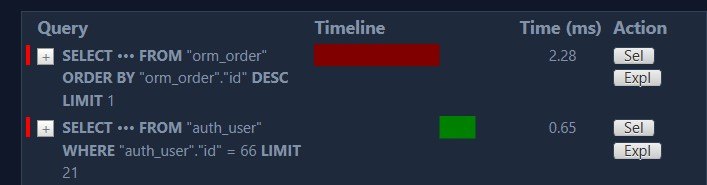
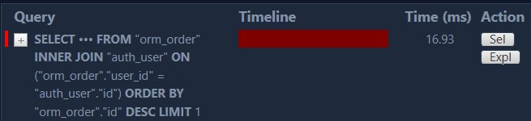
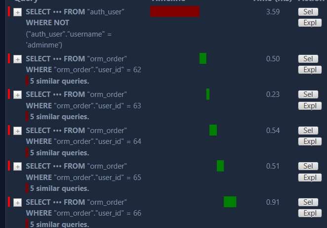
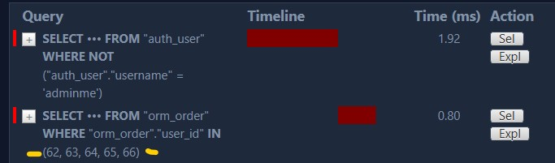

# Django ORM

- [Django ORM](#django-orm)
  - [Database configuration](#database-configuration)
  - [ORM-Models](#orm-models)
    - [Creating Django models](#creating-django-models)
  - [Relationships](#relationships)
    - [One-to-Many](#one-to-many)
    - [Many-to-Many](#many-to-many)
  - [CRUD operations](#crud-operations)
    - [Inserting Data - `save()`](#inserting-data---save)
    - [Retrieving Data](#retrieving-data)
      - [Retrieving all objects - `all()`](#retrieving-all-objects---all)
      - [Selecting specific fields with `values()`](#selecting-specific-fields-with-values)
      - [Retrieving a single object with `get(attribute='value')`](#retrieving-a-single-object-with-getattributevalue)
      - [Limiting QuerySets `all()[offset:offset+limit]`](#limiting-querysets-alloffsetoffsetlimit)
      - [Filtering by field lookups](#filtering-by-field-lookups)
        - [`Or` condition with `Q` objects](#or-condition-with-q-objects)
        - [`exclude()`](#exclude)
    - [Updating Data](#updating-data)
    - [Deleting Data](#deleting-data)
    - [Aggregation \& Ordering](#aggregation--ordering)
    - [Deferring Fields](#deferring-fields)
  - [CRUD operations with Relationships](#crud-operations-with-relationships)
    - [Creating records for a one-to-many relation](#creating-records-for-a-one-to-many-relation)
    - [Creating records with many-to-many relationships](#creating-records-with-many-to-many-relationships)
    - [Querying Related objects | one-to-many + many-to-one relation](#querying-related-objects--one-to-many--many-to-one-relation)
      - [Forward | the `One` side of one-to-many relation](#forward--the-one-side-of-one-to-many-relation)
        - [Optimizing Forward access to one-to-many relationships](#optimizing-forward-access-to-one-to-many-relationships)
      - [Backward | the `One` side of one-to-many relation](#backward--the-one-side-of-one-to-many-relation)
      - [Optimizing Backward access to one-to-many relationships](#optimizing-backward-access-to-one-to-many-relationships)
    - [querying across a many-to-many relationship using the field lookup](#querying-across-a-many-to-many-relationship-using-the-field-lookup)
    - [a many-to-many query using objects](#a-many-to-many-query-using-objects)
  - [Annotations and Grouping](#annotations-and-grouping)
  - [Transaction Management](#transaction-management)
  - [SubQuery](#subquery)
    - [Introduction to subqueries](#introduction-to-subqueries)
    - [Implementing subqueries in python:](#implementing-subqueries-in-python)
  - [Seeding Example](#seeding-example)

## Database configuration

The default database configuration present in this file when a Django
project is created is as follows:

```python
DATABASES = {
    'default': {
    'ENGINE': 'django.db.backends.sqlite3',
    'NAME': BASE_DIR / 'db.sqlite3',
    }
}
```

If you are using other databases, such as PostgreSQL, MySQL, and so on..

- [https://www.geeksforgeeks.org/how-to-use-postgresql-database-in-django/](https://www.geeksforgeeks.org/how-to-use-postgresql-database-in-django/)

To get Python working with Postgres, you will need to install the “psycopg2” module.

```bash
pipenv install psycopg2
```

```python
DATABASES = {
    'default': {
    'ENGINE': 'django.db.backends.postgresql',
    'NAME': <db_name>,
    'USER': postgres,
    'PASSWORD': <password>,
    'HOST': 'localhost',
    'PORT': '5432',
    }
}
```

## ORM-Models

Object Relational Mapping (ORM) is a programming technique that maps content in a relational database to object-oriented code. Instead of thinking in terms of tables, you write classes representing the data in project.

### Creating Django models

A Django model is essentially a Python class that holds the blueprint for creating a table in a database. The `models.py` file can have many such models, and each model is transformed into a database table. The attributes of the class form the fields and relationships of the database table as per the model definitions.

Here is an blueprint of a model:

```python
from django.db import models
class ModelName(models.Model):
    field_name = models.CharField(field_options)
```

Example:

```python
from django.db import models
class Product(models.Model):
    title = models.CharField(max_length=200)
    description = models.TextField()
    price = models.DecimalField(max_digits=6, decimal_places=2)
```

Common field types, representing database column types:

- `🟠CharField(max_length=None, **options)` : Text field for short to medium-sized strings.
- `🟠TextField(**options)` : Suitable for longer text content.
- `🟠IntegerField` : Holds integer values.
- `🟠DecimalField(max_digits=None, decimal_places=None, **options)` : Stores decimal numbers with fixed precision.
- `🟠BooleanField` : Represents True/False values.
- `DateField(auto_now=False, auto_now_add=False, **options)` : Stores date values.
- `TimeField(auto_now=False, auto_now_add=False, **options)` : Holds time values.
- `🟠DateTimeField(auto_now=False, auto_now_add=False, **options)` : Combines date and time in a single field.
- `🟠EmailField(max_length=254, **options)` : Ensures a valid email format.
- `🟠ImageField(upload_to=None, height_field=None, width_field=None, max_length=100, **options)` : For uploading and storing image files.
- `🟠FileField(upload_to='', storage=None, max_length=100, **options)` : Handles file uploads.
- `🟠SlugField(max_length=50, **options)` : Used for URL-friendly representations of text.
- `URLField(max_length=200, **options)` : Ensures a valid URL format.

For primary keys, Django provides the following field types:

- `AutoField/BigAutoField(primary_key=True,editable=False, unique=True, **options)` : An IntegerField that automatically increments according to available IDs.
- `🟠UUIDField(primary_key=True, default=uuid.uuid4, editable=False, unique=True, **options)` - Primary key field, which stores a universally unique identifier (UUID) value.

> Note that by default, Django will automatically add a `id` AutoField to serve as the primary key.

For relationships, Django provides the following field types:

- `🟠ForeignKey(to, on_delete, **options)` : Establishes a many-to-one relationship with another model.
- `🟠ManyToManyField(to,through, **options)` : Creates a many-to-many relationship with another model.

There are some **field options** that can be used to customize the field behavior:

**Database Specific:**

1. `unique`: Ensures each value is unique.
2. `primary_key`: Designates the field as the primary key.
3. `related_name`: Sets the reverse relation name for ForeignKey and ManyToManyField. **Naming should follow the name of the model that contains the field.**
4. `on_delete`: Defines the behavior when the referenced object is deleted.
5. `db_index`: Creates an index for the field.
6. `null`: If `True`, Django will store empty values as NULL in the database. Default is False.
7. `default`: The default value for the field.
8. `auto_now`: Automatically set the field to now every time the object is saved. Useful for “last-modified” timestamps. The default value is False.
9. `auto_now_add`: Automatically set the field to now when the object is first created. Useful for creation of timestamps. The default value is False.
10. `through`: Creates a many-to-many relationship using an intermediate model. The default value is None.

**Not Database Specific:**

1. `blank`: Determines if the field is required in forms. If `True`, the field is allowed to be blank. Default is False.*Note that this is different than null. **null is purely database-related, whereas blank is validation-related.***
2. `verbose_name`: Provides a human-readable name for the field.
3. `help_text`: Offers additional information for forms.
4. `editable`: Determines if the field is displayed in forms.
5. `upload_to`: Specifies the directory path for file uploads.
6. `error_messages`: Customizes error messages for validation failures.
7. `validators`: Specifies a list of validators to run for the field. [/5.0/ref/validators](https://docs.djangoproject.com/en/5.0/ref/validators/#)
8. `choices` : Provides choices for the field. i.e `choices=VOTE_CHOICES` where `VOTE_CHOICES = (('up', 'UP VOTE'),('down', 'DOWN VOTE'),)`

While all fields and options affect the database in some way, the ones listed as "Database Specific" have a more direct impact on the database structure and queries. The ones listed as "Admin UI" are more related to how the field is presented and controlled in the Django Admin interface.

- [More on field-types](https://docs.djangoproject.com/en/5.0/ref/models/fields/#field-types)
- [More on field-options](https://docs.djangoproject.com/en/5.0/ref/models/fields/#field-options)

Simple complete example:

```python
from django.db import models
import uuid
from django.core.validators import MinValueValidator, MaxValueValidator

class Product(models.Model):
    id = models.UUIDField(primary_key=True, default=uuid.uuid4, editable=False, unique=True)
    title = models.CharField(max_length=200,  verbose_name="Product name", help_text="Name of the product",)
    description = models.TextField(null=True, blank=True)
    price = models.DecimalField(max_digits=10, decimal_places=2, validators=[MinValueValidator(0)])
    created_at = models.DateTimeField(auto_now_add=True)
    updated_at = models.DateTimeField(auto_now=True)

    class Status(models.TextChoices):
        # first value is stored in db and second value is displayed in admin
        ACTIVE = 'active', 'Active'
        INACTIVE = 'inactive', 'Inactive'

    status = models.CharField(max_length=10, choices=Status.choices, default=Status.ACTIVE)

    def __str__(self):
        return f'{self.title}'
```


> Make migrations and migrate

```bash
python manage.py makemigrations
python manage.py migrate
# in case of "no changes detected" error, make sure models are in `models.py` and app is registered in `INSTALLED_APP` or run explicitly:
python manage.py makemigrations name
```

> Register Model for Admin site

`app/model.py`

```python
from django.contrib import admin
from .models import Project
admin.site.register(Project)
```

With `django_extensions` lib, this can be done automatically with `python manage.py admin_generator <<name>>`

## Relationships

### One-to-Many

In this type of relationship, a single object of one class can be associated with multiple objects of another class. For example, a single product can have multiple reviews. We know that is SQL we can create a one-to-many relationship **by adding a foreign key in the table of the many side.**

<div align="center">

</div>

```sql
-- Product Table
CREATE TABLE Product (
    ProductID INT PRIMARY KEY,
    ProductName VARCHAR(255),
    Price DECIMAL(10, 2)
);

-- Review Table
CREATE TABLE Review (
    ReviewID INT PRIMARY KEY,
    ProductID INT,
    Rating INT,
    Comment TEXT,
    FOREIGN KEY (ProductID) REFERENCES Product(ProductID)
);

-- Insert Product Data
INSERT INTO Product (ProductID, ProductName, Price) VALUES
(1, 'iPhon 15 pro', 999.99),
(2, 'Samsung A50', 499.99);

-- Insert Review Data
INSERT INTO Review (ReviewID, ProductID, Rating, Comment) VALUES
(101, 1, 5, 'Great laptop!'),
(102, 1, 4, 'Good performance'),
(103, 2, 3, 'Decent smartphone');
```

Similarly in Django, we can create a one-to-many relationship by adding a `ForeignKey` field **to the model of the many side**.


```python
class Product(models.Model):
    #...

class Review(models.Model):
    product = models.ForeignKey("Product", on_delete=models.CASCADE)
    body = models.TextField()
    rating = models.IntegerField()
```

### Many-to-Many

<div align="center">

</div>

In this type of relationship, a single object of one class can be associated with multiple objects of another class, and vice versa. For example, a product can have multiple tags, and a tag can be associated with multiple products.

In SQL, we can create a many-to-many relationship by creating a third table that holds the primary keys of both the tables.

```sql
-- Product Table
CREATE TABLE Product (
    ProductID INT PRIMARY KEY,
    ProductName VARCHAR(255),
    Price DECIMAL(10, 2)
);

-- Tag Table
CREATE TABLE Tag (
    TagID INT PRIMARY KEY,
    TagName VARCHAR(255)
);

-- ProductTag Table
CREATE TABLE ProductTag (
    ProductID INT,
    TagID INT,
    PRIMARY KEY (ProductID, TagID),
    FOREIGN KEY (ProductID) REFERENCES Product(ProductID),
    FOREIGN KEY (TagID) REFERENCES Tag(TagID)
);

-- Insert Product Data
INSERT INTO Product (ProductID, ProductName, Price) VALUES
(1, 'iPhon 15 pro', 999.99),
(2, 'Samsung A50', 499.99);

-- Insert Tag Data
INSERT INTO Tag (TagID, TagName) VALUES
(1, 'SmartPhone'),
(2, 'Mobile');

-- Insert ProductTag Data
INSERT INTO ProductTag (ProductID, TagID) VALUES
(1, 1),
(1, 2),
(2, 2);
```

But in Django, we don't need to create a third table. We can create a many-to-many relationship by adding a `ManyToManyField` field **to the model of either side** (follow the logic).

```python
class Product(models.Model):
    #...
    tags = models.ManyToManyField("Tag")

class Tag(models.Model):
    name = models.CharField(max_length=200)
```

This says that a product can have multiple tags, and a tag can be associated with multiple products.

Also, we can create a many-to-many relationship with an intermediate model. For example, we can create a many-to-many relationship between the `Product` and `Attribute` models using the `ProductAttribute` model as an intermediate model.


```python
class Product(models.Model):
    title = models.CharField(max_length=200, unique=True)
    attributes = models.ManyToManyField(
        "Attribute", through="ProductAttribute")

class Attribute(models.Model):
    name = models.CharField(max_length=200, unique=True)

class ProductAttribute(models.Model):
    product = models.ForeignKey(
        "Product", on_delete=models.CASCADE)
    attribute = models.ForeignKey(
        "Attribute", on_delete=models.CASCADE)
```

Downside to this approach is that we need extra efforts in creating and managing the intermediate model. Additionally, we need to configure the ability to add attributes from product admin page with `admin.StackedInline` or `admin.TabularInline`.Which in case of the many-to-many relationship without an intermediate model is done automatically - i.e. Tag can be added to Product from Product admin page by default.

```python
from .models import Product, ProductAttribute
class ProductAttributeInline(admin.TabularInline):
    model = ProductAttribute
    extra = 1  # Number of empty forms to show for adding attributes
    autocomplete_fields = ['attribute']


@admin.register(Product)
class ProductAdmin(admin.ModelAdmin):
    list_display = ( 'id', 'title',)
    list_display_links = ('id', 'title')
    inlines = [ProductAttributeInline]
```


## CRUD operations

Once you’ve created your data models, Django automatically gives you a database-abstraction API that lets you create, retrieve, update and delete objects.

- [https://docs.djangoproject.com/en/5.0/ref/models/querysets/#](https://docs.djangoproject.com/en/5.0/ref/models/querysets/#)
- [https://docs.djangoproject.com/en/5.0/topics/db/queries/#](https://docs.djangoproject.com/en/5.0/topics/db/queries/#)

Overview:

<div align="center">

</div>

For running queries, we can use the `python manage.py shell` or better use `django_extensions` lib and run `python manage.py runscript <script_name>` to run a script.

`app\scripts\run_orm.py`

```python
from app.models import Product

def run(*arg):
    products = Product.objects.all()
    print(list(products))
```

### Inserting Data - `save()`

```python
from app.models import Product

product = Product()
product.title = "Product 1"
product.description = "Product 1 description"
product.price = 100
product.save()
```

> Additionally, you can use `create()`, `bulk_create()` and `get_or_create()` methods to create objects.

example seeding database with faker:

```python
from faker import Faker
import faker_commerce
# https://github.com/nicobritos/python-faker-commerce/blob/main/faker_commerce/__init__.py

def run():
    fake = Faker()
    fake.add_provider(faker_commerce.Provider)
    print("Deleting all products")
    Product.objects.all().delete()
    print("Creating new products")
    for _ in range(20):
        try:
            product = Product()
            product.title = fake.ecommerce_name()
            product.description = fake.sentence(nb_words=20)
            product.price = fake.random_int(min=100, max=1000)
            product.status = fake.random.choice(
                [Product.Status.ACTIVE, Product.Status.INACTIVE])
            product.save()
            print(f"Saved {product.title}")
        except Exception:
            pass
```

### Retrieving Data

#### Retrieving all objects - `all()`

The `all()` method returns a `QuerySet` of all the objects in the database.

```python
from app.models import Product

products = Product.objects.all()
print(list(products))

```

#### Selecting specific fields with `values()`

```python
Product.objects.values('title', 'price')
# SELECT "title","price". ...

Product.objects.values('title', 'price').distinct()
# SELECT DISTINCT "title","price" ...
```

#### Retrieving a single object with `get(attribute='value')`

If you know there is only one object that matches your query, you can use the `get()` method on a Manager which returns the object directly:

syntax:

```python
from app.models import Model
Model.objects.get(attribute="value")
```

```python
from app.models import Product

product = Product.objects.get(id=1) # or pk=1
print(product)
```

`get()` will raise a `DoesNotExist` exception. This exception is an attribute of the model class that the query is being performed on - so in the code above, if there is no `Entry` object with a primary key of 20, Django will raise `Entry.DoesNotExist`.

```python
pprint(Product.objects.get(pk=10))
# Traceback (most recent call last):
#   File "<console>", line 1, in <module>
#   File ...
#     raise self.model.DoesNotExist(
# app.models.Product.DoesNotExist: Product matching query does not exist.
```

#### Limiting QuerySets `all()[offset:offset+limit]`

Use a subset of Python’s array-slicing syntax to limit your QuerySet to a certain number of results. This is the equivalent of SQL’s `LIMIT` and `OFFSET` clauses.

For example, this returns the first 2 objects (LIMIT 2):

```python
Product.objects.all()[:2]
```

This returns the sixth through tenth objects (OFFSET 2, LIMIT 3):

```python
Product.objects.all()[2:5] # 5 - OFFSET 2 = LIMIT 3
```

#### Filtering by field lookups

Field lookups are how you specify the meat of an SQL `WHERE` clause. They’re specified as keyword arguments to the QuerySet methods `filter()`, `exclude()` and `get()`. In such a case, we can use a **double-underscore lookup**. Basic lookups keyword arguments take the form `field__lookuptype=value`. For example:

<div align="center">

</div>

```python
def run(*arg):

    # Exact Match
    query1 = Product.objects.filter(title='Product 1')

    # Case-Insensitive Exact Match
    query2 = Product.objects.filter(title__iexact='product 1')

    # Contains
    query3 = Product.objects.filter(title__contains='Product')

    # Case-Insensitive Contains
    query4 = Product.objects.filter(title__icontains='product')

    # StartsWith
    query5 = Product.objects.filter(title__startswith='P')

    # EndsWith
    query6 = Product.objects.filter(title__endswith='1')

    # In List
    titles_list = ['Product 1', 'Product 2', 'Product 3']
    query7 = Product.objects.filter(title__in=titles_list)

    # Greater Than
    query8 = Product.objects.filter(price__gt=0.00)

    # Less Than
    query9 = Product.objects.filter(price__lt=100000.00)

    # Date Range
    start_date = datetime(2022, 1, 1, 0, 0, 0, tzinfo=timezone.utc)
    end_date = datetime(2025, 12, 31, tzinfo=timezone.utc)
    query10 = Product.objects.filter(created_at__range=(start_date, end_date))

    # Status Filter (Choices Field)
    query11 = Product.objects.filter(status=Product.Status.ACTIVE)

    # Tag Filter (Many-to-Many Relationship)
    query12 = Product.objects.filter(tags__name__icontains='Tag 1')

    # Combining Queries with OR
    combined_query = (query1 | query2 | query3 | query4 | query5 | query6 |
                      query7 | query8 | query9 | query10 | query11 | query12).distinct()

    # Combining Queries with AND
    combined_query_and = (query1 & query8 & query11).distinct()

    # Displaying results
    print(list(combined_query)) # [<Product: Product 1>, <Product: Iphone 15 pro max>]
    print(list(combined_query_and)) # [<Product: Product 1>]
```

##### `Or` condition with `Q` objects

```python
def run():
    # Q objects with different filtering methods
    # Example 1: OR conditions
    or_conditions = Q(title__icontains='product') | Q(
        description__icontains='good')

    # Example 2: AND conditions
    and_conditions = Q(price__gt=50.00) & Q(status=Product.Status.ACTIVE)

    # Example 3: Combined OR and AND conditions
    combined_conditions = (Q(title__icontains='product') | Q(
        description__icontains='good')) & Q(price__gt=50.00)

    # Example 4: Excluding certain conditions
    exclude_condition = ~Q(status=Product.Status.INACTIVE)

    # Applying the conditions to the queryset
    result_or_conditions = Product.objects.filter(or_conditions)
    result_and_conditions = Product.objects.filter(and_conditions)
    result_combined_conditions = Product.objects.filter(combined_conditions)
    result_exclude_condition = Product.objects.filter(exclude_condition)

    # Displaying results
    print(result_or_conditions)
    print(result_and_conditions)
    print(result_combined_conditions)
    print(result_exclude_condition)
```

Dynamically constructing filters

```python
def run():
    def build_dynamic_query(**kwargs):
        dynamic_query = Q()

        for key, value in kwargs.items():
            if value:
                if key == 'search':
                    dynamic_query &= Q(title__icontains=value) | Q(
                        description__icontains=value)
                elif key == 'min_price':
                    dynamic_query &= Q(price__gte=value)
                elif key == 'status':
                    dynamic_query &= Q(status=value)
                # Add more conditions as needed for other parameters

        return dynamic_query

    dynamic_query = build_dynamic_query(
        search='product',
        min_price=10000,
        status='active'
        # Add more parameters as needed
    )

    products = Product.objects.filter(dynamic_query)

    print(list(products))
```

##### `exclude()`

Returns a new QuerySet containing objects that do not match the given lookup parameters.

The lookup parameters (**kwargs) should be in the format described in Field lookups below. Multiple parameters are joined via AND in the underlying SQL statement, and the whole thing is enclosed in a NOT().

This example excludes all entries whose pub_date is later than 2005-1-3 AND whose headline is “Hello”:

```python
Entry.objects.exclude(pub_date__gt=datetime.date(2005, 1, 3), headline='Hello')
```

In SQL terms, that evaluates to:

```sql
SELECT ...
WHERE NOT (pub_date > '2005-1-3' AND headline = 'Hello')
```

This example excludes all entries whose pub_date is later than 2005-1-3 OR whose headline is “Hello”:

```python
Entry.objects.exclude(pub_date__gt=datetime.date(2005, 1, 3)).exclude(headline='Hello')
```

In SQL terms, that evaluates to:

```python
SELECT ...
WHERE NOT pub_date > '2005-1-3'
AND NOT headline = 'Hello'
```

### Updating Data

```python
product1 = Product.objects.get(pk=1)
product1.title = "Product 2"
product1.save()
# v2
Product.objects.filter(pk=1).update(title="Product 3")
```

Bulk update:

```python
products_in_book_category = Product.objects.filter(category__name='Book')

# Create a list of Product objects with updated titles
updated_products = [
    Product(pk=product.pk, title=f"{product.title} | Book")
    for product in products_in_book_category
]

# Use bulk_update to update all products in a single query
Product.objects.bulk_update(updated_products, ['title'])
```

### Deleting Data

```python
Product.objects.get(pk=1).delete()
Product.objects.all().delete()
```

### Aggregation & Ordering

```python
Product.objects.order_by('status', '-price')
# SELECT * FROM "product"
#  ORDER BY "product"."status" ASC,
#           "product"."price" DESC
Product.objects.order_by('status', '-price').reverse()
#  ORDER BY "product"."status" DESC,
#           "product"."price" ASC
```

```python
from django.db.models import Avg,Min,Max,Count

reviewInfo = Review.objects.aggregate(Count("rating"), Avg("rating"), Min("rating"), Max("rating"))
print(reviewInfo) # {'rating__count': 43, 'rating__avg': 2.7674418604651163, 'rating__min': 1, 'rating__max': 5}

# SELECT COUNT("review"."rating") AS "rating__count",
#        AVG("review"."rating") AS "rating__avg",
#        MIN("review"."rating") AS "rating__min",
#        MAX("review"."rating") AS "rating__max"
#   FROM "review
```

### Deferring Fields

In Django, the `defer()` method is used to defer the loading of certain fields in a query until they are specifically requested. This can be useful for optimizing database queries by avoiding the unnecessary loading of large or less frequently used fields.

Suppose you want to defer loading the `description` field when querying for `Product` instances. You can do this as follows:


```python
# Query to get products with deferred 'description' field
products = Product.objects.defer('description').all()

# Accessing the 'title' and 'price' fields will not trigger a new database query
for product in products:
    print(product.title, product.price)

# Accessing the 'description' field will trigger a new database query for `each` product
for product in products:
    print(product.description)
```

In this example, the description field is deferred, so when initially querying for Product instances, the data for the description field is not loaded. Only when you explicitly access the deferred field will a new query be made to fetch the data.

On the other hand, the `only()` method is used to retrieve only the specified fields in a query. It is the **opposite of** `defer()`. Here's how you might use `only()`:


```python
products = Product.objects.only('title', 'price').all() # opposite of `defer()`

# Accessing 'title' and 'price' will not trigger a new database query
for product in products:
    print(product.title, product.price)

# Accessing 'description' or any other field will trigger a new database query for each product
for product in products:
    print(product.description)
```

## CRUD operations with Relationships

- [https://docs.djangoproject.com/en/5.0/topics/db/examples/many_to_one/](https://docs.djangoproject.com/en/5.0/topics/db/examples/many_to_one/)
- [https://docs.djangoproject.com/en/5.0/topics/db/examples/many_to_many/](https://docs.djangoproject.com/en/5.0/topics/db/examples/many_to_many/)

### Creating records for a one-to-many relation

- [db/queries/#saving-foreignkey-and-manytomanyfield-fields](https://docs.djangoproject.com/en/5.0/topics/db/queries/#saving-foreignkey-and-manytomanyfield-fields)

Creating a record for a one-to-many relationship is very similar to creating a record for a simple model. **The only difference is that we need to associate the record with the parent model before saving it.**

```python
product, isCreated = Product.objects.get_or_create(
    title="Product 1", price=1000,)

review = Review()
review.product = product
review.body = "This is a new review"
review.rating = 5
review.save()

# or
Review.objects.create(product=product, body="This is a new review", rating=5)
```

Creating multiple records at once using `bulk_create()`:

```python
# Create a Product
product = Product.objects.create(
    title="Sample Product",
    description="A sample product description.",
    price=99.99,
    status=Product.Status.ACTIVE
)

# Create multiple Reviews for the Product
reviews_data = [
    {
        'body': "Great product!",
        'rating': 5,
    },
    {
        'body': "Good value for money.",
        'rating': 4,
    },
    {
        'body': "Could be better.",
        'rating': 3,
    }
]

# Create Review instances and associate them with the Product
reviews_instances = [Review(product=product, **review_data)
                        for review_data in reviews_data]
Review.objects.bulk_create(reviews_instances)
```

### Creating records with many-to-many relationships

Updating a ManyToManyField works a little differently – use the `add()` or `set()` methods to create relationships:

```python
# Create a Product
product = Product.objects.create(
    title="Sample Product xx",
    description="A sample product description.",
    price=99.99,
    status=Product.Status.ACTIVE
)

tags_data = [
    {'name': 'Electronics'},
    {'name': 'Gadgets'},
    {'name': 'Tech'},
]
# Create Tag instances
tags_instances = [Tag.objects.create(**tag_data) for tag_data in tags_data]
# 1. Associate the tags with the product using set() method
product.tags.set(tags_instances)
# or
# 2. Associate the tags with the product using add() method
for tag_instance in tags_instances:
    product.tags.add(tag_instance)
```

If we would have crated an intermediate model for the many-to-many relationship, we would have to create an instance of the intermediate model and associate it with the parent model and the child model. For example , consider the following models:

```python
class Product(models.Model):
    title = models.CharField(max_length=200, unique=True)
    attributes = models.ManyToManyField(
        "Attribute", related_name="products", through="ProductAttribute")

class Attribute(models.Model):
    name = models.CharField(max_length=200, unique=True)

class ProductAttribute(models.Model):
    product = models.ForeignKey(
        "Product", on_delete=models.CASCADE, related_name="product_attributes")
    attribute = models.ForeignKey(
        "Attribute", on_delete=models.CASCADE, related_name="product_attributes")
```

Here, we need to create an instance of the `ProductAttribute` model and associate it with the `Product` and `Attribute` models:

```python
from django.utils import timezone
from your_app.models import Product

# Create a Product
product = Product.objects.create(
    title="Sample Product",
    description="A sample product description.",
    price=99.99,
    status=Product.Status.ACTIVE
)

# Create multiple Attributes
attributes_data = [
    {'name': 'Color'},
    {'name': 'Size'},
    {'name': 'Weight'},
]

# Create Attribute instances
attributes_instances = [Attribute.objects.create(**attribute_data) for attribute_data in attributes_data]

# Associate the Attributes with the Product using the ProductAttribute intermediate table
for attribute_instance in attributes_instances:
    ProductAttribute.objects.create(product=product, attribute=attribute_instance, value="Sample Value")

# Print information
print(f"Product created: {product}")
print("Attributes associated with the product:")
for product_attribute in product.product_attributes.all():
    print(f"Attribute: {product_attribute.attribute}, Value: {product_attribute.value}")
```

### Querying Related objects | one-to-many + many-to-one relation

- [https://docs.djangoproject.com/en/5.1/topics/db/queries/#related-objects](https://docs.djangoproject.com/en/5.1/topics/db/queries/#related-objects)

When you define relationships in Django models, such as `ForeignKey` (many-to-one), `OneToOneField`, or `ManyToManyField`, Django provides an intuitive API for accessing related objects.

```python
class Order(models.Model):
    user = models.ForeignKey(User, on_delete=models.CASCADE)
```

Above defines relation: **One User has Many Orders**, and like SQL table ForeignKey is present in the Many side of the table/model.

#### Forward | the `One` side of one-to-many relation

If a model (Order) has a `ForeignKey`, instances of that model(order) will have access to the related (foreign) object (User) via an attribute (user) of the model.

```python
order = Order.objects.last()
print(order.user)
```

In this query we `order` instance has the `foreignkey` attribute `user` therefore we got the related user of the last order.

update to the relation can be made similarly using same approach by calling `save()`:

```python
order = Order.objects.last()
order.user = new_user
# or
order.user= None # If ForeignKey field has null=True set (i.e., it allows NULL values),
user.save() # update relation
```


##### Optimizing Forward access to one-to-many relationships

```python
order = Order.objects.last()
order.user
```

This query make two sql queries, one to fetch the last order and another to fetch the user associated with the last order

<p align="center">

</p>

This can be optimized with the `select_related()` QuerySet method that recursively prepopulates the cache of all one-to-many relationships ahead of time.

```typescript
order = Order.objects.select_related().last()
order.user
```

Now only one SQL query is needed to fetch the last order and the user associated with the last order. This is done by joining the two tables in a single query.

<p align="center">

</p>


```sql
SELECT **
  FROM "order"
 INNER JOIN "auth_user"
    ON ("order"."user_id" = "auth_user"."id")
 ORDER BY "order"."id" DESC
 LIMIT 1
```

#### Backward | the `One` side of one-to-many relation

```python
class Order(models.Model):
    user = models.ForeignKey(User, on_delete=models.CASCADE)
```

In our model definition "`User`" model does has reference to the `Order` model; so how we can Access all `Order` instances for a `User`? In this case, a `User` instance gets a `Manager` that allows you to retrieve all the `Order` instances related to that `User`.

By default, this `Manager` is named `<model>_set`, where `<model>` is the source model name, lowercased

```python
user = User.objects.last()
user.order_set.all()
```

In our example, we get all the orders for the last user with `order_set` manager where `order` is the source model name, lowercased of `Order` model.

You can override the `<model>_set` name by setting the `related_name` parameter in the `ForeignKey` definition. For example, if the `Order` try model was altered to `user = models.ForeignKey(User, on_delete=models.CASCADE, related_name="orders")`:

```python
class Order(models.Model):
    user = models.ForeignKey(User, on_delete=models.CASCADE, related_name="orders")
```

The query would look like this:

```python
user = User.objects.last()
user.orders.all()
```

#### Optimizing Backward access to one-to-many relationships

Let sat we have `N` number of `User`. In case we want to get all the order of these `N` users,there will be `N+1` SQL queries made,query for each users separately, severely degrading the performance of the application.

```python
    users = User.objects.exclude(username="adminme")
    for user in users:
        for order in user.orders.all():
            print(order)
```

<p align="center">

</p>

This can be optimized with the `prefetch_related()`; Returns a QuerySet that will automatically retrieve, in a single batch, related objects for each of the specified lookups.

```python
users = User.objects.prefetch_related("orders").exclude(username="adminme")
for user in users:
    for order in user.orders.all():
        print(order)
```

<p align="center">

</p>


### querying across a many-to-many relationship using the field lookup

```python
class Product(models.Model):
    title = models.CharField(max_length=200, unique=True)
    tags = models.ManyToManyField("Tag", related_name="products")
    attributes = models.ManyToManyField("Attribute", related_name="products", through="ProductAttribute")

class Attribute(models.Model):
    name = models.CharField(max_length=200, unique=True)

class ProductAttribute(models.Model):
    product = models.ForeignKey("Product", on_delete=models.CASCADE, related_name="product_attributes")
    attribute = models.ForeignKey("Attribute", on_delete=models.CASCADE, related_name="product_attributes")
    value = models.CharField(max_length=200)

class Tag(models.Model):
    name = models.CharField(max_length=200, unique=True)
```

```python
# Query products with a specific tag name
products = Product.objects.filter(tags__name='Trending')
print(products)

# SELECT "product"."*"
#   FROM "product"
#  INNER JOIN "product_tags"
#     ON ("product"."id" = "product_tags"."product_id")
#  INNER JOIN "tag"
#     ON ("product_tags"."tag_id" = "tag"."id")
#  WHERE "tag"."name" = '''Trending'''

# Query products with a specific attribute name and value
products = Product.objects.filter(
    product_attributes__attribute__name='Color', product_attributes__value='Red')
print(products)

# SELECT "product"."*"
#   FROM "product"
#  INNER JOIN "productattribute"
#     ON ("product"."id" = "productattribute"."product_id")
#  INNER JOIN "attribute"
#     ON ("productattribute"."attribute_id" = "attribute"."id")
#  WHERE ("attribute"."name" = '''Color''' AND "productattribute"."value" = '''Red''')

product1_tags = Tag.objects.filter(products__id=99)
print(product1_tags)

# SELECT "tag"."*"
#   FROM "tag"
#  INNER JOIN "product_tags"
#     ON ("tag"."id" = "product_tags"."tag_id")
#  WHERE "product_tags"."product_id" = '99'
```

### a many-to-many query using objects


```python
q = Product.objects.get(pk=1)
print(q.tags.all())
```

```python
product = Product.objects.get(pk=1)
attributes_and_values = product.product_attributes.values('attribute__name', 'value')
for item in attributes_and_values:
    print(f"Attribute: {item['attribute__name']}, Value: {item['value']}")


# SELECT "product"."*"
#   FROM "product"
#  WHERE "product"."id" = '1'

# SELECT "attribute"."name",
#        "productattribute"."value"
#   FROM "productattribute"
#  INNER JOIN "attribute"
#     ON ("productattribute"."attribute_id" = "attribute"."id")
#  WHERE "productattribute"."product_id" = '1'
```

## Annotations and Grouping

In django, we can use the `annotate()` method to add extra information to each object in the queryset. For example, we can add the total number of order for each customer.

```python
q = Customer.objects.annotate(order_count=Count('orders'))
for customer in q:
    print(f'{customer.name} | order count: {customer.order_count}') # Jhon | order count: 1

SELECT "customer"."id",
       "customer"."name",
       "customer"."email",
       "customer"."phone",
       "customer"."address",
       COUNT("order"."id") AS "order_count"
  FROM "customer"
  LEFT OUTER JOIN "order"
    ON ("customer"."id" = "order"."customer_id")
 GROUP BY "customer"."id",
          "customer"."name",
          "customer"."email",
          "customer"."phone",
          "customer"."address"

# Nested
q = Customer.objects.annotate(item_count=Count('orders__order_items'))
for customer in q:
    print(customer.name, customer.item_count) # Jhon 3

SELECT "customer"."id",
       "customer"."name",
       "customer"."email",
       "customer"."phone",
       "customer"."address",
       COUNT("orderitem"."id") AS "item_count"
  FROM "customer"
  LEFT OUTER JOIN "order"
    ON ("customer"."id" = "order"."customer_id")
  LEFT OUTER JOIN "orderitem"
    ON ("order"."id" = "orderitem"."order_id")
 GROUP BY "customer"."id",
          "customer"."name",
          "customer"."email",
          "customer"."phone",
          "customer"."address"
```

## Transaction Management

in Django, we can use the `transaction.atomic()` decorator or the `atomic()` context manager to manage transactions.

```python
from django.db import models, transaction

class Product(models.Model):
    title = models.CharField(max_length=200, unique=True)
    stock = models.IntegerField(default=0)

class Order(models.Model):
    product = models.ForeignKey(Product, on_delete=models.CASCADE)
    quantity = models.IntegerField()

# Example of using a transaction to create an order and update product stock
def create_order(product_id, quantity):
    try:
        with transaction.atomic():
            # Start a transaction
            product = Product.objects.select_for_update().get(id=product_id)
            # Use select_for_update to lock the product row for update within the transaction

            # Check if there is enough stock
            if product.stock >= quantity:
                # Create an order
                order = Order(product=product, quantity=quantity)
                order.save()

                # Update product stock
                product.stock -= quantity
                product.save()
            else:
                raise ValueError("Not enough stock for the order")

    except Exception as e:
        # Handle exceptions and rollback the transaction if an error occurs
        print(f"Error: {e}")
        transaction.rollback()

# Example usage
try:
    create_order(product_id=1, quantity=2)
except ValueError as e:
    print(f"Order creation failed: {e}")

```

## SubQuery

### Introduction to subqueries

A subquery is a query nested within another query. It is used to perform a secondary query that provides a value or set of values to the outer query. It is often used in the `WHERE`, `HAVING`, or `FROM` clauses of a statement. Subqueries are commonly used with `SELECT`, `UPDATE`, `INSERT`, and `DELETE` statements to achieve complex filtering and data manipulation.

- [https://www.w3resource.com/sql/subqueries/understanding-sql-subqueries.php](https://www.w3resource.com/sql/subqueries/understanding-sql-subqueries.php)

A subquery can be located in :
- In the `SELECT` Clause : Used to return a single value or a set of values.

    ```sql
    SELECT first_name, 
        (SELECT department_name 
            FROM departments 
            WHERE departments.department_id = employees.department_id) 
        AS department_name
    FROM employees;
    ```
    
    - Here, for each employee in the `employees` table, the subquery finds the matching `department_name` from the `departments` table based on the `department_id`. This result is shown alongside the employee's name.


- In the `WHERE` Clause : Used to filter the subquery results.

    ```sql
    SELECT first_name
    FROM employees
    WHERE department_id IN (SELECT department_id FROM departments WHERE location_id>1500);
    ```

    - The subquery fetches all `department_id`s from the `departments` table where the `location_id` is greater than 1500. The main query then retrieves the `first_name` of employees who belong to any of these departments.

- In the `HAVING` Clause : Used to filter groups.

    ```sql
    SELECT department_id, AVG(salary)
    FROM employees
    GROUP BY department_id
    HAVING AVG(salary) > (SELECT AVG(salary) FROM employees);
    ```
    
    - The subquery calculates the average salary of all employees. The main query groups employees by `department_id` and calculates the average salary for each department, returning only those departments where the average salary exceeds the overall average salary.


- In the `FROM` Clause : Treated as a derived table or inline view.

    ```sql
    SELECT *
    FROM (SELECT first_name, salary FROM employees WHERE salary > 5000) AS "high_salaried"
    ```
   -The subquery creates a temporary result set of employees who earn more than 5000. The main query then selects all columns from this temporary result set (alias `"high_salaried"`).


---

### Implementing subqueries in python:

> Example: Fetching the Latest Order for Each User


```python
from django.db.models import Subquery, OuterRef, Max
from .models import User, Order

# Subquery to get the latest order date for each user
latest_order_date = (
    Order.objects.filter(
        user=OuterRef("id")
    )  # OuterRef('id') refers to the id field of the user in the outer query. This is used inside the subquery to filter Order objects by the user field.
    .order_by("-created_at")
    .values("created_at")[:1]
)

# Fetch users along with their latest order date
users_with_latest_order = User.objects.annotate(
    latest_order_date=Subquery(latest_order_date)
)

for user in users_with_latest_order:
    print(f"User: {user.username}, Latest Order Date: {user.latest_order_date}")
```

```sql
SELECT "user".*
       (
        SELECT o."created_at"
          FROM "order" o
         WHERE o."user_id" = ("user"."id")
         ORDER BY o."created_at" DESC
         LIMIT 1
       ) AS "latest_order_date"
  FROM "user"
```

---

> Example: Fetching the Latest Order for Each User


```python
# Get the ContentType for the Product model
product_content_type = ContentType.objects.get_for_model(Product)

# Subquery to calculate the average rating for each product
average_rating = (
    Review.objects.filter(
        content_type=product_content_type,  # Filter reviews for Product
        object_id=OuterRef("id"),  # Match product ID with review's object_id
    )
    .values("object_id")
    .annotate(avg_rating=Avg("rating"))
    .values("avg_rating")
)

# Annotate products with their average rating
products_with_avg_rating = Product.objects.annotate(
    avg_rating=Subquery(average_rating)
)

# Fetch products with average rating > 4
top_rated_products = products_with_avg_rating.filter(avg_rating__gt=4)

for product in top_rated_products:
    print(f"Product: {product.name}, Average Rating: {product.avg_rating}")
```

```sql
SELECT "product"."id",
       "product"."name",
       "product"."description",
       "product"."price",
       "product"."category_id",
       "product"."created_at",
       "product"."updated_at",
       "product"."status",
       (
        SELECT AVG(r."rating") AS "avg_rating"
          FROM "review" r
         WHERE (r."content_type_id" = 1 AND r."object_id" = ("product"."id"))
         GROUP BY r."object_id"
       ) AS "avg_rating"
  FROM "product"
 WHERE (
        SELECT AVG(r."rating") AS "avg_rating"
          FROM "review" r
         WHERE (r."content_type_id" = 1 AND r."object_id" = ("product"."id"))
         GROUP BY r."object_id"
       ) > 4.0
```


## Seeding Example


Models:

```python
import uuid
from django.db import models
from django.contrib.auth.models import User
from django.contrib.contenttypes.models import ContentType
from django.contrib.contenttypes.fields import GenericForeignKey


# User Profile with One-to-One Relationship
class UserProfile(models.Model):
    user = models.OneToOneField(User, on_delete=models.CASCADE, related_name="profile")
    phone_number = models.CharField(max_length=15)
    address = models.TextField()

    def __str__(self):
        return f"{self.user.username}'s Profile"


# Product Model
class Product(models.Model):
    id = models.UUIDField(
        primary_key=True, default=uuid.uuid4, editable=False, unique=True
    )
    name = models.CharField(max_length=100)
    description = models.TextField()
    price = models.DecimalField(max_digits=10, decimal_places=2)
    category = models.ForeignKey(
        "Category", on_delete=models.CASCADE, related_name="products"
    )
    created_at = models.DateTimeField(auto_now_add=True)
    updated_at = models.DateTimeField(auto_now=True)

    class Status(models.TextChoices):
        ACTIVE = "active", "Active"
        INACTIVE = "inactive", "Inactive"

    status = models.CharField(
        max_length=10, choices=Status.choices, default=Status.ACTIVE
    )

    def __str__(self):
        return self.name


# Order Model with Many-to-One Relationship
class Order(models.Model):
    class Status(models.TextChoices):
        PENDING = "pending", "Pending"
        SHIPPED = "shipped", "Shipped"
        DELIVERED = "delivered", "Delivered"
        CANCELLED = "cancelled", "Cancelled"

    id = models.UUIDField(
        primary_key=True, default=uuid.uuid4, editable=False, unique=True
    )
    user = models.ForeignKey(User, on_delete=models.CASCADE, related_name="orders")
    status = models.CharField(
        max_length=20, choices=Status.choices, default=Status.PENDING
    )
    shipping_address = models.TextField()
    total_price = models.DecimalField(max_digits=10, decimal_places=2, default=0.00)
    created_at = models.DateTimeField(auto_now_add=True)
    updated_at = models.DateTimeField(auto_now=True)

    def __str__(self):
        return f"Order {self.id} by {self.user.username} ({self.status})"

    def calculate_total_price(self):
        total = sum(item.total_price() for item in self.order_items.all())
        self.total_price = total
        self.save()

    def get_ordered_products(self):
        return [(item.product.name, item.quantity) for item in self.order_items.all()]


# OrderProduct Model (Through Model for Many-to-One Relationship)
class OrderProduct(models.Model):
    order = models.ForeignKey(
        Order, on_delete=models.CASCADE, related_name="order_items"
    )
    product = models.ForeignKey(Product, on_delete=models.CASCADE)
    quantity = models.PositiveIntegerField()

    def __str__(self):
        return f"Order {self.order.id} - {self.product.name} x {self.quantity}"

    def total_price(self):
        return self.product.price * self.quantity


# Cart Model
class Cart(models.Model):
    class Status(models.TextChoices):
        ACTIVE = "active", "Active"
        ABANDONED = "abandoned", "Abandoned"

    id = models.UUIDField(
        primary_key=True, default=uuid.uuid4, editable=False, unique=True
    )
    user = models.OneToOneField(User, on_delete=models.CASCADE, related_name="cart")
    status = models.CharField(
        max_length=20, choices=Status.choices, default=Status.ACTIVE
    )

    def __str__(self):
        return f"{self.user.username}'s Cart"

    def calculate_total_price(self):
        return sum(item.total_price() for item in self.cart_products.all())


# CartProduct Model (Through Model for Many-to-Many Relationship)
class CartProduct(models.Model):
    cart = models.ForeignKey(
        Cart, on_delete=models.CASCADE, related_name="cart_products"
    )
    product = models.ForeignKey(Product, on_delete=models.CASCADE)
    quantity = models.PositiveIntegerField()

    def __str__(self):
        return f"{self.cart.user.username} - {self.product.name} x {self.quantity}"

    def total_price(self):
        return self.product.price * self.quantity


# Category Model with Self-Referential Relationship
class Category(models.Model):
    id = models.UUIDField(
        primary_key=True, default=uuid.uuid4, editable=False, unique=True
    )
    name = models.CharField(max_length=100)
    parent = models.ForeignKey(
        "self",
        on_delete=models.CASCADE,
        null=True,
        blank=True,
        related_name="subcategories",
    )

    def __str__(self):
        return self.name if not self.parent else f"{self.parent} -> {self.name}"


# Review Model with Generic Relationship
class Review(models.Model):
    id = models.UUIDField(
        primary_key=True, default=uuid.uuid4, editable=False, unique=True
    )
    user = models.ForeignKey(User, on_delete=models.CASCADE, related_name="reviews")
    content_type = models.ForeignKey(ContentType, on_delete=models.CASCADE)
    object_id = models.UUIDField()
    content_object = GenericForeignKey()
    text = models.TextField()
    rating = models.PositiveIntegerField()

    def __str__(self):
        return f"Review by {self.user.username} ({self.rating}/5)"
```

Seeding: `app\scripts\seed.py`

```python
from faker import Faker
import faker_commerce
from django.contrib.auth.models import User
from ..models import Category,OrderProduct,Product,Order,Cart,CartProduct,Review,ContentType,UserProfile,
import random


def run():
    fake = Faker()
    fake.add_provider(faker_commerce.Provider)

    # Seed Categories and Products
    print("Deleting old data....")
    users = User.objects.exclude(username="adminme")
    # Delete all users except adminme
    for user in users:
        user.delete()
    Category.objects.all().delete()
    Product.objects.all().delete()
    Order.objects.all().delete()
    OrderProduct.objects.all().delete()
    Cart.objects.all().delete()
    CartProduct.objects.all().delete()
    Review.objects.all().delete()

    # print("Populating new data.....")

    # Seed Categories
    categories_data = [
        {"name": "Electronics"},
        {"name": "Smartphones"},
        {"name": "Laptops"},
        {"name": "Home Appliances"},
    ]
    for cat in categories_data:
        Category.objects.create(**cat)

    cat1 = Category.objects.get(name="Electronics")
    cat2 = Category.objects.get(name="Smartphones")
    cat2.parent = cat1
    cat2.save()

    categories = Category.objects.all()

    # Seed Products
    for _ in range(10):
        try:
            product = Product()
            product.name = fake.ecommerce_name()
            product.description = fake.sentence(nb_words=20)
            product.price = fake.random_int(min=100, max=1000)  # Safe range for price
            product.status = fake.random.choice(
                [Product.Status.ACTIVE, Product.Status.INACTIVE]
            )
            product.category = random.choice(categories)  # Adding random category
            product.save()
            print(f"Saved Product: {product.name}")
        except Exception as e:
            print(f"Error saving product: {e}")

    # Seed Users
    print("Seeding Users...")
    for _ in range(5):  # Create 20 users
        user = User.objects.create_user(
            username=fake.user_name(), email=fake.email(), password="password123"
        )
        UserProfile.objects.create(
            user=user, phone_number=fake.phone_number(), address=fake.address()
        )
        print(f"Created User: {user.username}")

    # Seeding Orders
    # Seeding Orders
    print("Seeding Orders...")
    for _ in range(3):  # Create 3 orders
        user = random.choice(User.objects.all())
        order = Order.objects.create(
            user=user,
            status=random.choice([Order.Status.PENDING, Order.Status.SHIPPED]),
        )

        # Add products to the order
        for _ in range(random.randint(1, 5)):
            product = random.choice(Product.objects.all())
            quantity = random.randint(1, 3)  # Random quantity between 1 and 3
            OrderProduct.objects.create(order=order, product=product, quantity=quantity)

        # Calculate total price for the order
        order.calculate_total_price()
        print(f"Created Order {order.id} for User {user.username}")

    # Seeding Carts
    print("Seeding Carts...")
    for user in User.objects.all():
        cart = Cart.objects.create(
            user=user, status=random.choice([Cart.Status.ACTIVE, Cart.Status.ABANDONED])
        )

        # Add products to the cart
        for _ in range(random.randint(1, 5)):
            product = random.choice(Product.objects.all())
            quantity = random.randint(1, 3)  # Random quantity between 1 and 3
            CartProduct.objects.create(cart=cart, product=product, quantity=quantity)

        print(f"Created Cart for User {user.username}")

    # Seeding Reviews
    print("Seeding Reviews...")
    for product in Product.objects.all():
        for _ in range(random.randint(1, 3)):
            user = random.choice(User.objects.all())
            Review.objects.create(
                user=user,
                content_type=ContentType.objects.get_for_model(
                    Product
                ),  # Link review to Product
                object_id=product.id,
                text=fake.sentence(nb_words=20),
                rating=fake.random_int(1, 5),
            )
            print(f"Created Review for Product {product.name} by {user.username}")

    print("Seeding complete!")
```

