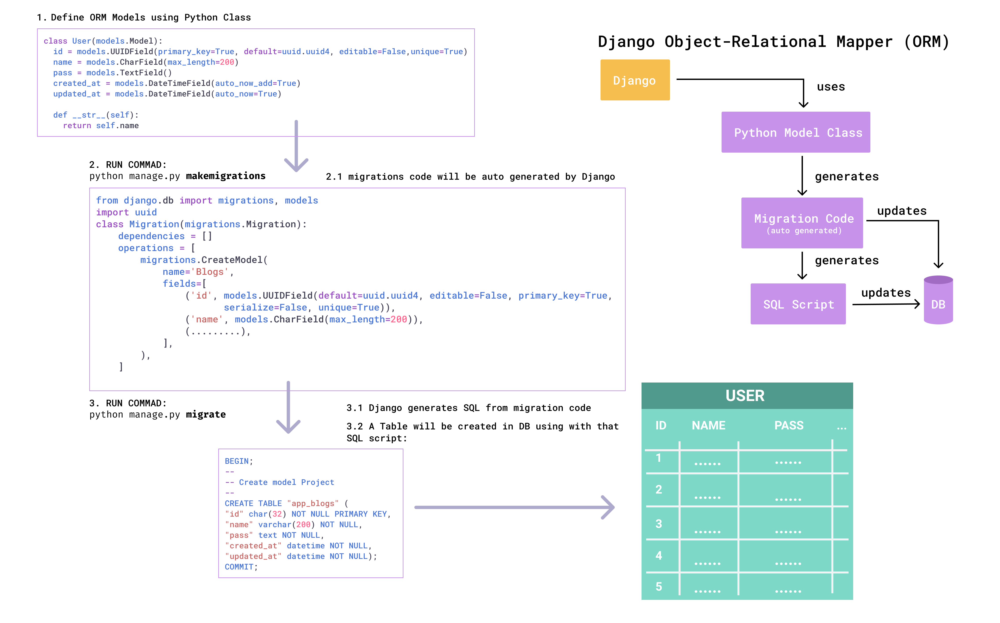

# Django ORM

- [Django ORM](#django-orm)
  - [ORM-Models](#orm-models)
    - [default migrations with sqlite3](#default-migrations-with-sqlite3)
    - [Create a new model](#create-a-new-model)
    - [Install PostgreSQL](#install-postgresql)

## ORM-Models

<div align="center">

</div>

<div align="center">

</div>


- [Models](https://docs.djangoproject.com/en/4.0/topics/db/models/#)
- [field-types](https://docs.djangoproject.com/en/4.0/topics/db/models/#field-types)
- [field-types-choices](https://docs.djangoproject.com/en/4.0/topics/db/models/#field-types-choices)

### default migrations with sqlite3

VSCode extension for sqlite3

Name: SQLite Viewer
Publisher: Florian Klampfer
VS [Marketplace Link](https://marketplace.visualstudio.com/items?itemName=qwtel.sqlite-viewer)

Migrate:

```bash
python manage.py migrate
python manage.py createsuperuser
```

### Create a new model

1. register app

```python
INSTALLED_APPS = [
    '...',
    'ORMmodel',
]
```

2. define model

`app/models.py`

```python
class Project(models.Model):
 """
 Project model
 """
 id = models.UUIDField(primary_key=True, default=uuid.uuid4, editable=False,unique=True)
 title = models.CharField(max_length=200)
 description = models.TextField()
 source_link = models.URLField(max_length=200, blank=True)
 created_at = models.DateTimeField(auto_now_add=True)
 updated_at = models.DateTimeField(auto_now=True)

 def __str__(self):
  return self.name
```

3. Make migrations and migrate

```bash
python manage.py makemigrations
python manage.py migrate
# shows only sql
python manage.py sqlmigrate app_name migration_file_number
# ex:
python manage.py sqlmigrate app 0001_initial
```

4. register Model for Admin site

`app/model.py`

```python
from django.contrib import admin
# Register your models here.
from ORMmodel.models import Project
admin.site.register(Project)
```

### Install PostgreSQL

[https://www.geeksforgeeks.org/how-to-use-postgresql-database-in-django/](https://www.geeksforgeeks.org/how-to-use-postgresql-database-in-django/)

To get Python working with Postgres, you will need to install the “psycopg2” module.

```bash
pip install psycopg2
```

open the `settings.py` file

now change database settings with this template code

```python
DATABASES = {
    'default': {
        'ENGINE': 'django.db.backends.postgresql',
        'NAME': 'db_name',
        'USER': 'postgres',
        'PASSWORD': 'pass',
        'HOST': 'localhost',
        'PORT': '5432',
    }
}
```

Run these commands:

```bash
python manage.py makemigrations
python manage.py migrate
```

To show the list of tables with the corresponding schema name in PgSql, run this statement:

```sql
SELECT * FROM information_schema.tables where table_schema = 'public';
```
