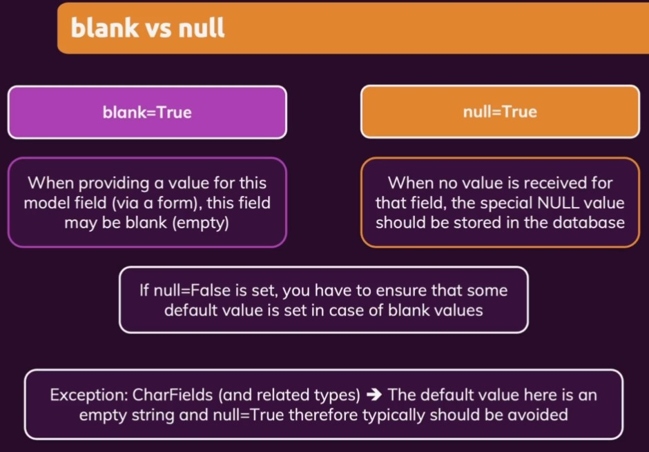
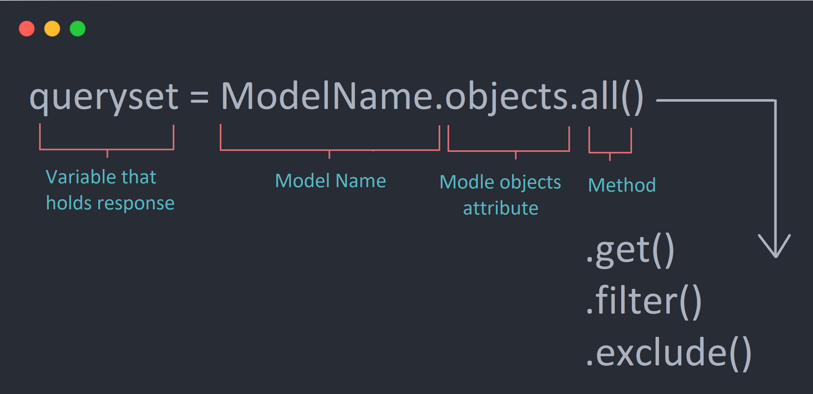

# Django ORM

- [Django ORM](#django-orm)
  - [ORM-Models](#orm-models)
    - [default migrations with sqlite3](#default-migrations-with-sqlite3)
    - [Create a new model](#create-a-new-model)
      - [model options](#model-options)
    - [Install PostgreSQL](#install-postgresql)
  - [Relationships](#relationships)
    - [One-to-Many](#one-to-many)
    - [Many-to-Many](#many-to-many)
  - [QuerySet](#queryset)
    - [Inserting Data - `save()`](#inserting-data---save)
    - [Retrieving Data](#retrieving-data)
      - [Retrieving all objects - `all()`](#retrieving-all-objects---all)
      - [Retrieving a single object with `get(attribute='value')`](#retrieving-a-single-object-with-getattributevalue)
      - [Limiting QuerySets `all()[offset:offset+limit]`](#limiting-querysets-alloffsetoffsetlimit)
      - [Retrieving specific objects with `filters(attribute='value')`](#retrieving-specific-objects-with-filtersattributevalue)
      - [Field lookups - mimic `WHERE` clause](#field-lookups---mimic-where-clause)
        - [`Or` condition with `Q` objects](#or-condition-with-q-objects)
        - [`exclude()`](#exclude)
    - [Updating Data](#updating-data)
    - [Deleting Data](#deleting-data)
    - [Aggregation & Ordering](#aggregation--ordering)
  - [Rendering Queried Data in the Template](#rendering-queried-data-in-the-template)
    - [Model Urls](#model-urls)
      - [Manually](#manually)
      - [Using `reverse`](#using-reverse)
  - [Slugify before saving](#slugify-before-saving)
    - [Using the Slug in the URL](#using-the-slug-in-the-url)
  - [Querying Relationships](#querying-relationships)
    - [One to Many](#one-to-many-1)
      - [query `Many` side of `One to Many` relation](#query-many-side-of-one-to-many-relation)
      - [query `One` side of `One to Many` relation](#query-one-side-of-one-to-many-relation)
    - [Many to Many](#many-to-many-1)
      - [Query Many to Many fields](#query-many-to-many-fields)
      - [Add Many to Many Field](#add-many-to-many-field)

## ORM-Models

<div align="center">

</div>

- [Models](https://docs.djangoproject.com/en/4.0/topics/db/models/#)
- [field-types](https://docs.djangoproject.com/en/4.0/topics/db/models/#field-types)
- [field-types-choices](https://docs.djangoproject.com/en/4.0/topics/db/models/#field-types-choices)

### default migrations with sqlite3

VSCode extension for sqlite3

Name: SQLite Viewer
Publisher: Florian Klampfer
VS [Marketplace Link](https://marketplace.visualstudio.com/items?itemName=qwtel.sqlite-viewer)

Migrate:

```bash
python manage.py migrate
python manage.py createsuperuser
```

### Create a new model

1. register app

```python
INSTALLED_APPS = [
    '...',
    'app',
]
```

2. define model

`app/models.py`

```python
from django.db import models
import uuid

# Create your models here.
class Product(models.Model):
    """
    Product model
    """
    id = models.UUIDField(
        primary_key=True, default=uuid.uuid4, editable=False, unique=True)
    title = models.CharField(max_length=200)
    description = models.TextField()
    price = models.DecimalField(max_digits=6, decimal_places=2)
    inventory = models.IntegerField(default=0)
    created_at = models.DateTimeField(auto_now_add=True)
    updated_at = models.DateTimeField(auto_now=True)

    def __str__(self):
        return self.title
```

3. Make migrations and migrate

```bash
python manage.py makemigrations
python manage.py migrate
# shows only sql
python manage.py sqlmigrate app_name migration_file_number
# ex:
python manage.py sqlmigrate app 0001_initial
```

4. register Model for Admin site

`app/model.py`

```python
from django.contrib import admin
# Register your models here.
from .models import Project
# from app.models import Product
admin.site.register(Project)
```

#### model options

<div align="center">

</div>

### Install PostgreSQL

[https://www.geeksforgeeks.org/how-to-use-postgresql-database-in-django/](https://www.geeksforgeeks.org/how-to-use-postgresql-database-in-django/)

To get Python working with Postgres, you will need to install the “psycopg2” module.

```bash
pip install psycopg2
```

open the `settings.py` file

now change database settings with this template code

```python
DATABASES = {
    'default': {
        'ENGINE': 'django.db.backends.postgresql',
        'NAME': 'db_name',
        'USER': 'postgres',
        'PASSWORD': 'pass',
        'HOST': 'localhost',
        'PORT': '5432',
    }
}
```

Run these commands:

```bash
python manage.py makemigrations
python manage.py migrate
```

To show the list of tables with the corresponding schema name in PgSql, run this statement:

```sql
SELECT * FROM information_schema.tables where table_schema = 'public';
```

## Relationships

### One-to-Many

<div align="center">

</div>

```python
from django.db import models
import uuid

class Product(models.Model):
    id = models.UUIDField(
        primary_key=True, default=uuid.uuid4, editable=False, unique=True)
    title = models.CharField(max_length=200)
    description = models.TextField()
    price = models.DecimalField(max_digits=6, decimal_places=2)
    inventory = models.IntegerField(default=0)
    created_at = models.DateTimeField(auto_now_add=True)
    updated_at = models.DateTimeField(auto_now=True)

    def __str__(self):
        return self.title

# One `Product` can have Many `Reviews`
# One `Review` can only belong to one `Product`

class Review(models.Model):
    product = models.ForeignKey(Product, on_delete=models.CASCADE, related_name='reviews')
    # above line will create 'product_id' column in Review table

    # `related_name` reverse relation
    # p = Product.objects.get(title="Apple iPhone 12 Pro Max")
    # p.review_set.all() # X -without `related_name` X
    # p.reviews.all()
    VOTE_CHOICES = (
        ('up', 'UP VOTE'),
        ('down', 'DOWN VOTE'),
    )
    body = models.TextField(null=True, blank=True)
    vote = models.CharField(max_length=10, choices=VOTE_CHOICES, default='up')
    created_at = models.DateTimeField(auto_now_add=True)
    id = models.UUIDField(default=uuid.uuid4, editable=False,
                          unique=True, primary_key=True)

    def __str__(self):
        return self.body[:20]
```

Update `admin.py`:

```python
from django.contrib import admin
# Register your models here.
from .models import Product, Review
# from app.models import Product, Review
admin.site.register(Product)
admin.site.register(Review)
# ....

```

### Many-to-Many

<div align="center">

</div>

```python
from django.db import models
import uuid
# M to M: Product to Tag

class Product(models.Model):
    """
    Product model
    """
    id = models.UUIDField(
        primary_key=True, default=uuid.uuid4, editable=False, unique=True)
    title = models.CharField(max_length=200)
    description = models.TextField()
    price = models.DecimalField(max_digits=6, decimal_places=2)
    inventory = models.IntegerField(default=0)
    created_at = models.DateTimeField(auto_now_add=True)
    updated_at = models.DateTimeField(auto_now=True)
    tags = models.ManyToManyField('Tag', blank=True, related_name='products')
    #  Tags` instead of Tag because Tag Model is defined later
    def __str__(self):
        return self.title

class Tag(models.Model):
    name = models.CharField(max_length=200)
    created_at = models.DateTimeField(auto_now_add=True)
    updated_at = models.DateTimeField(auto_now=True)
    id = models.UUIDField(default=uuid.uuid4, editable=False,
                          primary_key=True, unique=True)

    def __str__(self):
        return self.name
```

Update `admin.py`:

```python
from django.contrib import admin

# Register your models here.
from .models import Product, Tag
# from app.models import Product, Tag
admin.site.register(Product)
admin.site.register(Tag)
# ....

```

## QuerySet

Once you’ve created your data models, Django automatically gives you a database-abstraction API that lets you create, retrieve, update and delete objects.

Basic QuerySet Syntax:

<div align="center">

</div>

[https://docs.djangoproject.com/en/4.0/topics/db/queries/](https://docs.djangoproject.com/en/4.0/topics/db/queries/)

Overview:

<div align="center">

</div>

### Inserting Data - `save()`

To represent database-table data in Python objects, Django uses an intuitive system: A model `class` represents a database table, and an `instance` of that class represents a particular record in the database table.

To create an object, instantiate it using keyword arguments to the model class, then call `save()` to save it to the database.

```python
class Book(models.Model):
    title = models.CharField(max_length=200)
    rating = models.IntegerField(default=0)
    def __str__(self):
        return self.title.title()
```

```python
# python manage.py shell
from app.models import Book
harry_potter = Book(title="Harry Potter 1 - The Philoshoper's Stone",rating=5)
harry_potter.save()
b2 = Book(title="Lord of the Rings", rating=4)
b2.save()
```

`save()` takes a number of advanced options. For example, If a model has an AutoField but you want to define a new object’s ID explicitly when saving, define it explicitly before saving, rather than relying on the auto-assignment of the ID:

```python
b3 = Book(id=3, name='Programming and Problem Solving with C', rating=3)
b3.id     # Returns 3.
b3.save()
b3.id     # Returns 3.
```

See the documentation for [save()](https://docs.djangoproject.com/en/4.0/ref/models/instances/#django.db.models.Model.save) for complete details.

To create and save an object in a single step, use the `create()` method.

```python
b = Book.objects.create(title='Programming and Problem Solving with C', rating=3)
```

and:

```python
b = Book(title='Programming and Problem Solving with C', rating=3)
b.save(force_insert=True)
```

are equivalent.

### Retrieving Data

#### Retrieving all objects - `all()`

The `all()` method returns a `QuerySet` of all the objects in the database.

```python
Book.objects.all()
# <QuerySet [<Book: Harry Potter 1 - The Philoshoper'S Stone>,
#               <Book: Lord Of The Rings>, <Book: Programming And Problem Solving With C>]>
Book.objects.all()[1]
# <Book: Lord Of The Rings>
```

#### Retrieving a single object with `get(attribute='value')`

If you know there is only one object that matches your query, you can use the `get()` method on a Manager which returns the object directly:

syntax:

```python
from app.models import Model
Model.objects.get(attribute="value")
```

```python
Book.objects.get(pk=2)
# <Book: Lord Of The Rings>
Book.objects.get(title="Lord of the Rings")
# <Book: Lord Of The Rings>
```

`get()` will raise a `DoesNotExist` exception. This exception is an attribute of the model class that the query is being performed on - so in the code above, if there is no `Entry` object with a primary key of 20, Django will raise `Entry.DoesNotExist`.

```python
Book.objects.get(pk=20)
# Traceback (most recent call last):
#   File "<console>", line 1, in <module>
#   File ...
#     raise self.model.DoesNotExist(
# app.models.Book.DoesNotExist: Book matching query does not exist.
```

#### Limiting QuerySets `all()[offset:offset+limit]`

Use a subset of Python’s array-slicing syntax to limit your QuerySet to a certain number of results. This is the equivalent of SQL’s `LIMIT` and `OFFSET` clauses.

For example, this returns the first 2 objects (LIMIT 2):

```python
Book.objects.all()[:2]
# <QuerySet [<Book: Harry Potter 1 - The Philoshoper'S Stone>, <Book: Lord Of The Rings>]>
```

This returns the sixth through tenth objects (OFFSET 2 LIMIT 3):

```python
Book.objects.all()[2:5] #OFFSET 2 + LIMIT 3 = 5
# <QuerySet [<Book: Programming And Problem Solving With C>, <Book: Barron’S Ielts Superpack>,
#        <Book: The Official Cambridge Guide To Ielts>]>
```

#### Retrieving specific objects with `filters(attribute='value')`

The QuerySet returned by `all()` describes all objects in the database table. Usually, though, you’ll need to select only a subset of the complete set of objects.

```python
Book.objects.filter(author="n/a")
#  <QuerySet [<Book: Harry Potter 1 - The Philoshoper'S Stone>,
# <Book: Lord Of The Rings>, <Book: Programming And Problem Solving With C>,
#  <Book: Barron’S Ielts Superpack>, <Book: The Official Cambridge Guide To Ielts>,
#  <Book: Official Ielts Practice Materials>]>
Book.objects.filter(author="n/a",rating=4)
# <QuerySet [<Book: Lord Of The Rings>, <Book: Barron’S Ielts Superpack>]>
```

#### Field lookups - mimic `WHERE` clause

Field lookups are how you specify the meat of an SQL `WHERE` clause. They’re specified as keyword arguments to the QuerySet methods `filter()`, `exclude()` and `get()`.

Basic lookups keyword arguments take the form `field__lookuptype=value`. (That’s a `double-underscore`). For example:

<div align="center">

</div>

```python
# SELECT * FROM books WHERE rating <= 4;

Book.objects.filter(rating<=4)
# Traceback (most recent call last):
#   File "<console>", line 1, in <module>
# NameError: name 'rating' is not defined
Book.objects.filter(rating__lte=4)
# <QuerySet [<Book: Lord Of The Rings>, <Book: Programming And Problem Solving With C>,
#           <Book: Barron’S Ielts Superpack>, <Book: The Official Cambridge Guide To Ielts>,
#           <Book: Official Ielts Practice Materials>]>
Book.objects.filter(rating__lte=4, title__icontains='ielts')
# SELECT ... WHERE rating <= 4 and ILIKE '%ielts%';
# <QuerySet [<Book: Barron’S Ielts Superpack>, <Book: The Official Cambridge Guide To Ielts>,
# <Book: Official Ielts Practice Materials>]>
Book.objects.filter(id__in=[1,3,6])
# <QuerySet [<Book: Harry Potter 1 - The Philoshoper'S Stone>,
#       <Book: Programming And Problem Solving With C>, <Book: Official Ielts Practice Materials>]>
# SELECT ... WHERE id IN (1, 3, 4);

```

##### `Or` condition with `Q` objects

```python
from django.db.models import Q
Book.objects.filter(Q(rating__lte=4) | Q(is_bestseller=True))
# <QuerySet [<Book: Programming And Problem Solving With C>, <Book: The Official Cambridge Guide To Ielts>]>
# combining with `and`
Book.objects.filter(Q(rating__lt=4) | Q(is_bestseller=True),title__icontains='ielts')
# <QuerySet [<Book: The Official Cambridge Guide To Ielts>]>
# but watch out!! odering is important
Book.objects.filter(title__icontains='ielts',Q(rating__lt=4) | Q(is_bestseller=True))
#   File "<console>", line 1
#     Book.objects.filter(title__icontains='ielts',Q(rating__lt=4) | Q(is_bestseller=True))
#                                                                                         ^
# SyntaxError: positional argument follows keyword argument
```

```python

```

##### `exclude()`

Returns a new QuerySet containing objects that do not match the given lookup parameters.

The lookup parameters (**kwargs) should be in the format described in Field lookups below. Multiple parameters are joined via AND in the underlying SQL statement, and the whole thing is enclosed in a NOT().

This example excludes all entries whose pub_date is later than 2005-1-3 AND whose headline is “Hello”:

```python
Entry.objects.exclude(pub_date__gt=datetime.date(2005, 1, 3), headline='Hello')
```

In SQL terms, that evaluates to:

```sql
SELECT ...
WHERE NOT (pub_date > '2005-1-3' AND headline = 'Hello')
```

This example excludes all entries whose pub_date is later than 2005-1-3 OR whose headline is “Hello”:

```python
Entry.objects.exclude(pub_date__gt=datetime.date(2005, 1, 3)).exclude(headline='Hello')
```

In SQL terms, that evaluates to:

```python
SELECT ...
WHERE NOT pub_date > '2005-1-3'
AND NOT headline = 'Hello'
```

### Updating Data

```python
b = Book.objects.all()[0]
b.author = "John"
b.is_bestseller = True
b.save()
```

### Deleting Data

```python
b = Book.objects.all()[0]
# <Book: The Official Cambridge Guide To Ielts>
b.delete()
# (1, {'app.Book': 1})
```

### Aggregation & Ordering

```python
Book.objects.all()
# <QuerySet [<Book: Official Ielts Practice Materials>,
# <Book: Harry Potter 1 - The Philoshoper'S Stone>, <Book: Lord Of The Rings>,
# <Book: Programming And Problem Solving With C>, <Book: Barron’S Ielts Superpack>]>
Book.objects.all().order_by("-title")
# <QuerySet [<Book: Programming And Problem Solving With C>,
# <Book: Official Ielts Practice Materials>, <Book: Lord Of The Rings>,
#  <Book: Harry Potter 1 - The Philoshoper'S Stone>, <Book: Barron’S Ielts Superpack>]>
from django.db.models import Avg,Min,Max
Book.objects.all().aggregate(Avg("rating"))
# {'rating__avg': 4.0}
Book.objects.all().aggregate(Min("rating"))
# {'rating__min': 3}
Book.objects.all().aggregate(Max("rating"))
# {'rating__max': 5}
```

## Rendering Queried Data in the Template

`app/view.py`

```python
from django.shortcuts import render
from .models import Book
# Create your views here.

def index(request):
    books = Book.objects.all()
    context = {
        'books': books
    }
    return render(request, 'app/index.html', context)
```

`app/templates/app/index.html`

```html
<!DOCTYPE html>
<html lang="en">
<head>
 <meta charset="UTF-8">
 <meta http-equiv="X-UA-Compatible" content="IE=edge">
 <meta name="viewport" content="width=device-width, initial-scale=1.0">
 <title>Document</title>
</head>
<body>
 <ul>
  
   <li>
    {{book.title}} (Ratings: {{book.rating}})
   </li>
  
 </ul>
</body>
</html>
```

### Model Urls

#### Manually

`app/views.py`

```python
def book_detail(request, id):
    # try:
    #     book = Book.objects.get(id=id)
    # except:
    #     raise Http404('Book does not exist')
    book = get_object_or_404(Book, id=id)
    context = {
        'title': book.title,
        'author': book.author,
        'rating': book.rating,
    }
    return render(request, 'app/book_detail.html', context)
```

`app/templates/app/book_detail.html`

```html
 <h3><a href="">Go Home</a></h3>
 <h1>{{title}}</h1>
 <h3> - Author: {{author}}</h3>
 <h3> - Avg. Rating: {{rating}}</h3>
```

`app/urls.py`

```python
from django.urls import path
from . import views
urlpatterns = [
    path('', views.index, name='index'),
    path('books/<int:id>', views.book_detail, name='book-details'),
]
```

`app/templates/app/index.html`

```html
<ul>
  
   <li>
   <!-- manual url link -->
    <a href="">{{book.title}} </a>
    (Ratings: {{book.rating}})
   </li>
  
 </ul>
```

#### Using `reverse`

`app/urls.py`

```python
from django.urls import path
from . import views
urlpatterns = [
    path('', views.index, name='index'),
    path('books/<int:id>', views.book_detail, name='book-details'),
]
```

`app/models.py`

```python
from django.urls import reverse

class Book(models.Model):
    title = models.CharField(max_length=200)
    rating = models.IntegerField(default=0)
    author = models.CharField(max_length=200)
    is_bestseller = models.BooleanField(default=False)

    # Model Url
    def get_absolute_url(self):
        # return reverse('book-details', kwargs={'pk': self.pk})
        return reverse('book-details', args=[self.pk])

    def __str__(self):
        return self.title.title()
```

`app/templates/app/index.html`

```html
<ul>
  
   <li>
    <!-- <a href="">{{book.title}} </a>  -->
    <a href="{{ book.get_absolute_url}}">{{book.title}} </a>
    (Ratings: {{book.rating}})
   </li>
  
 </ul>
```

## Slugify before saving

A slug is a human-readable, unique identifier, used to identify a resource instead of a less human-readable identifier like an id. You use a slug when you want to refer to an item while preserving the ability to see, at a glance, what the item is.

- Typically slugs are used when making `search-engine optimized(SEO)` urls

<div align="center">

</div>

```python
from django.utils.text import slugify

class Book(models.Model):
    title = models.CharField(max_length=200)
    rating = models.IntegerField(default=0)
    author = models.CharField(max_length=200)
    is_bestseller = models.BooleanField(default=False)
    slug = models.SlugField(default="", null=False, blank=False)

    # slugify before save()
    def save(self, *args, **kwargs):
        self.slug = slugify(self.title)
        super().save(*args, **kwargs)

    def __str__(self):
        return self.title.title()
```

```python
Book.objects.get(title="Official IELTS Practice Materials").save()
Book.objects.get(title="Official IELTS Practice Materials").slug
# 'official-ielts-practice-materials'
```

### Using the Slug in the URL

`app/urls.py`

```python
from django.urls import path
from . import views
urlpatterns = [
    path('', views.index, name='index'),
    path('books/<int:id>', views.book_detail, name='book-details'),
]
```

`app/views.py`

```python
def book_detail(request, s):
    # try:
    #     book = Book.objects.get(id=id)
    # except:
    #     raise Http404('Book does not exist')
    book = get_object_or_404(Book, slug=s)
    context = {
        'title': book.title,
        'author': book.author,
        'rating': book.rating,
    }
    return render(request, 'app/book_detail.html', context)
```

```python
from django.utils.text import slugify

class Book(models.Model):
    title = models.CharField(max_length=200)
    rating = models.IntegerField(default=0)
    author = models.CharField(max_length=200)
    is_bestseller = models.BooleanField(default=False)
    slug = models.SlugField(default="", null=False, blank=False)

    # slugify before save()
    def save(self, *args, **kwargs):
        self.slug = slugify(self.title)
        super().save(*args, **kwargs)

    # Model Url
    # def get_absolute_url(self):
    #     return reverse('book-details', args=[self.pk])
    def get_absolute_url(self):
        return reverse('book-details', args=[self.slug])

    def __str__(self):
        return self.title.title()
```

## Querying Relationships


### One to Many

#### query `Many` side of `One to Many` relation

```python
# Review-M
# Product-1

# get all reviews of Product="Apple iPhone 12 Pro Max"
Review.objects.filter(product__title="Apple iPhone 12 Pro Max")
    # <QuerySet [<Review: Not good>, <Review: Very Avg...>]>


# get a review's associated product
a_good_review = Review.objects.filter(body__icontains="good")[0]
a_good_review
    # <Review: Not good>
a_good_review.product
    # <Product: Apple iPhone 12 Pro Max>
a_good_review.product.title
    # 'Apple iPhone 12 Pro Max'

# save Product with review
from app.models import Product, Review
p = Product(title="Samsung Galaxy S10", price=1000,description="Samsung Galaxy S10")
p.save()
r = Review(body="best android phone", product = p)
r.save()
r = Review(body="best android phone for 2020", product = p)
r.save()
```

#### query `One` side of `One to Many` relation

If we don't specify a `related_name`, Django automatically creates one using the name of our model with the suffix `_set`, for instance `product.review_set.all()`.

```python
# Product - 1
# Review - M
# get all reviews of Product="Apple iPhone 12 Pro Max"
from app.models import Product,Review
p = Product.objects.get(title="Apple iPhone 12 Pro Max")
p.review_set.all()
    # <QuerySet [<Review: Not good>, <Review: Very Avg...>]>
```

The `related_name` attribute specifies the name of the `reverse` relation from the `Review` model back to `Product` model.

Defining a `related_name` attribute on the `Review` model (many side) allows us to use the `reverse` relation to access the `Review` objects that belong to an `Product` object.

```python
class Review(models.Model):
    # ........
    product = models.ForeignKey(
        Product, on_delete=models.CASCADE, related_name='reviews')
    # ......
```

Run these commands:

```python
python manage.py makemigrations
python manage.py migrate
```

Now we can access the `Book` objects that belong to an `Author` object using the `reverse` relation.

```python
p = Product.objects.get(title="Apple iPhone 12 Pro Max")
p.reviews.all()
# <QuerySet [<Review: Not good>, <Review: Very Avg...>]>
p.reviews.filter(body__icontains='good')
# <QuerySet [<Review: Not good>]>
```

### Many to Many

#### Query Many to Many fields

```python
tag = Tag.objects.get(name="SmartPhone")
tag.products.all()
# <QuerySet [<Product: Apple iPhone 12 Pro Max>, <Product: Google Pixel>, <Product: Apple iPhone 11 Pro, 64GB>]>
tag.products.filter(title__icontains='pixel')
# <QuerySet [<Product: Google Pixel>]>


p = Product.objects.get(title="Apple iPhone 12 Pro Max")
p.tags.all()
# <QuerySet [<Tag: SmartPhone>, <Tag: Mobile>]>
```

#### Add Many to Many Field

<div align="center">

</div>

```python
# add new tag
p = Product.objects.get(title="Apple iPhone 12 Pro Max")
t = Tag.objects.create(name="Apple")
p.tags.add(t)
# existing tag
p = Product.objects.get(title="Apple iPhone 12 Pro Max")
t = Tag.objects.get(name="iphone")
p.tags.add(t)
```
