# Customizing the Admin Site

- [Customizing the Admin Site](#customizing-the-admin-site)
  - [default migrations with sqlite3](#default-migrations-with-sqlite3)
  - [Registering Models](#registering-models)
  - [Customizing List Page](#customizing-list-page)
  - [Adding Computed Columns](#adding-computed-columns)
  - [Selecting Related Objects](#selecting-related-objects)
  - [Overriding the Base QuerySet](#overriding-the-base-queryset)
  - [Search Fields](#search-fields)
  - [Custom Actions](#custom-actions)
  - [Customizing Forms](#customizing-forms)
    - [Autocomplete](#autocomplete)

## default migrations with sqlite3

VSCode extension for sqlite3
Name: SQLite Viewer Publisher: [Florian Klampfer](https://marketplace.visualstudio.com/items?itemName=qwtel.sqlite-viewer)

Migrate:

```python
python manage.py migrate
python manage.py createsuperuser
```

Create a new model

register app

```python
INSTALLED_APPS = [
    '...',
    'app',
]
```

## Registering Models

```python
from django.contrib import admin

# default 1
# Register your models here.
# from .models import Author
# from app.models import Author
# admin.site.register(Author)

# default 2
# from . import models
# admin.site.register(models.Product)
# admin.site.register(models.Review)
# admin.site.register(models.Tag)
# admin.site.register(models.Book)
# admin.site.register(models.Author)

# or custom
@admin.register(models.Product)
class ProductAdmin(admin.ModelAdmin):
    list_display = ('title', 'price', 'created_at', 'updated_at')

```

## Customizing List Page

<div align="center">
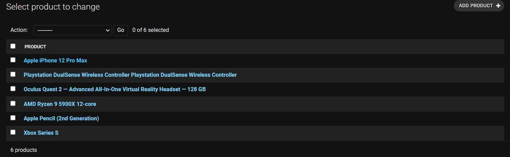
</div>

```python
@admin.register(models.Product)
class ProductAdmin(admin.ModelAdmin):
    list_display = ['title', 'price', 'created_at', 'updated_at']
    list_editable = ['price']
    ordering = ['title']
    list_per_page = 5
```

<div align="center">
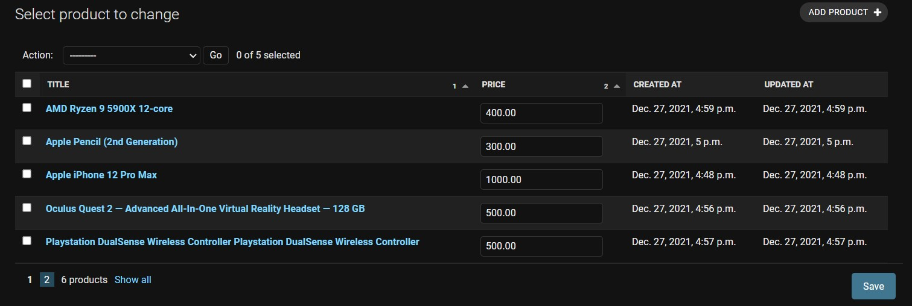
</div>

## Adding Computed Columns

```python
@admin.register(models.Product)
class ProductAdmin(admin.ModelAdmin):
    list_display = ['title', 'price', 'inventory', 'inventory_status_fn']
    list_editable = ['price']
    ordering = ['title']
    list_per_page = 5

    @admin.display(ordering='inventory')
    def inventory_status_fn(self, product):
        return 'In Stock' if product.inventory > 0 else 'Out of Stock'
```

<div align="center">
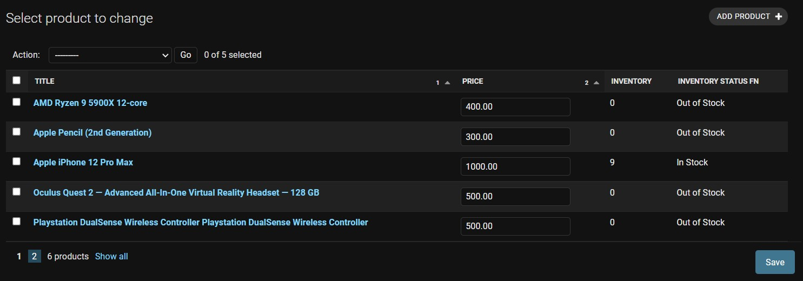
</div>

## Selecting Related Objects

```python
@admin.register(models.Review)
class ReviewAdmin(admin.ModelAdmin):
    list_display = ['product', 'product_price', 'body', 'vote']
    ordering = ['created_at']
    list_per_page = 5
    # Selecting Related Objects
    list_select_related = ['product']

    def product_price(self, review):
        return review.product.price
```

<div align="center">
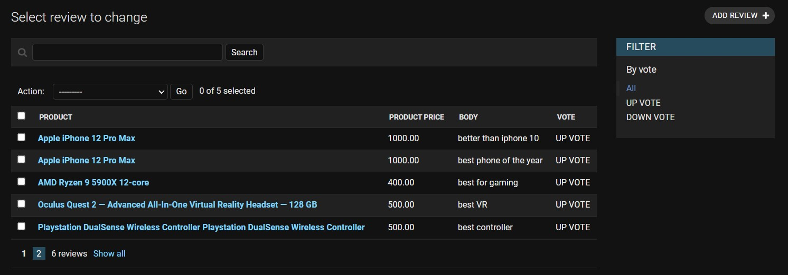
</div>

## Overriding the Base QuerySet

```python
@admin.register(models.Tag)
class TagAdmin(admin.ModelAdmin):
    list_display = ['name', 'products_count']
    ordering = ['name']
    list_per_page = 5

    @admin.display(ordering='products_count')
    def products_count(self, tag):
        return tag.products.count()
```

<div align="center">
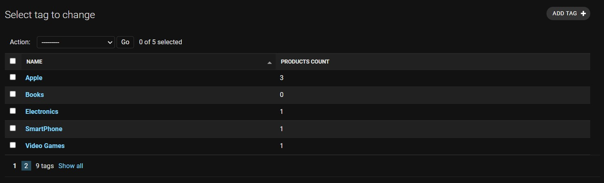
</div>

Still `products_count` is not sortable

> Cannot resolve keyword 'products_count' into field. Choices are: created_at, id, name, products, updated_at

```python
@admin.register(models.Tag)
class TagAdmin(admin.ModelAdmin):
    list_display = ['name', 'products_count']
    ordering = ['name']
    list_per_page = 5

    @admin.display(ordering='products_count')
    def products_count(self, tag):
        return tag.products.count()

    def get_queryset(self, request):
        qs = super().get_queryset(request)
        return qs.annotate(products_count=Count('products'))
```

<div align="center">

</div>

## Search Fields

```python
@admin.register(models.Product)
class ProductAdmin(admin.ModelAdmin):
    # ....
    search_fields = ['title__icontains']
    # ...
```

<div align="center">
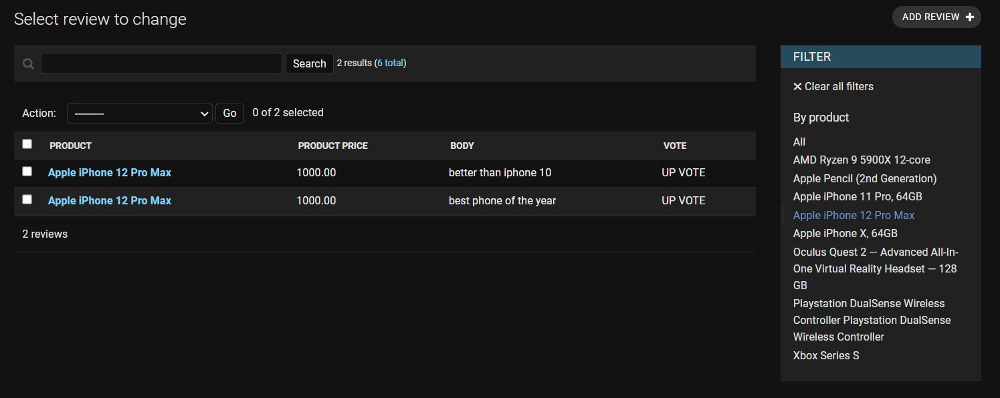
</div>

```python
class InventoryFilter(admin.SimpleListFilter):
    title = 'inventory'
    parameter_name = 'inventory'

    def lookups(self, request, model_admin):
        return (
            ('in', 'In Stock'),
            ('out', 'Out of Stock'),
        )

    def queryset(self, request, queryset):
        if self.value() == 'in':
            return queryset.filter(inventory__gt=0)
        if self.value() == 'out':
            return queryset.filter(inventory=0)


@admin.register(models.Product)
class ProductAdmin(admin.ModelAdmin):
    # l.....
    list_filter = [InventoryFilter]
```

<div align="center">
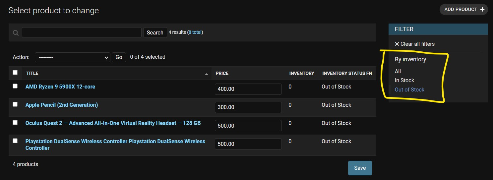
</div>

## Custom Actions

Clearing inventory of selected products:

<div align="center">
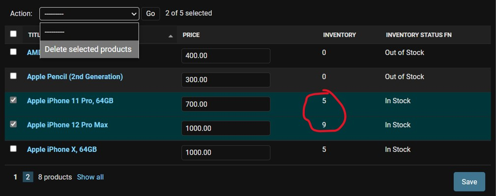
</div>

```python
from django.contrib import admin, messages
@admin.register(models.Product)
class ProductAdmin(admin.ModelAdmin):
    actions = ['clear_inventory']

    @admin.action(description='Clear Inventory')
    def clear_inventory(self, request, queryset):
        cleared_inventory = queryset.update(inventory=0)
        self.message_user(
            request, f'Cleared {cleared_inventory} inventory', messages.ERROR)
```

<div align="center">
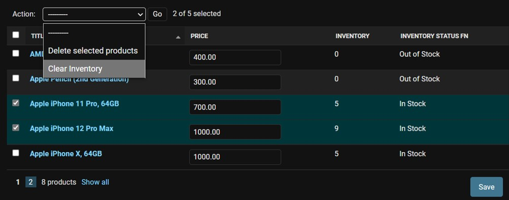
</div>

<div align="center">
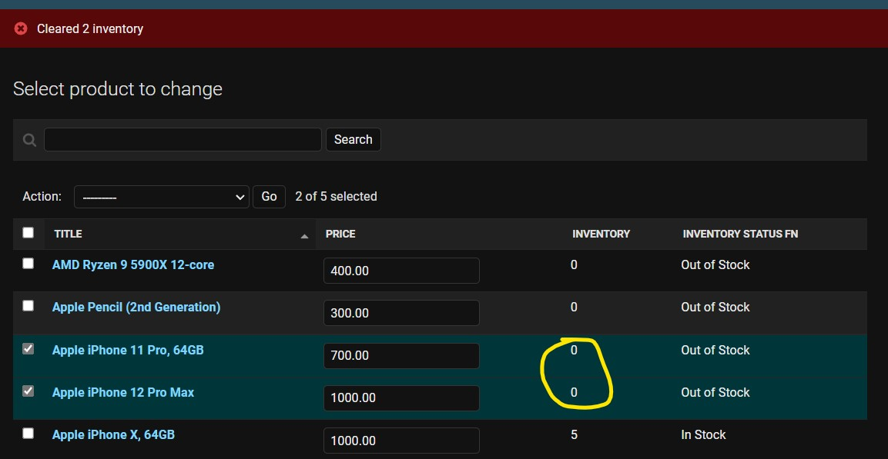
</div>

## Customizing Forms

### Autocomplete

<div align="center">
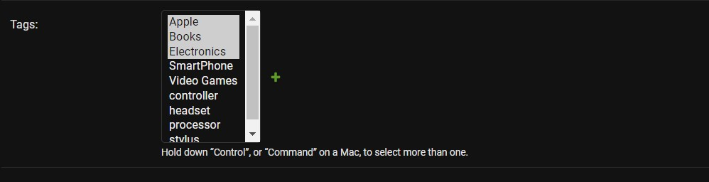
</div>


```python
@admin.register(models.Product)
class ProductAdmin(admin.ModelAdmin):

    autocomplete_fields = ['tags']
    # (admin.E040) TagAdmin must define "search_fields",
    # because it's referenced by ProductAdmin.autocomplete_fields.

@admin.register(models.Tag)
class TagAdmin(admin.ModelAdmin):
    search_fields = ['name']
```

<div align="center">
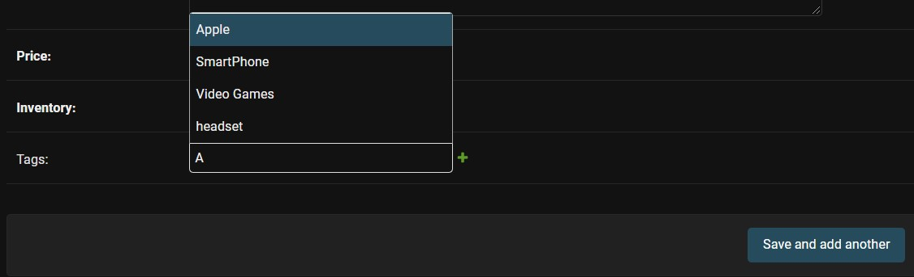
</div>