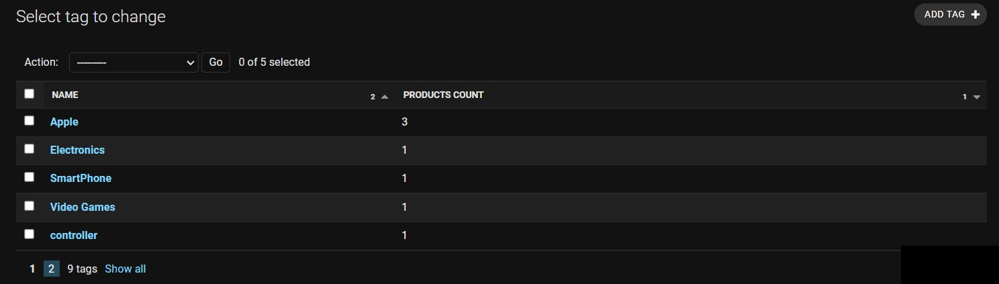

# Customizing the Admin Site

- [Customizing the Admin Site](#customizing-the-admin-site)
  - [Demo](#demo)
  - [Registering Models](#registering-models)
  - [Customizing List Page](#customizing-list-page)
  - [Adding Computed Columns](#adding-computed-columns)
  - [Selecting Related Objects](#selecting-related-objects)
  - [Overriding the Base QuerySet](#overriding-the-base-queryset)
  - [Search Fields](#search-fields)
  - [Custom Actions](#custom-actions)
  - [Customizing Forms](#customizing-forms)
    - [Autocomplete](#autocomplete)

## Demo

```python
from urllib.parse import urlencode

from django.contrib import admin
from django.db.models import Count
from django.urls import reverse
from django.utils.html import format_html

from .models import (Attribute, Category, Customer, Order, OrderItem, Product,
                     ProductAttribute, Review, Tag)


class ProductAttributeInline(admin.TabularInline):
    model = ProductAttribute
    autocomplete_fields = ['attribute']
    min_num = 1
    max_num = 10
    extra = 0  # Number of empty forms to show for adding attributes


class ProductInline(admin.TabularInline):
    model = Product
    min_num = 1
    max_num = 10
    extra = 0  # Number of empty forms to show for adding attributes


class LowStockFiltering(admin.SimpleListFilter):
    title = 'Low Stock'
    parameter_name = 'low_stock'  # this will be used in the url

    def lookups(self, request, model_admin):
        return (
            ('yes', 'Yes'),
            ('no', 'No'),
        )

    def queryset(self, request, queryset):
        if self.value() == 'yes':
            return queryset.filter(stock__lt=5)
        elif self.value() == 'no':
            return queryset.filter(stock__gte=5)


@admin.register(Product)
class ProductAdmin(admin.ModelAdmin):
    # ListPage customization START
    list_display = (
        'id',
        'title',
        # 'description',
        'status',
        'category',
        'price',
        # "stock",
        'low_stock',
        'created_at',
        'updated_at',
    )
    list_display_links = ('id', 'title')
    list_filter = ('category', 'created_at', 'updated_at', LowStockFiltering)
    list_editable = ('status', 'price', 'category',)
    list_per_page = 10
    list_select_related = ('category',)
    search_fields = ('title', )
    actions = ['clear_stock']
    # ListPage customization END

    # DetailPage customization START
    # Enabling autocomplete_fields for many-to-one and many-to-many fields
    autocomplete_fields = ['tags', 'category', ]
    # since ProductAttribute is a through model, we need to use inline
    inlines = [ProductAttributeInline]
    # DetailPage customization END

    def low_stock(self, product):
        if product.stock < 5:
            return f"Low({product.stock})"
        return product.stock

    @admin.action(description="Clear stock")
    def clear_stock(self, request, queryset):
        updated_count = queryset.update(stock=0)
        self.message_user(request, f'{updated_count} products updated')


@admin.register(Category)
class CategoryAdmin(admin.ModelAdmin):

    list_display = ('id', 'name', 'products_count')
    list_display_links = ('id', 'name')
    search_fields = ('name',)

    """
    product_count computed field start:

    1. we are using `get_queryset()` method to annotate the queryset with the count of products for each category.
    2. Then we are implementing `products_count` method to display the count of products for each category.
    3. Additionally we ordered the `products_count` column by using `admin.display` decorator and provided link to the products list page filtered by that category.
    """

    def get_queryset(self, request):
        qs = super().get_queryset(request)
        qs = qs.annotate(
            products_count=Count('products', distinct=True),
        )
        return qs

    @admin.display(ordering='products_count')
    def products_count(self, category):
        # simple
        # return category.products_count
        # add link
        url = (
            reverse("admin:app_product_changelist")
            + '?' +
            urlencode({'category__id': str(category.id)})
        )
        return format_html('<a href="{}">{}</a>', url, category.products_count)


@admin.register(Attribute)
class AttributeAdmin(admin.ModelAdmin):
    list_display = ('id', 'name', 'created_at', 'updated_at')
    list_display_links = ('id', 'name')
    list_filter = ('created_at', 'updated_at')
    search_fields = ('name',)
    date_hierarchy = 'created_at'


@admin.register(ProductAttribute)
class ProductAttributeAdmin(admin.ModelAdmin):
    list_display = (
        'id',
        'product',
        'attribute',
        'value',
        'created_at',
        'updated_at',
    )
    list_display_links = ('id', 'product', 'attribute')
    list_filter = ('product', 'attribute', 'created_at', 'updated_at')
    date_hierarchy = 'created_at'
    autocomplete_fields = ['product', 'attribute']
    search_fields = ('value', 'attribute__name')


@admin.register(Tag)
class TagAdmin(admin.ModelAdmin):
    list_display = ('id', 'name', 'created_at',
                    'updated_at',)  # 'products_count')
    list_display_links = ('id', 'name')
    list_filter = ('created_at', 'updated_at')
    search_fields = ('name',)
    date_hierarchy = 'created_at'


@admin.register(Review)
class ReviewAdmin(admin.ModelAdmin):
    list_display = (
        'id',
        'product',
        'body',
        'rating',
        'created_at',
        'updated_at',
    )
    list_display_links = ('id', 'product')
    list_filter = ('created_at', 'updated_at')
    date_hierarchy = 'created_at'
    autocomplete_fields = ['product']


@admin.register(Customer)
class CustomerAdmin(admin.ModelAdmin):
    list_display = ('id', 'name', 'email', 'phone', 'address')
    list_display_links = ('id', 'name', 'email')
    search_fields = ('name',)


@admin.register(Order)
class OrderAdmin(admin.ModelAdmin):
    list_display = (
        'id',
        'customer',
        'payment_method',
        'created_at',
        'updated_at',
    )
    list_display_links = ('id', 'customer')
    list_filter = ('created_at', 'updated_at')
    date_hierarchy = 'created_at'
    autocomplete_fields = ['customer']
    search_fields = ('customer__name',)


@admin.register(OrderItem)
class OrderItemAdmin(admin.ModelAdmin):
    list_display = (
        'id',
        'order',
        'product',
        'quantity',
        'unit_price',
        'created_at',
        'updated_at',
    )
    list_filter = ('order', 'product', 'created_at', 'updated_at')
    date_hierarchy = 'created_at'

    autocomplete_fields = ['order', 'product']

```

## Registering Models

```python
from django.contrib import admin

# default 1
# Register your models here.
# from .models import Author
# from app.models import Author
# admin.site.register(Author)

# default 2
# from . import models
# admin.site.register(models.Product)
# admin.site.register(models.Review)
# admin.site.register(models.Tag)
# admin.site.register(models.Book)
# admin.site.register(models.Author)

# or custom
@admin.register(models.Product)
class ProductAdmin(admin.ModelAdmin):
    list_display = ('title', 'price', 'created_at', 'updated_at')

```

## Customizing List Page

<div align="center">

</div>

```python
@admin.register(models.Product)
class ProductAdmin(admin.ModelAdmin):
    list_display = ['title', 'price', 'created_at', 'updated_at']
    list_editable = ['price']
    ordering = ['title']
    list_per_page = 5
```

<div align="center">

</div>

## Adding Computed Columns

```python
@admin.register(models.Product)
class ProductAdmin(admin.ModelAdmin):
    list_display = ['title', 'price', 'inventory', 'inventory_status_fn']
    list_editable = ['price']
    ordering = ['title']
    list_per_page = 5

    @admin.display(ordering='inventory')
    def inventory_status_fn(self, product):
        return 'In Stock' if product.inventory > 0 else 'Out of Stock'
```

<div align="center">

</div>

## Selecting Related Objects

```python
@admin.register(models.Review)
class ReviewAdmin(admin.ModelAdmin):
    list_display = ['product', 'product_price', 'body', 'vote']
    ordering = ['created_at']
    list_per_page = 5
    # Selecting Related Objects
    list_select_related = ['product']

    def product_price(self, review):
        return review.product.price
```

<div align="center">

</div>

## Overriding the Base QuerySet

```python
@admin.register(models.Tag)
class TagAdmin(admin.ModelAdmin):
    list_display = ['name', 'products_count']
    ordering = ['name']
    list_per_page = 5

    @admin.display(ordering='products_count')
    def products_count(self, tag):
        return tag.products.count()
```

<div align="center">

</div>

Still `products_count` is not sortable

> Cannot resolve keyword 'products_count' into field. Choices are: created_at, id, name, products, updated_at

```python
@admin.register(models.Tag)
class TagAdmin(admin.ModelAdmin):
    list_display = ['name', 'products_count']
    ordering = ['name']
    list_per_page = 5

    @admin.display(ordering='products_count')
    def products_count(self, tag):
        return tag.products.count()

    def get_queryset(self, request):
        qs = super().get_queryset(request)
        return qs.annotate(products_count=Count('products'))
```

<div align="center">

</div>

## Search Fields

```python
@admin.register(models.Product)
class ProductAdmin(admin.ModelAdmin):
    # ....
    search_fields = ['title__icontains']
    # ...
```

<div align="center">

</div>

```python
class InventoryFilter(admin.SimpleListFilter):
    title = 'inventory'
    parameter_name = 'inventory'

    def lookups(self, request, model_admin):
        return (
            ('in', 'In Stock'),
            ('out', 'Out of Stock'),
        )

    def queryset(self, request, queryset):
        if self.value() == 'in':
            return queryset.filter(inventory__gt=0)
        if self.value() == 'out':
            return queryset.filter(inventory=0)


@admin.register(models.Product)
class ProductAdmin(admin.ModelAdmin):
    # l.....
    list_filter = [InventoryFilter]
```

<div align="center">

</div>

## Custom Actions

Clearing inventory of selected products:

<div align="center">

</div>

```python
from django.contrib import admin, messages
@admin.register(models.Product)
class ProductAdmin(admin.ModelAdmin):
    actions = ['clear_inventory']

    @admin.action(description='Clear Inventory')
    def clear_inventory(self, request, queryset):
        cleared_inventory = queryset.update(inventory=0)
        self.message_user(
            request, f'Cleared {cleared_inventory} inventory', messages.ERROR)
```

<div align="center">

</div>

<div align="center">

</div>

## Customizing Forms

### Autocomplete

<div align="center">

</div>


```python
@admin.register(models.Product)
class ProductAdmin(admin.ModelAdmin):

    autocomplete_fields = ['tags']
    # (admin.E040) TagAdmin must define "search_fields",
    # because it's referenced by ProductAdmin.autocomplete_fields.

@admin.register(models.Tag)
class TagAdmin(admin.ModelAdmin):
    search_fields = ['name']
```

<div align="center">

</div>