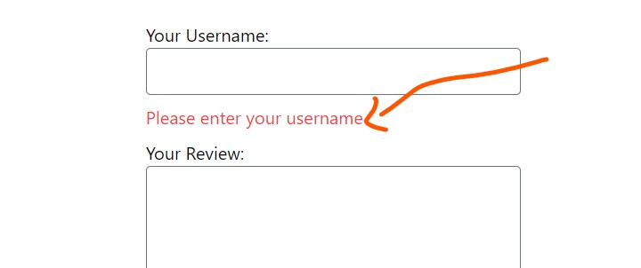
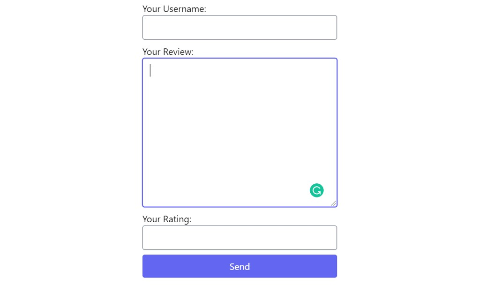

# Form in Django

- [Form in Django](#form-in-django)
  - [Handle Form Manually](#handle-form-manually)
  - [Handle Form with Django Form Class](#handle-form-with-django-form-class)
    - [Customizing the Form Controls](#customizing-the-form-controls)
    - [Customizing the Rendered HTML](#customizing-the-rendered-html)
    - [with or without novalidate attribute](#with-or-without-novalidate-attribute)
  - [Styling with Tailwind CSS](#styling-with-tailwind-css)
  - [Store Form Data in Database](#store-form-data-in-database)
    - [Manually](#manually)
    - [Using 🚀 ModelForm 🚀](#using--modelform-)

## Handle Form Manually

`urls.py`

```python
from django.urls import path
from . import views
urlpatterns = [
    path('', views.review, name='review'),
    path('thank-you/', views.thank_you),
]
```

`views.py`

```python
def review(request):
    if request.method == 'POST':
        username = request.POST['username']
        # print(username)
        if username == '' and len(username) <= 4:
            return render(request, 'reviews/review.html', {'has_error': True})
        return HttpResponseRedirect('thank-you')

    return render(request, 'reviews/review.html')

def thank_you(request):
    return render(request, 'reviews/thank_you.html')
```

`review.html`

```html
<form method="post" action="">
   
   
    <p>Please enter valid user name</p>
   
   <label for="username">Your Username</label>
   <input type="text" name='username' id='username'>
   <button>Send</button>
</form>
```

## Handle Form with Django Form Class

`app/forms.py`

```python
from django import forms
class ReviewForm(forms.Form):
    username = forms.CharField()
```

`app/views.py`

```python
from django.http.response import HttpResponseRedirect
from django.shortcuts import render
from .forms import ReviewForm

def review_class(request):
    # if request.method == 'POST':
    #     username = request.POST['username']
    #     # print(username)
    #     if username == '' and len(username) <= 4:
    #         return render(request, 'reviews/review.html', {'has_error': True})
    #     return HttpResponseRedirect('thank-you')
    if request.method == 'POST':
        form = ReviewForm(request.POST)
        if form.is_valid():
            print(form.cleaned_data)
            return HttpResponseRedirect('thank-you')
    else:
        form = ReviewForm()
    context = {
        'form': form
    }
    return render(request, 'reviews_class/review.html', context)

def thank_you(request):
    return render(request, 'reviews_class/thank_you.html')
```

`review.html`

```html
<form action="" method="post">
   
   {{form}}
   <!--
        
            <p>Please enter valid user name</p>
        
        <label for="username">Your Username</label>
        <input type="text" name='username' id='username'>
        <label for="pass"></label>
        <input type="text" name='pass' id='pass'>
    -->
   <button type='submit'>Send</button>
  </form>
```

### Customizing the Form Controls

```python
class ReviewForm(forms.Form):
    username = forms.CharField(label="Your Username", max_length=10, error_messages={
        'required': 'Please enter your username',
        'max_length': 'Please enter a username less than 10 characters',
    })
```

### Customizing the Rendered HTML

`app/forms.py`

```python
from django import forms
class ReviewForm(forms.Form):
    username = forms.CharField(label="Your Username", min_length=5, max_length=10, error_messages={
        'required': 'Please enter your username',
        'max_length': 'Please enter a username less than 10 characters',
        'min_length': 'Please enter a username greater than 5 characters'
    })
    review_text = forms.CharField(
        label="Your Review", max_length=200, widget=forms.Textarea)
    rating = forms.IntegerField(label="Your Rating", min_value=1, max_value=5)
```

`review.html`

```html
<form action="" method="post">
   
   
    <div>
     
      errors
     
     {{field.label_tag}}
     {{field}}
     {{field.errors}}
    </div>
   
   <button type='submit'>Send</button>
  </form>
```

### with or without novalidate attribute

Without novalidate attribute

```html
<form action="" method="post">
</form>
```

<div align="center">

</div>

With novalidate attribute

```html
<form action="" method="post" novalidate>
</form>
```

<div align="center">

</div>

## Styling with Tailwind CSS

Install the `@tailwindcss/forms` plugin from npm:

```python
# Using npm
npm install @tailwindcss/forms
# Using Yarn
yarn add @tailwindcss/forms
```

Then add the plugin to your `tailwind.config.js` file:

```javascript
// tailwind.config.js
module.exports = {
  theme: {
    // ...
  },
  plugins: [
    require('@tailwindcss/forms'),
    // ...
  ],
}
```

`form.html`

```python
<form action="" method="post" novalidate>
   
   
    <div class="form-control flex flex-col">
     {{field.label_tag}}
     {{field}}
     
      
       <span class="text-red-500 mb-2">{{error}}</span>
      
     
    </div>
   
   <button type='submit' class="bg-indigo-500 text-white rounded w-full p-2">Send</button>
  </form>
```

`tailwind.css`

```css
@import url('https://fonts.googleapis.com/css2?family=Inter&display=swap');

@tailwind base;
@tailwind components;
@tailwind utilities;

.form-control input,textarea {
 @apply mb-2 rounded focus:border-indigo-500 focus:ring-indigo-500;
}
```

<div align="center">

</div>

## Store Form Data in Database

### Manually

`models.py`

```python
from django.db import models
class Review(models.Model):
    username = models.CharField(max_length=100)
    review_text = models.CharField(max_length=500)
    rating = models.IntegerField()
```

```bash
python manage.py makemigrations
python manage.py migrate
```

`views.py`

```python
from .forms import ReviewForm
from .models import Review

def review_class(request):
    if request.method == 'POST':
        form = ReviewForm(request.POST)
        if form.is_valid():
            # print(form.cleaned_data)
            review = Review(
                username=form.cleaned_data['username'],
                review_text=form.cleaned_data['review_text'],
                rating=form.cleaned_data['rating']
            )
            review.save()
            return HttpResponseRedirect('thank-you')
    else:
        form = ReviewForm()
    context = {
        'form': form
    }
    return render(request, 'reviews_class/review.html', context)

```

### Using 🚀 ModelForm 🚀