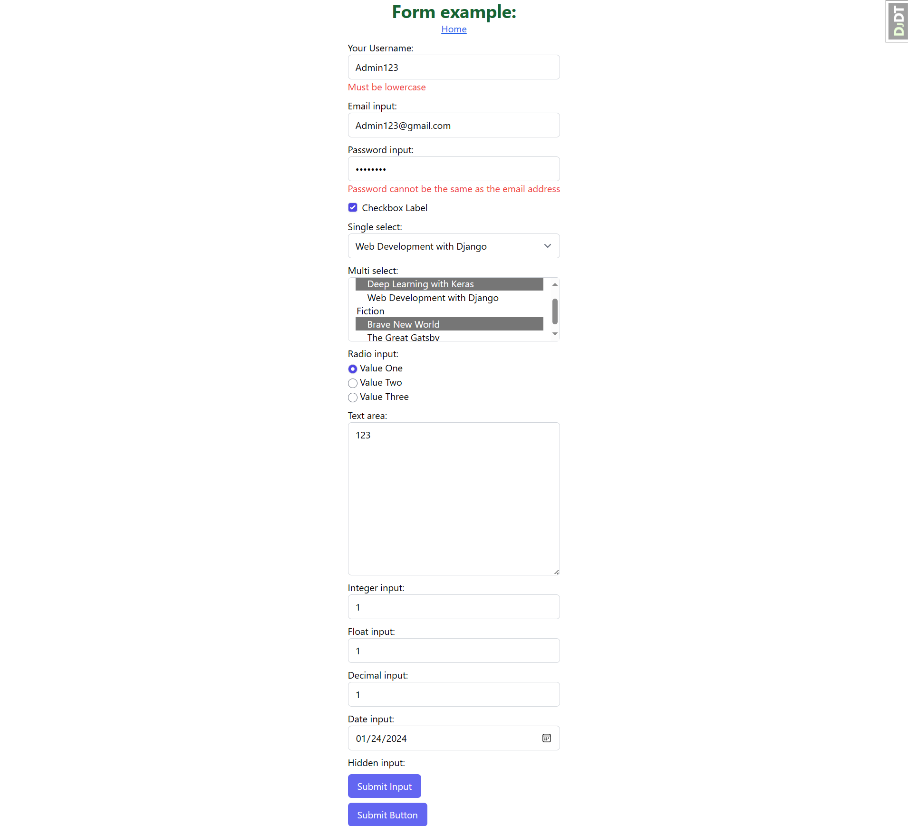

# Form in Django

- [Form in Django](#form-in-django)
	- [tailwind css styling basic for forms](#tailwind-css-styling-basic-for-forms)
	- [Handle Form Manually](#handle-form-manually)
	- [The Django Forms library](#the-django-forms-library)
		- [Defining a form](#defining-a-form)
		- [Rendering a form in a template](#rendering-a-form-in-a-template)
		- [Validating forms and retrieving Python values](#validating-forms-and-retrieving-python-values)
		- [Using 🚀 ModelForm 🚀](#using--modelform-)
		- [Create or Update](#create-or-update)


## tailwind css styling basic for forms

Install the plugin from npm:

```sh
pnpm install -D @tailwindcss/forms
```

Then add the plugin to your `tailwind.config.js` file:

```js
// tailwind.config.js
module.exports = {
  theme: {
    // ...
  },
  plugins: [
    require('@tailwindcss/forms'),
    // ...
  ],
}
```

Override the default styles of the plugin by adding the following to your `static\src\input.css` file:

```css
@tailwind base;
@tailwind components;
@tailwind utilities;

@layer base {
 input[type='text'],
 input[type='password'],
 input[type='email'],
 input[type='number'],
 input[type='search'],
 input[type='tel'],
 input[type='url'],
 input[type='date'],
 input[type='datetime-local'],
 input[type='month'],
 input[type='week'],
 input[type='time'],
 input[type='color'],
 select,
 select[multiple],
 textarea {
  @apply border-gray-300 rounded-md;
 }

 input[type='checkbox'] {
  @apply rounded-sm;
 }
 input[type='checkbox']:checked {
  @apply rounded border-gray-300 text-indigo-600 shadow-sm;
 }

 input[type='radio']:checked {
  @apply border-gray-300 text-indigo-600 shadow-sm;
 }

 input[type='text']:focus,
 input[type='password']:focus,
 input[type='email']:focus,
 input[type='number']:focus,
 input[type='search']:focus,
 input[type='tel']:focus,
 input[type='url']:focus,
 input[type='date']:focus,
 input[type='datetime-local']:focus,
 input[type='month']:focus,
 input[type='week']:focus,
 input[type='time']:focus,
 input[type='color']:focus,
 input[type='radio']:focus,
 input[type='checkbox']:focus,
 select:focus,
 select[multiple]:focus,
 textarea:focus {
  @apply border-indigo-300 ring ring-offset-0 ring-indigo-200 ring-opacity-50;
 }
}

```

## Handle Form Manually

<p align="center">

</p>

`templates\form\form-example.html`

```html


    <main class="flex flex-col items-center  min-h-screen">
        <h1 class="text-3xl text-green-800 font-bold">Form example:</h1>
        <a href= class="underline text-blue-600">Home</a>
        <form method="post" class="flex flex-col space-y-4">
            
            <p>
                <label for="id_text_input">Text Input</label>
                <br>
                <input id="id_text_input"
                       type="text"
                       name="text_input"
                       value=""
                       placeholder="Enter some text">
            </p>
            <p>
                <label for="id_password_input">Password Input</label>
                <br>
                <input id="id_password_input"
                       type="password"
                       name="password_input"
                       value=""
                       placeholder="Your password">
            </p>
            <p>
                <input id="id_checkbox_input"
                       type="checkbox"
                       name="checkbox_on"
                       value="Checkbox Checked"
                       checked>
                <label for="id_checkbox_input">Checkbox</label>
            </p>
            <p>
                <input id="id_radio_one_input"
                       type="radio"
                       name="radio_input"
                       value="Value One">
                <label for="id_radio_one_input">Value One</label>
                <input id="id_radio_two_input"
                       type="radio"
                       name="radio_input"
                       value="Value Two"
                       checked>
                <label for="id_radio_two_input">Value Two</label>
                <input id="id_radio_three_input"
                       type="radio"
                       name="radio_input"
                       value="Value Three">
                <label for="id_radio_three_input">Value Three</label>
            </p>
            <p>
                <label for="id_single_select">Single Select</label>
                <br>
                <select id="id_single_select" name="single_select">
                    <optgroup label="Non-Fiction">
                        <option value="1">Deep Learning with Keras</option>
                        <option value="2">Web Development with Django</option>
                    </optgroup>
                    <optgroup label="Fiction">
                        <option value="3">Brave New World</option>
                        <option value="4">The Great Gatsby</option>
                    </optgroup>
                </select>
            </p>
            <p>
                <label for="id_multi_select">Multiple Select</label>
                <br>
                <select id="id_multi_select" name="multi_select" multiple>
                    <optgroup label="Non-Fiction">
                        <option value="1">Deep Learning with Keras</option>
                        <option value="2">Web Development with Django</option>
                    </optgroup>
                    <optgroup label="Fiction">
                        <option value="3">Brave New World</option>
                        <option value="4">The Great Gatsby</option>
                    </optgroup>
                </select>
            </p>
            <p>
                <label for="id_text_area">Text Area</label>
                <br>
                <textarea name="text_area"
                          id="id_text_area"
                          placeholder="Enter multiple lines of text"></textarea>
            </p>
            <p>
                <label for="id_number_input">Number Input</label>
                <br>
                <input id="id_number_input"
                       type="number"
                       name="number_input"
                       value=""
                       step="any"
                       placeholder="A number">
            </p>
            <p>
                <label for="id_email_input">Email Input</label>
                <br>
                <input id="id_email_input"
                       type="email"
                       name="email_input"
                       value=""
                       placeholder="Your email address">
            </p>
            <p>
                <label for="id_date_input">Date Input</label>
                <br>
                <input id="id_date_input" type="date" name="date_input" value="2019-11-23">
            </p>
            <p>
                <input type="submit"
                       name="submit_input"
                       value="Submit Input"
                       class="py-2 px-4 rounded-md bg-indigo-500 text-white hover:bg-indigo-600 ">
            </p>
            <p>
                <button type="submit"
                        name="button_element"
                        value="Button Element"
                        class="py-2 px-4 rounded-md bg-indigo-500 text-white hover:bg-indigo-600 ">
                    Submit Button
                </button>
            </p>
            <input type="hidden" name="hidden_input" value="Hidden Value">
        </form>
    </main>


```

`templates\form\thank_you.html`

```html
<div>
    <h1>Thank you for your message</h1>
    <p>Thank you for your message. We will get back to you as soon as possible.</p>
    <a href= class="underline text-blue-600">Go to form</a>
</div>
```


`urls.py`

```python
from django.http import HttpRequest,
from django.shortcuts import redirect, render
from .views import index
from django.urls import include, path, reverse

def form_example(request: HttpRequest):
    if request.method == "POST":
        for name in request.POST:
            print(f"{name}: {request.POST[name]}")
            if 'multi_select' in name:
                print(f"{name}: {request.POST.getlist(name)}")
        return redirect(reverse('thank-you'))
    # if a GET (or any other method) we'll create a blank form
    return render(request, "form/form-example.html")

def thank_you(request):
    return render(request, 'form/thank_you.html')

urlpatterns = [
    path("", index, name='index'),
    path('form-example/', form_example, name='form-example'),
    path('thank-you/', thank_you, name='thank-you'),
]
```

`` is a template tag in Django used to include a `Cross-Site Request Forgery (CSRF)` token in your HTML form. CSRF is a security measure to protect against malicious attacks where an attacker tricks a user's browser into making an unintended request.  Django checks if the received CSRF token is valid for the user's session. If it's valid, the form submission is processed; otherwise, it is rejected.

- [https://knowledge-base.secureflag.com/vulnerabilities/cross_site_request_forgery/cross_site_request_forgery_vulnerability.html](https://knowledge-base.secureflag.com/vulnerabilities/cross_site_request_forgery/cross_site_request_forgery_vulnerability.html)

<p align="center">

</p>

## The Django Forms library

The Django Forms library allows you to quickly define a form using a Python class. This is done by creating a subclass of the base Django Form class. You can then use an instance of this class to render the form in your template and validate the input data.

Creating a Django form is similar to creating a Django model: you define a class that inherits from the `django.forms.Form` class. The class has attributes that are instances of different `django.forms.Field` subclasses. When rendered, the attribute name in the class corresponds to its input name in HTML.

<p align="center">

</p>

Form fields are more coupled to the type of data they collect rather than how they are displayed. To illustrate this, consider a `text` input and a `password` input. They both accept some typed-in text data, but the main difference between them is that the text is displayed in a text input whereas, with a password input, the text is obscured. In a Django form, both of these fields are represented using a `CharField`. Their difference in how they are displayed is set by changing the `widget` the field is using. Django defines several `widget` classes that define how a field should be rendered as HTML. They inherit from `django.forms.widgets.Widget`. For example, a `CharField` renders as a `text <input>` by default. If we use the PasswordInput widget, it will instead render as a `password <input>`. The other widgets we will use are as follows:

### Defining a form

`app/forms.py`

```python
from django import forms
from django.core.exceptions import ValidationError


def validate_lowercase(value):
    if value.lower() != value:
        raise ValidationError("Must be lowercase")


def validate_email_domain(value):
    if value.split("@")[-1].lower() != "gmail.com":
        raise ValidationError("The email address must be on the domain gmail.com.")


class ExampleForm(forms.Form):
    text_input = forms.CharField(
        label="Your Username",
        max_length=10,
        widget=forms.TextInput(
            attrs={"placeholder": "john123"}),
        validators=[validate_lowercase],
        error_messages={
            'required': 'Please enter your username',
            'max_length': 'Please enter a username less than 10 characters',
        })
    email_input = forms.EmailField(
        required=False,
        validators=[validate_email_domain])
    password_input = forms.CharField(
        min_length=6,
        widget=forms.PasswordInput(attrs={"placeholder": "Password Placeholder"}))
    # add checkbox label after the checkbox input
    checkbox_on = forms.BooleanField(label="Checkbox Label", required=False)
    CHOICES = (
        ("1", "Deep Learning with Keras"),
        ("2", "Web Development with Django"),
        ("3", "Brave New World"),
        ("4", "The Great Gatsby")
    )
    single_select = forms.ChoiceField(choices=CHOICES)
    MULTI_CHOICES = (
        (
            "Non-Fiction", (
                ("1", "Deep Learning with Keras"),
                ("2", "Web Development with Django")
            )
        ),
        (
            "Fiction", (
                ("3", "Brave New World"),
                ("4", "The Great Gatsby")
            )
        )
    )
    multi_select = forms.MultipleChoiceField(choices=MULTI_CHOICES)

    RADIO_CHOICES = (
        ("Value One", "Value One"),
        ("Value Two", "Value Two"),
        ("Value Three", "Value Three")
    )
    radio_input = forms.ChoiceField(choices=RADIO_CHOICES, widget=forms.RadioSelect)
    text_area = forms.CharField(widget=forms.Textarea)
    integer_input = forms.IntegerField(min_value=1, max_value=10)
    float_input = forms.FloatField()
    decimal_input = forms.DecimalField(max_digits=5, decimal_places=3)
    date_input = forms.DateField(widget=forms.DateInput(attrs={"type": "date"}))
    hidden_input = forms.CharField(widget=forms.HiddenInput, initial="Hidden Value")

    # Multi-field validation using clean()
    def clean(self):
        cleaned_data = super().clean()
        email = cleaned_data.get("email_input")
        password = cleaned_data.get("password_input")
        email_part = email.split("@")[0]
        if email_part == password:
            self.add_error("password_input", "Password cannot be the same as the email address")

```

### Rendering a form in a template

We’ve now seen how to create a form and add fields, and we’ve seen what the form looks like and what HTML is generated. But how is the form rendered in the template? We simply instantiate the form class and pass it to the render function in a view, using the context, just like any other variable

In html template we can render the form using `{{form}}`, `{{ form.as_table }}` , `{{ form.as_ul }}` or `{{ form.as_p }}` or we can loop through the fields and render them individually.

`templates\form\form-example2.html`

```html


    <main class="flex flex-col items-center  min-h-screen">
        <h1 class="text-3xl text-green-800 font-bold">Form example:</h1>
        <a href= class="underline text-blue-600">Home</a>
        <form method="post" class="flex flex-col space-y-2">
            
            <!-- {{ form.as_table }} -->
            <!-- {{ form.as_p }} -->
            
                <div class="flex flex-col">
                    
                        <div class="flex items-center space-x-2 w-full">
                            {{ field }}
                            <label for="{{ field.id_for_label }}">{{ field.label }}</label>
                        </div>
                    
                        {{ field.label_tag }}
                        {{ field }}
                    
                    <div class="text-red-500">{{ field.errors }}</div>
                </div>
            
            <p>
                <input type="submit"
                       name="submit_input"
                       value="Submit Input"
                       class="py-2 px-4 rounded-md bg-indigo-500 text-white hover:bg-indigo-600 ">
            </p>
            <p>
                <button type="submit"
                        name="button_element"
                        value="Button Element"
                        class="py-2 px-4 rounded-md bg-indigo-500 text-white hover:bg-indigo-600 ">
                    Submit Button
                </button>
            </p>
        </form>
    </main>


```

- [forms/#looping-over-the-form-s-fields](https://docs.djangoproject.com/en/5.0/topics/forms/#looping-over-the-form-s-fields)

### Validating forms and retrieving Python values

We will now look at the other part of what makes Django forms useful: their ability to automatically validate the form and then retrieve native Python objects and values from them.

In Django, a form can either be *unbound* or *bound*. These terms describe whether or not the form has had the submitted POST data sent to it for validation. So far, we have only seen *unbound* forms – they are instantiated without arguments, like this:

```python
form = ExampleForm()
```

A form is *bound* if it is called with some data to be used for validation, such as the POST data. A bound form can be created like this:

```python
form = ExampleForm(request.POST)
```

A bound form allows us to start using built-in validation-related tools on the form instance. First, there’s the `is_valid` method, which checks the form validity, then the `cleaned_data` attribute, which contains the values converted from strings into Python objects. The `cleaned_data` attribute is only available after the form has been cleaned, which is the process of cleaning up the data and converting it from strings into Python objects. The cleaning process runs during the `is_valid` call. An AttributeError will be raised if you try to access `cleaned_data` before calling `is_valid`.


`app\views.py`

```python
from .forms import ExampleForm

def form_example(request):
    if request.method == "POST":
        form = ExampleForm(request.POST)
        if form.is_valid():
            for name, value in form.cleaned_data.items():
                print(f"names: {name}, value: {value}, type: {type(value)}")
            # return render(request, "form/form-example2.html", {"form": ExampleForm()})
            return redirect(reverse('thank-you'))
    else:
        form = ExampleForm()

    return render(request, "form/form-example2.html", {"form": form})

def thank_you(request):
    return render(request, 'form/thank_you.html')

urlpatterns = [
    path("", index, name='index'),
    path('form-example/', form_example, name='form-example'),
    path('thank-you/', thank_you, name='thank-you'),
]
```

Using From class we can also add options dynamically to the form from the view.


```python
def form_example(request):
    Dynamic_CHOICES = [("dynamic", "Dynamic Option")]
    if request.method == "POST":
        form = ExampleForm(request.POST)
        form.fields['single_select'].choices = form.fields['single_select'].choices + Dynamic_CHOICES
        if form.is_valid():
            for name, value in form.cleaned_data.items():
                print(f"names: {name}, value: {value}, type: {type(value)}")

            # return render(request, "form/form-example2.html", {"form": ExampleForm()})
            return redirect(reverse('thank-you'))
    else:
        form = ExampleForm()

    form.fields['single_select'].choices = form.fields['single_select'].choices + Dynamic_CHOICES
    return render(request, "form/form-example2.html", {"form": form})
```

Clean data output:

```txt
names: text_input, value: admin123, type: <class 'str'>
names: email_input, value: Admin123@gmail.com, type: <class 'str'>
names: password_input, value: Admin1231, type: <class 'str'>
names: checkbox_on, value: True, type: <class 'bool'>
names: single_select, value: 2, type: <class 'str'>
names: multi_select, value: ['1', '3'], type: <class 'list'>
names: radio_input, value: Value One, type: <class 'str'>
names: text_area, value: 123, type: <class 'str'>
names: integer_input, value: 1, type: <class 'int'>
names: float_input, value: 1.0, type: <class 'float'>
names: decimal_input, value: 1, type: <class 'decimal.Decimal'>
names: date_input, value: 2024-01-24, type: <class 'datetime.date'>
names: hidden_input, value: Hidden Value, type: <class 'str'>
```

### Using 🚀 ModelForm 🚀

Luckily, Django provides a method of building Model instances from forms much more simply, with the `ModelForm` class. A `ModelForm` is a form that is built automatically from a particular model. It will inherit the validation rules from the model (such as whether fields are required or the maximum length of `CharField` instances, and so on). It provides an extra `__init__` argument (called instance) for automatically populating the initial values from an existing model. It also adds a save method to automatically persist the form data to the database. All you need to do to set up `ModelForm` is specify its model and what fields should be used: this is done on the `class Meta` attribute of the form class.

```python
class Category(models.Model):
    name = models.CharField(max_length=100)

class Tag(models.Model):
    name = models.CharField(max_length=50)

class Product(models.Model):
    name = models.CharField(max_length=200)
    description = models.TextField()
    price = models.DecimalField(max_digits=10, decimal_places=2)
    category = models.ForeignKey(Category, on_delete=models.CASCADE)
    tags = models.ManyToManyField(Tag)
```

`core\forms.py`

```python
from app.models import Category, Product, Tag

class ProductForm(forms.ModelForm):
    class Meta:
        model = Product
        fields = ['name', 'price', 'category', 'tags']
        exclude = ['description']
```

<p align="center">

</p>

If the form is valid, we can save the model instance. This can be done simply by calling the save method on the form. This will automatically create the instance, or simply save changes to the old one:


Additionally, the `ModelForm`'s `ModelChoiceField` and `ModelMultipleChoiceField` fields to configure the
`ForeignKey` and `ManyToManyField` fields respectively.


```python
class ProductForm(forms.ModelForm):
    category = forms.ModelChoiceField(queryset=Category.objects.all())
    tags = forms.ModelMultipleChoiceField(queryset=Tag.objects.all())

    class Meta:
        model = Product
        fields = ['name', 'price', 'category', 'tags']
        exclude = ['description']
```

For Advance:

- [/how-to-implement-grouped-model-choice-field.html](https://simpleisbetterthancomplex.com/tutorial/2019/01/02/how-to-implement-grouped-model-choice-field.html)
- [/customizing-modelmultiplechoicefield-in-a-django-form-96e3ae7e1a07](https://medium.com/@alfarhanzahedi/customizing-modelmultiplechoicefield-in-a-django-form-96e3ae7e1a07)

### Create or Update

```python
def form_edit(request, pk=None):
    if pk is not None:
        product = get_object_or_404(Product, pk=pk)
    else:
        product = None
    if request.method == "POST":
        form = ProductForm(request.POST, instance=product)
        if form.is_valid():
            updated_product = form.save()
            if product is None:
                messages.success(request, f"Product {updated_product.name} created!")
            else:
                messages.success(request, f"Product {updated_product.name} updated!")
            # redirect on edit page
            return redirect(reverse("form_edit", kwargs={"pk": updated_product.pk}))
    else:
        form = ProductForm(instance=product)

    return render(request, "form/form-example2.html", {"form": form})


urlpatterns = [
    path('form-edit/', form_edit, name='form_create'),
    path('form-edit/<int:pk>/', form_edit, name='form_edit'),
]
```

Add messages to the template:

`templates\form\message.html`

```html

    <div class="p-4 mb-4 border rounded-lg
        
            bg-green-200 border-green-500 text-green-700
        
            bg-blue-200 border-blue-500 text-blue-700
        
            bg-yellow-200 border-yellow-500 text-yellow-700
        
            bg-red-200 border-red-500 text-red-700
        
    "
    id='message'>
        <p>
            <em>{{ message.level_tag|title }}:</em>
            {{ message }}
        </p>
    </div>


<script>
    document.addEventListener('DOMContentLoaded', function () {
        setTimeout(function () {
            document.querySelectorAll('#message').forEach(function (element) {
                element.remove();
            });
        }, 3000);
    });
</script>
```

`templates\form\form-example2.html`

```html


    <main class="flex flex-col items-center  min-h-screen">

        

        <form method="post" class="flex flex-col space-y-2">
            <!-- ... -->
        </form>
    </main>

```

