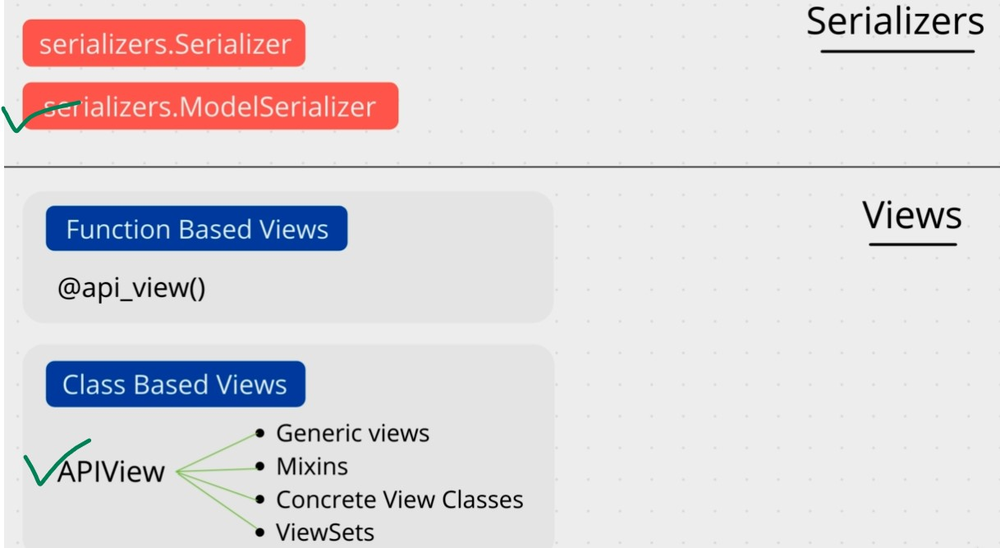
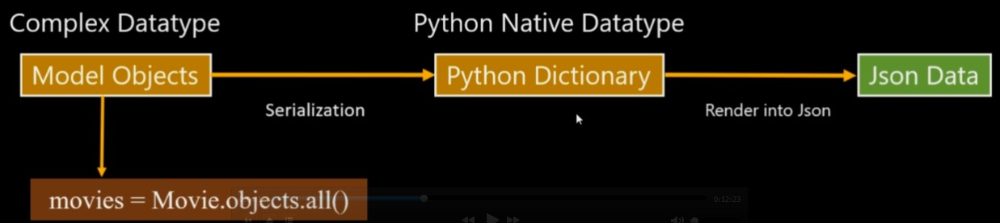

# Django Rest API

- [Django Rest API](#django-rest-api)
  - [Installation](#installation)
  - [Introduction](#introduction)
    - [Serializers](#serializers)
    - [Quick Examples](#quick-examples)
    - [Implement Non Primary Key Based CRUD Operations](#implement-non-primary-key-based-crud-operations)
    - [Implement Primary Key Based CRUD Operations](#implement-primary-key-based-crud-operations)
  - [Mixin in DRF](#mixin-in-drf)
    - [Mixin for List and Create (non primary key based CRUD)](#mixin-for-list-and-create-non-primary-key-based-crud)
    - [Mixin for Retrieve, Update and Destroy (primary key based CRUD)](#mixin-for-retrieve-update-and-destroy-primary-key-based-crud)
  - [Concrete View](#concrete-view)
    - [For List and Create (non primary key based CRUD)](#for-list-and-create-non-primary-key-based-crud)
    - [For Retrieve, Update and Destroy (primary key based CRUD)](#for-retrieve-update-and-destroy-primary-key-based-crud)
  - [ViewSet](#viewset)
    - [ModelViewSet](#modelviewset)
    - [Customizing the ModelViewSet](#customizing-the-modelviewset)
  - [Related Fields in Django REST Framework](#related-fields-in-django-rest-framework)

## Installation

```bash
pipenv install djangorestframework
```

## Introduction

Django REST Framework (DRF) is a widely-used, full-featured API framework designed for building RESTful APIs with Django. At its core, DRF integrates with Django's core features -- **models, views, and URLs** -- making it simple and seamless to create a RESTful API.

The core concepts:

- Serializers
- Views and ViewSets
- Routers
- Authentication and Authorization

DRF is composed of the following components:

- `Serializers` are used to convert Django QuerySets and model instances to (serialization) and from (deserialization) JSON (and a number of other data rendering formats like XML and YAML). Otherwise, we will get  `TypeError: Object of type 'User' is not JSON serializable`
- `Views` (along with `ViewSets`), which are similar to traditional Django views, handle RESTful HTTP requests and responses. The view itself uses serializers to validate incoming payloads and contains the necessary logic to return the response. Viewsets are coupled with routers, which map the views back to the exposed URLs.

<p align="center">

</p>

Although, DRF provides a number of ways to build APIs, the most common approach is to use a combination of `ModelSerializer` for serialization and `APIView` for views.

### Serializers

Again, serializers are used to convert Django QuerySets and model instances to and from JSON. Also, before deserializing the data, for incoming payloads, serializers validate the shape of the data.

Why does the data need to be (de)serialized?

Django QuerySets and model instances are Django-specific and, as such, not universal. In other words, the data structure needs to be converted into a simplified structure before it can be communicated over a RESTful API.

<p align="center">

</p>

### Quick Examples

To specify how incoming and outgoing data gets serialized and deserialized, you create a [SomeResource]Serializer class. So, if you have a Task model, you'd create a TaskSerializer class.

For example:

```python
# model
class Task(models.Model):
    title = models.CharField(max_length=200)
    description = models.TextField()
    completed = models.BooleanField(default=False)


# basic serializer
class TaskSerializer(serializers.Serializer):
    title = serializers.CharField()
    description = serializers.CharField()
    completed = serializers.BooleanField()
```

Similarly to how Django forms are created, when the serialization is closely coupled to the model, you can extend from `ModelSerializer`:

```python
class TaskSerializer(serializers.ModelSerializer):
    class Meta:
        model = Task
        fields = "__all__"
```

You can easily adapt a ModelSerializer to your needs:

```python
class TaskSerializer(serializers.ModelSerializer):
    short_description = serializers.SerializerMethodField()

    class Meta:
        model = Task
        fields = ["title", "description", "completed", "short_description"]
        read_only_fields = ['completed']

    def get_short_description(self, obj):
        return obj.description[:50]
```


Here, we-

- Explicitly defined the fields the serializer has access to via the `fields` attribute
- Set the `completed` field to `read-only`
- Added additional data -- `short_description`

### Implement Non Primary Key Based CRUD Operations

`serializers.py`

```python
class CategorySerializer(serializers.ModelSerializer):
    class Meta:
        model = Category
        fields = '__all__'

class ProductSerializer(serializers.ModelSerializer):
    class Meta:
        model = Product
        fields = '__all__'
```

Non Primary Key Based CRUD Operations involves getting lists, creating new objects.

```python
class CategoryListView(APIView):
    def get(self, request):
        categories = Category.objects.all()
        serializer = CategorySerializer(categories, many=True, context={'request': request})
        return Response(serializer.data)

    def post(self, request):
        serializer = CategorySerializer(data=request.data)
        if serializer.is_valid():
            serializer.save()
            return Response(serializer.data, status=status.HTTP_201_CREATED)
        return Response(serializer.errors, status=status.HTTP_400_BAD_REQUEST)
```

```python
urlpatterns = [
    path('categories/', CategoryListView.as_view(), name='category-list'),
    path('products/', ProductListView.as_view(), name='product-list'),
]
```

### Implement Primary Key Based CRUD Operations

```python
urlpatterns = [
    # ...
    path('categories/<int:pk>/', CategoryDetailView.as_view(), name='category-detail'),
    path('products/<int:pk>/', ProductDetailView.as_view(), name='product-detail'),
    path('products/<int:product_id>/reviews/', ProductReviewsView.as_view(), name='product-reviews'),
    path('products/<int:product_id>/reviews/<int:review_id>/', ProductReviewsView.as_view(), name='review-detail'),
]
```

```python
class CategoryDetailView(APIView):
    def get(self, request, pk):
        category = get_object_or_404(Category, pk=pk)
        serializer = CategorySerializer(category, context={'request': request})
        return Response(serializer.data)

    def put(self, request, pk):
        category = get_object_or_404(Category, pk=pk)
        serializer = CategorySerializer(category, data=request.data)
        if serializer.is_valid():
            serializer.save()
            return Response(serializer.data)
        return Response(serializer.errors, status=status.HTTP_400_BAD_REQUEST)

    def delete(self, request, pk):
        category = get_object_or_404(Category, pk=pk)
        category.delete()
        return Response(status=status.HTTP_204_NO_CONTENT)

class ProductDetailView(APIView):
    def get(self, request, pk):
        product = get_object_or_404(Product, pk=pk)
        serializer = ProductSerializer(product)
        return Response(serializer.data)

    def put(self, request, pk):
        product = get_object_or_404(Product, pk=pk)
        serializer = ProductSerializer(product, data=request.data)
        if serializer.is_valid():
            serializer.save()
            return Response(serializer.data)
        return Response(serializer.errors, status=status.HTTP_400_BAD_REQUEST)

    def delete(self, request, pk):
        product = get_object_or_404(Product, pk=pk)
        product.delete()
        return Response(status=status.HTTP_204_NO_CONTENT)

class ProductReviewsView(APIView):

    def get(self, request, product_id, review_id=None):
        product = Product.objects.get(pk=product_id)

        if review_id:
            review = Review.objects.get(pk=review_id, product=product)
            serializer = ReviewSerializer(review)
            return Response(serializer.data)

        reviews = Review.objects.filter(product=product)
        serializer = ReviewSerializer(reviews, many=True)
        return Response(serializer.data)

    def post(self, request, product_id):
        product = Product.objects.get(pk=product_id)
        serializer = ReviewSerializer(data=request.data)
        if serializer.is_valid():
            serializer.save(product=product)
            return Response(serializer.data, status=status.HTTP_201_CREATED)
        return Response(serializer.errors, status=status.HTTP_400_BAD_REQUEST)

    def put(self, request, product_id, review_id):
        product = Product.objects.get(pk=product_id)
        review = Review.objects.get(pk=review_id, product=product)
        serializer = ReviewSerializer(review, data=request.data)
        if serializer.is_valid():
            serializer.save(product=product)
            return Response(serializer.data)
        return Response(serializer.errors, status=status.HTTP_400_BAD_REQUEST)

    def delete(self, request, product_id, review_id):
        product = Product.objects.get(pk=product_id)
        review = Review.objects.get(pk=review_id, product=product)
        review.delete()
        return Response(status=status.HTTP_204_NO_CONTENT)
```

## Mixin in DRF

DRF provides a number of built-in generic class-based views that can be used to abstract common actions. These views are called `Mixins`. Additionally, in the UI, you can use the `GenericAPIView` class to create a custom view.
The HTML forms and the API endpoints are tightly coupled. So, you can use the same view to render HTML forms and to handle API requests.

### Mixin for List and Create (non primary key based CRUD)

```python
# v1
# class CategoryListView(APIView):
#     def get(self, request):
#         categories = Category.objects.all()
#         serializer = CategorySerializer(categories, many=True, context={'request': request})
#         return Response(serializer.data)
#
#     def post(self, request):
#         serializer = CategorySerializer(data=request.data)
#         if serializer.is_valid():
#             serializer.save()
#             return Response(serializer.data, status=status.HTTP_201_CREATED)
#         return Response(serializer.errors, status=status.HTTP_400_BAD_REQUEST)

# v2
class CategoryListView(mixins.ListModelMixin,
                       mixins.CreateModelMixin,
                       generics.GenericAPIView):
    queryset = Category.objects.all()
    serializer_class = CategorySerializer

    def get(self, request):
        return self.list(request)

    def post(self, request):
        return self.create(request)

# v1
# class ProductListView(APIView):
#     def get(self, request):
#         products = Product.objects.all()
#         serializer = ProductSerializer(products, many=True, context={'request': request})
#         return Response(serializer.data)
#
#     def post(self, request):
#         serializer = ProductSerializer(data=request.data)
#         if serializer.is_valid():
#             serializer.save()
#             return Response(serializer.data, status=status.HTTP_201_CREATED)
#         return Response(serializer.errors, status=status.HTTP_400_BAD_REQUEST)

# v2
class ProductListView(mixins.ListModelMixin,
                      mixins.CreateModelMixin,
                      generics.GenericAPIView):
    queryset = Product.objects.all()
    serializer_class = ProductSerializer

    def get(self, request):
        return self.list(request)

    def post(self, request):
        return self.create(request)
```

### Mixin for Retrieve, Update and Destroy (primary key based CRUD)

```python
# class CategoryDetailView(APIView):
#     def get(self, request, pk):
#         category = get_object_or_404(Category, pk=pk)
#         serializer = CategorySerializer(category, context={'request': request})
#         return Response(serializer.data)

#     def put(self, request, pk):
#         category = get_object_or_404(Category, pk=pk)
#         serializer = CategorySerializer(category, data=request.data)
#         if serializer.is_valid():
#             serializer.save()
#             return Response(serializer.data)
#         return Response(serializer.errors, status=status.HTTP_400_BAD_REQUEST)

#     def delete(self, request, pk):
#         category = get_object_or_404(Category, pk=pk)
#         category.delete()
#         return Response(status=status.HTTP_204_NO_CONTENT)

class CategoryDetailView(mixins.RetrieveModelMixin,
                         mixins.UpdateModelMixin,
                         mixins.DestroyModelMixin,
                         generics.GenericAPIView):
    queryset = Category.objects.all()
    serializer_class = CategorySerializer

    def get(self, request, pk):
        return self.retrieve(request, pk)

    def put(self, request, pk):
        return self.update(request, pk)

    def delete(self, request, pk):
        return self.destroy(request, pk)
```

For complex route pattern, we have to customize the `queryset`.

```python
# class ProductReviewsView(APIView):#     def get(self, request, product_id, review_id=None):
#         product = Product.objects.get(pk=product_id)

#         if review_id:
#             review = Review.objects.get(pk=review_id, product=product)
#             serializer = ReviewSerializer(review)
#             return Response(serializer.data)

#         reviews = Review.objects.filter(product=product)
#         serializer = ReviewSerializer(reviews, many=True)
#         return Response(serializer.data)

#     def post(self, request, product_id):
#         product = Product.objects.get(pk=product_id)
#         serializer = ReviewSerializer(data=request.data)
#         if serializer.is_valid():
#             serializer.save(product=product)
#             return Response(serializer.data, status=status.HTTP_201_CREATED)
#         return Response(serializer.errors, status=status.HTTP_400_BAD_REQUEST)

#     def put(self, request, product_id, review_id):
#         product = Product.objects.get(pk=product_id)
#         review = Review.objects.get(pk=review_id, product=product)
#         serializer = ReviewSerializer(review, data=request.data)
#         if serializer.is_valid():
#             serializer.save(product=product)
#             return Response(serializer.data)
#         return Response(serializer.errors, status=status.HTTP_400_BAD_REQUEST)

#     def delete(self, request, product_id, review_id):
#         product = Product.objects.get(pk=product_id)
#         review = Review.objects.get(pk=review_id, product=product)
#         review.delete()
#         return Response(status=status.HTTP_204_NO_CONTENT)

# v2
class ProductReviewsView(mixins.ListModelMixin,
                         mixins.CreateModelMixin,
                         mixins.RetrieveModelMixin,
                         mixins.UpdateModelMixin,
                         mixins.DestroyModelMixin,
                         generics.GenericAPIView):
    queryset = Review.objects.all()
    serializer_class = ReviewSerializer

    def get_queryset(self):
        product = get_object_or_404(Product, pk=self.kwargs['product_id'])
        return Review.objects.filter(product=product)

    def get_object(self):
        if 'review_id' in self.kwargs:
            return get_object_or_404(Review, pk=self.kwargs['review_id'])
        else:
            return None

    def get(self, request, *args, **kwargs):
        if 'review_id' in kwargs:
            return self.retrieve(request, *args, **kwargs)
        else:
            return self.list(request, *args, **kwargs)

    def post(self, request, *args, **kwargs):
        product = get_object_or_404(Product, pk=self.kwargs['product_id'])
        return self.create(request, product=product, *args, **kwargs)

    def put(self, request, *args, **kwargs):
        product = get_object_or_404(Product, pk=self.kwargs['product_id'])
        return self.update(request, product=product, *args, **kwargs)

    def delete(self, request, *args, **kwargs):
        if 'review_id' in kwargs:
            return self.destroy(request, *args, **kwargs)
        else:
            product = get_object_or_404(Product, pk=self.kwargs['product_id'])
            Review.objects.filter(product=product).delete()
            return Response(status=status.HTTP_204_NO_CONTENT)
```


## Concrete View

- [https://www.django-rest-framework.org/api-guide/generic-views/#concrete-view-classes](https://www.django-rest-framework.org/api-guide/generic-views/#concrete-view-classes)

### For List and Create (non primary key based CRUD)

```python

# class CategoryListView(APIView):
#     def get(self, request):
#         categories = Category.objects.all()
#         serializer = CategorySerializer(categories, many=True, context={'request': request})
#         return Response(serializer.data)

#     def post(self, request):
#         serializer = CategorySerializer(data=request.data)
#         if serializer.is_valid():
#             serializer.save()
#             return Response(serializer.data, status=status.HTTP_201_CREATED)
#         return Response(serializer.errors, status=status.HTTP_400_BAD_REQUEST)

# v2
# class CategoryListView(mixins.ListModelMixin,
#                        mixins.CreateModelMixin,
#                        generics.GenericAPIView):
#     queryset = Category.objects.all()
#     serializer_class = CategorySerializer

#     def get(self, request):
#         return self.list(request)

#     def post(self, request):
#         return self.create(request)

# v3

class CategoryListView(generics.ListCreateAPIView):
    queryset = Category.objects.all()
    serializer_class = CategorySerializer
```

### For Retrieve, Update and Destroy (primary key based CRUD)

```python
# class ProductDetailView(APIView):
#     def get(self, request, pk):
#         product = get_object_or_404(Product, pk=pk)
#         serializer = ProductSerializer(product)
#         return Response(serializer.data)

#     def put(self, request, pk):
#         product = get_object_or_404(Product, pk=pk)
#         serializer = ProductSerializer(product, data=request.data)
#         if serializer.is_valid():
#             serializer.save()
#             return Response(serializer.data)
#         return Response(serializer.errors, status=status.HTTP_400_BAD_REQUEST)

#     def delete(self, request, pk):
#         product = get_object_or_404(Product, pk=pk)
#         product.delete()
#         return Response(status=status.HTTP_204_NO_CONTENT)

# v2

# class ProductDetailView(mixins.RetrieveModelMixin,
#                         mixins.UpdateModelMixin,
#                         mixins.DestroyModelMixin,
#                         generics.GenericAPIView):
#     queryset = Product.objects.all()
#     serializer_class = ProductSerializer

#     def get(self, request, *args, **kwargs):
#         return self.retrieve(request, *args, **kwargs)

#     def put(self, request, *args, **kwargs):
#         return self.update(request, *args, **kwargs)

#     def delete(self, request, *args, **kwargs):
#         return self.destroy(request, *args, **kwargs)

class ProductDetailView(generics.RetrieveUpdateDestroyAPIView):
    queryset = Product.objects.all()
    serializer_class = ProductSerializer
```

## ViewSet

### ModelViewSet

- [https://testdriven.io/blog/drf-views-part-3/#modelviewset](https://testdriven.io/blog/drf-views-part-3/#modelviewset)

ModelViewSet provides default create, retrieve, update, partial_update, destroy and list actions since it uses GenericViewSet and all of the available mixins.

```python
# class CategoryListView(generics.ListCreateAPIView):
#     queryset = Category.objects.all()
#     serializer_class = CategorySerializer

# class CategoryDetailView(generics.RetrieveUpdateDestroyAPIView):
#     queryset = Category.objects.all()
#     serializer_class = CategorySerializer

class CategoryViewSet(viewsets.ModelViewSet):
    queryset = Category.objects.all()
    serializer_class = CategorySerializer


# class ProductListView(generics.ListCreateAPIView):
#     queryset = Product.objects.all()
#     serializer_class = ProductSerializer

# class ProductDetailView(generics.RetrieveUpdateDestroyAPIView):
#     queryset = Product.objects.all()
#     serializer_class = ProductSerializer

class ProductViewSet(viewsets.ModelViewSet):
    queryset = Product.objects.all()
    serializer_class = ProductSerializer
```

ViewSets come with a router class that automatically generates the URL configurations.

DRF comes with two routers out-of-the-box:

- DefaultRouter
- SimpleRouter

The main difference between them is that `DefaultRouter` includes a default API root view:

Defining the router:

```python
from . import views
from rest_framework.routers import DefaultRouter
router = DefaultRouter()
router.register(r'products', views.ProductViewSet)
router.register(r'categories',  views.CategoryViewSet)

urlpatterns = [
    # path('categories/', views.CategoryListView.as_view(), name='category-list'),
    # path('products/', views.ProductListView.as_view(), name='product-list'),
    # path('categories/<int:pk>/', views.CategoryDetailView.as_view(), name='category-detail'),
    # path('products/<int:pk>/', views.ProductDetailView.as_view(), name='product-detail'),
    path("", include(router.urls)),
]
```

### Customizing the ModelViewSet

```python
class ProductReviewsViewSet(viewsets.ModelViewSet):
    serializer_class = ReviewSerializer

    def get_queryset(self):
        product_id = self.kwargs.get('product_id')
        if self.kwargs.get('review_id'):
            return Review.objects.filter(pk=self.kwargs['review_id'], product__pk=product_id)
        return Review.objects.filter(product__pk=product_id)

    def perform_create(self, serializer):
        product_id = self.kwargs.get('product_id')
        product = Product.objects.get(pk=product_id)
        serializer.save(product=product)

    def perform_update(self, serializer):
        product_id = self.kwargs.get('product_id')
        product = Product.objects.get(pk=product_id)
        serializer.save(product=product)

    def perform_destroy(self, instance):
        instance.delete()
```

```python
# ...
router.register(r'products/(?P<product_id>.*)/reviews', views.ProductReviewsViewSet, basename='product-reviews')
urlpatterns = [
    path("", include(router.urls)),
    # path('products/<int:product_id>/reviews/', views.ProductReviewsView.as_view(), name='product-reviews'),
    # path('products/<int:product_id>/reviews/<int:review_id>/', views.ProductReviewsView.as_view(), name='review-detail'),
]
```

## Related Fields in Django REST Framework

DRF tip:

To represent model relationships in a serializer, you can use various related fields that represent the target of the relationship in different ways:

- `StringRelatedField`
- `PrimaryKeyRelatedField`
- `HyperlinkedRelatedField`
- `SlugRelatedField`
- `HyperlinkedIdentityField`

Examples:

```python
class TagSerializer(serializers.ModelSerializer):

    posts = serializers.StringRelatedField(many=True)
    # result: ["My story" (from __str__ method)]


    posts = serializers.PrimaryKeyRelatedField(many=True, read_only=True)
    # result: [1]


    posts = serializers.HyperlinkedRelatedField(
        many=True,
        read_only=True,
        view_name='post-detail'
    )
    # result: ["http://127.0.0.1:8000/1/"]


    posts = serializers.SlugRelatedField(
        many=True,
        read_only=True,
        slug_field='title'
     )
    # result: ["My story" (from title field)]


    tag_detail = serializers.HyperlinkedIdentityField(view_name='tag-detail')
    # result: "http://127.0.0.1:8000/tags/1/"
    # *HyperlinkedIdentityField is used for current object, not related objects
```
