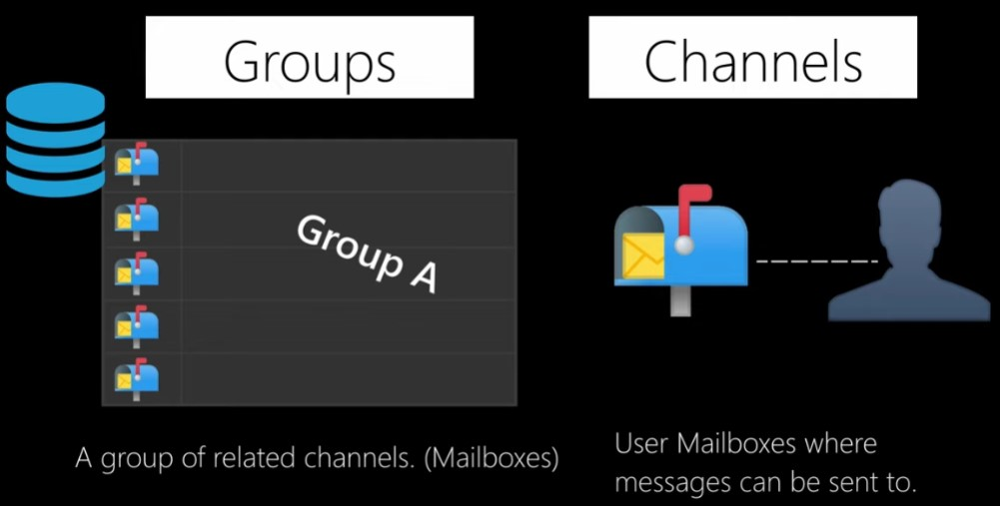

d# Django Channels + HTMX

- [What is Django Channels?](#what-is-django-channels)
- [Sync vs Async](#sync-vs-async)
- [Install and setup channels](#install-and-setup-channels)
- [WebSocket consumer](#websocket-consumer)
  - [Adding Routers for WebSocket connections](#adding-routers-for-websocket-connections)
  - [Setting up ASGI Application](#setting-up-asgi-application)
- [Implementing the WebSocket Client](#implementing-the-websocket-client)
  - [Sending Messages with HTMX](#sending-messages-with-htmx)
  - [Receiving Messages from WebSocket](#receiving-messages-from-websocket)
- [Enabling a channel layer](#enabling-a-channel-layer)
  - [Channels and groups:](#channels-and-groups)
  - [Setting up a channel layer with Redis](#setting-up-a-channel-layer-with-redis)
  - [Updating the consumer to broadcast messages](#updating-the-consumer-to-broadcast-messages)


## What is Django Channels?

Django Channels, often referred to as just Channels, enhances Django's capabilities by enabling the handling of not only HTTP but also protocols requiring long-lived connections like WebSockets, MQTT for IoT applications, chatbots, real-time notifications, and more. It seamlessly integrates with Django's core features such as authentication and sessions.

A typical Channels setup involves:

<p align="center">

</p>
## Sync vs Async
Channels necessitates frequent transitions between synchronous and asynchronous code execution due to the differences between Channels and Django. For instance, while accessing the Django database, synchronous code is required, whereas interaction with the Channels channel layer mandates asynchronous code.

To facilitate this transition, Django provides built-in asgiref functions:

- `sync_to_async`: Converts a synchronous function into an asynchronous one.
- `async_to_sync`: Converts an asynchronous function into a synchronous one.

These utilities streamline the integration of synchronous and asynchronous code within a Channels-powered Django application.


## Install and setup channels

To integrate WebSocket functionality into our Django project, we'll utilize Django Channels, a package that extends Django's capabilities to handle long-running connections and asynchronous protocols like WebSockets.

Begin by installing Django Channels along with Daphne, which serves as the web server gateway interface for asynchronous web applications:

```bash
pip install -U channels["daphne"]
```

This command installs the latest versions of both Django Channels and Daphne.


Additionally, ensure that both `channels` and `daphne` are added to the `INSTALLED_APPS` configuration of your Django project. It's essential to prioritize the `daphne` app by placing it at the top of the list of applications.
Also add `ASGI_APPLICATION` to the settings file.


```python
INSTALLED_APPS = [
    "daphne",
    # ...
    # ...
    "channels",
]

ASGI_APPLICATION = "config.asgi.application"
```


Since we'll be using WebSockets instead of HTTP to communicate from the client to the server, we need to wrap our ASGI config with `ProtocolTypeRouter` in `config/asgi.py`:


```python
import os
from channels.routing import ProtocolTypeRouter
from django.core.asgi import get_asgi_application

os.environ.setdefault("DJANGO_SETTINGS_MODULE", "config.settings")

application = ProtocolTypeRouter({
'http': get_asgi_application(),
})
```

## WebSocket consumer

Consumers are the equivalent of Django views for asynchronous applications. As mentioned, they handle WebSockets in a very similar way to how traditional views handle HTTP requests. Consumers are ASGI applications that can handle messages, notifications, and other things. Unlike Django views, consumers are built for longrunning communication. URLs are mapped to consumers through routing classes that allow you to combine and stack consumers.

Create a new file inside the `chat` application directory and name it `consumers.py`.
Add the following code to it:


```python
from channels.generic.websocket import AsyncJsonWebsocketConsumer
from django.template.loader import render_to_string

class ChatConsumer(AsyncJsonWebsocketConsumer):
    async def connect(self):
        # accept connection
        await self.accept()
        print("*" * 50)
        print("You are connected to websocket")

    # receive messages
    async def receive_json(self, data):
        print("*" * 50)
        print("WebSocket received data:")
        print(data)
        try:
            chat_message = data.get('chat_message')
            print(chat_message)
            if not chat_message:
                # Handle case where chat message is not present in data
                return

            # Render template with message and time
            html = render_to_string("chat/partials/ws_response.html",
                                    {'message': chat_message})

            # Send HTML response via WebSocket
            await self.send(text_data=html)

        except Exception as e:
            # Log any errors for debugging
            print(f"Error occurred: {e}")
```

### Adding Routers for WebSocket connections

Next, add the following code to a new file named `example_channels/routing.py` to configure routes, which function almost identically to Django URL configuration:

```python
from django.urls import path

from . import consumers

websocket_urlpatterns = [
    path('ws/chat', consumers.ChatConsumer.as_asgi()),
]
```

### Setting up ASGI Application


Register the `routing.py` file inside `config/asgi.py`:

```python
from chat import routing
import os
from django.core.asgi import get_asgi_application
from channels.auth import AuthMiddlewareStack
from channels.routing import ProtocolTypeRouter, URLRouter

os.environ.setdefault('DJANGO_SETTINGS_MODULE', 'config.settings')


application = ProtocolTypeRouter({
    'http': get_asgi_application(),
    "websocket": AuthMiddlewareStack(
        URLRouter(
            routing.websocket_urlpatterns
        )
    )
})
```


## Implementing the WebSocket Client

In the provided code snippet, a WebSocket client is implemented using JavaScript. Let's break down the implementation:

```html
<script>
    var url = 'ws://' + window.location.host +'/ws/chat';
    var chatSocket = new WebSocket(url);
</script>
```

Here's what's happening:

- `url` variable: It is set to the WebSocket URL. The URL is composed of the current host (`window.location.host`) and the WebSocket endpoint (`/ws/chat`). This endpoint should match the URL pattern defined in the `routing.py` file on the server side.

- `chatSocket` variable: It initializes a new WebSocket object connecting to the specified URL. This establishes the WebSocket connection to the server.

### Sending Messages with HTMX

To integrate HTMX with WebSocket for sending and receiving messages, you can utilize HTMX's WebSocket extension.

```html
<div id="content"></div>
<div hx-ext="ws" ws-connect="/ws/chat">
    <form id="form" ws-send>
        <input type="text" name="chat_message" id="chat_message" placeholder="Type a message...">
    </form>
</div>
```

Here's how it works:

- `hx-ext="ws"` attribute: Enables the WebSocket extension for HTMX.

- `ws-connect="/ws/chat"` attribute: Specifies the WebSocket URL to connect to. This URL should match the WebSocket URL pattern defined in the server-side routing.

- `ws-send` attribute: Indicates that when the form is submitted, the form values will be sent to the nearest enclosing WebSocket connection. In this case, it will send the data to the `/ws/chat` endpoint.

### Receiving Messages from WebSocket

On the server-side, when a message is received from the WebSocket, the `ChatConsumer` class handles it. After processing the message, it sends back HTML response via the WebSocket.

```python
async def receive_json(self, data):
        # Process received data

        # Render HTML response
        html = render_to_string("chat/partials/ws_response.html",{'message': chat_message})

        # Send HTML response via WebSocket
        await self.send(text_data=html)
```

The `ws_response.html` template contains the structure for displaying the received message content.

```html
<div hx-swap-oob="beforeend:#content">
    <div>
        {{ message }}
    </div>
</div>
```

This template is used to format the message content received from the WebSocket. The `hx-swap-oob` attribute specifies where to insert the content. In this case, it's appending the message to the `#content` element.

## Enabling a channel layer

A channel layer is a kind of communication system. It allows multiple consumer instances to talk with each other, and with other parts of Django.

### Channels and groups:

Channel layers provide two abstractions to manage communications: `channels` and `groups`:

- **Channel**:
  - Represents a communication pathway between WebSocket clients and the server.
  - Each channel(client) has a unique name. (`self.channel_name` in consumers)
  - WebSocket clients send messages to specific channels, and consumers listen on these channels to receive messages.

- **Group**:
  - A collection of one or more channels(clients), grouped together for a common purpose- like conversations, chat rooms, or notifications.
  - In this application, groups are used to logically group channels related to specific conversations.
  - WebSocket clients joining a conversation get added to the corresponding conversation group.
  - Messages sent within a conversation are broadcasted to all channels within the conversation group, allowing all participants to receive the message.

<p align="center">

</p>


### Setting up a channel layer with Redis

To enable a channel layer, you need to configure a channel backend. Django Channels supports several channel backends, including Redis, in-memory, and more.

For this example, we'll use Redis as the channel backend. Install the `channels-redis` package:

```bash
pipenv install channels-redis
```

> Note that you need to have Redis installed and running on your system to use it as a channel backend.


Edit the` settings.py` file of the educa project and add the following code to it:

```python
CHANNEL_LAYERS = {
    'default': {
        'BACKEND': 'channels_redis.core.RedisChannelLayer',
        'CONFIG': {
            'hosts': [('127.0.0.1', 6379)],
        },
    },
}
```

Open the Django shell using the following command: `python manage.py shell`

To verify that the channel layer can communicate with Redis, write the following code to send a message to a test channel named `test_channel` and receive it back:


```python
import channels.layers
from asgiref.sync import async_to_sync
channel_layer = channels.layers.get_channel_layer()
async_to_sync(channel_layer.send)('test_channel', {'message':'hello'})
async_to_sync(channel_layer.receive)('test_channel')
```

### Updating the consumer to broadcast messages

You will edit the `ChatConsumer` to utilize the channel layer, employing a channel group for each conversation. Each conversation's group name will be constructed using its unique conversation ID. ChatConsumer instances will be aware of the group name associated with their conversation, enabling communication among participants within the same conversation.

Passing the conversation ID to the consumer is necessary to create the group name. You can do this by including the conversation ID in the WebSocket URL. For example, the URL could be `/ws/chat/1/`, where `1` is the conversation ID.

Updated route def:

```python
from django.urls import path

from . import consumers

websocket_urlpatterns = [
    path('ws/chat/<int:conversation_id>', consumers.ChatConsumer.as_asgi()),
]
```


Here's the updated frontend code to connect to the WebSocket with the conversation ID:

```html
<div hx-ext="ws" ws-connect="/ws/chat/{{current_conversation.id}}" >
    <form id="form" ws-send>
        <input type="text" name="chat_message" id="chat_message" placeholder="Type a message...">
    </form>
</div>
```

Receive the conversation ID in the `ChatConsumer` and use it to create the group name:

```python
# from asgiref.sync import sync_to_async
from channels.db import database_sync_to_async
from channels.generic.websocket import AsyncJsonWebsocketConsumer
from django.template.loader import render_to_string
from chat.models import Conversation, Message
from django.contrib.auth import get_user_model
User = get_user_model()

class ChatConsumer(AsyncJsonWebsocketConsumer):
    async def connect(self):
        print("*" * 50)
        print("You are connected to websocket")
        # pprint(self.scope)
        self.user = self.scope["user"]
        print(self.user.username)
        # extract conversation id from the scope
        self.conversation_id = self.scope['url_route']['kwargs']['conversation_id']
        print(f"Conversation ID: {self.conversation_id}")
        self.conversation_group_name = f'chat_{self.conversation_id}'

        # Verify if user is part of the conversation
        is_participant = await self.check_participant()

        if not is_participant:
            await self.close()
            print("You are not part of this conversation")
            return

        # accept connection
        await self.accept()

        # Join conversation group
        await self.channel_layer.group_add(
            self.conversation_group_name,
            self.channel_name
        )  # adding the client/channel to the group

        print(f"User {self.user.username} has joined the conversation")

    @database_sync_to_async  # otherwsie it will raise an error: You cannot call this from an async context - use a thread or sync_to_async
    def check_participant(self):
        try:
            conversation = Conversation.objects.get(id=self.conversation_id)
            return self.user in conversation.participants.all()
        except Conversation.DoesNotExist:
            return False
```

- **WebSocket Connection**: Upon a client's connection attempt (`connect` method), the `ChatConsumer` verifies if the user is authenticated and authorized to participate in the specified conversation. If not, the connection is closed.

Receive messages and broadcast them to the conversation group:

```python
class ChatConsumer(AsyncJsonWebsocketConsumer):
    # .....
    # receive htmx
    async def receive_json(self, data):
        try:
            message_content = data.get('chat_message')
            print(message_content)
            if not message_content:
                # Handle case where chat message is not present in data
                return

            # Create and save message
            message = await self.create_message(message_content)

            # Broadcast message to conversation group
            await self.channel_layer.group_send(
                self.conversation_group_name,
                {
                    'type': 'chat_message',
                    'message': message.content,
                    'sender': message.sender.username,
                    'timestamp': message.timestamp.strftime('%Y-%m-%d %H:%M:%S')
                }
            )

        except Exception as e:
            # Log any errors for debugging
            print(f"Error occurred: {e}")

    @database_sync_to_async
    def create_message(self, content):
        return Message.objects.create(conversation_id=self.conversation_id, sender=self.user, content=content)

    async def chat_message(self, event):
        # Send message to WebSocket
        message_sender = event['sender']
        message_content = event['message']
        message_timestamp = datetime.datetime.fromisoformat(event['timestamp'])

        if message_sender == self.user.username:
            # Render template with message and time
            html = render_to_string("chat/partials/sender.html",
                                    {"message": {
                                        "content": message_content,
                                        "timestamp": message_timestamp}
                                     })

            # Send HTML response via WebSocket
            await self.send(text_data=html)
        else:
            # Render template with message and time
            html = render_to_string("chat/partials/receiver.html",
                                    {"message": {
                                        "content": message_content,
                                        "timestamp": message_timestamp}
                                     })

            # Send HTML response via WebSocket
            await self.send(text_data=html)

    async def disconnect(self, close_code):
        # Leave conversation group
        await self.channel_layer.group_discard(
            self.conversation_group_name,
            self.channel_name
        )
        print(f"User {self.user.username} has left the conversation")
```

- **Message Sending and Receiving**: The `receive_json` method handles incoming messages from the WebSocket. It extracts the message content, creates a new message object, and broadcasts it to all participants in the conversation.
- **Database Integration**: The `create_message` method asynchronously creates a new message object in the database, associating it with the current conversation and user.
- **HTML Response Rendering**: In the `chat_message` method, different HTML responses are sent to clients based on whether the message sender is the current user or another participant. This ensures a distinct visual representation of sent and received messages.
- **Database Access with `database_sync_to_async`**: Database operations are performed asynchronously using the `database_sync_to_async` decorator, ensuring non-blocking behavior within the consumer.

