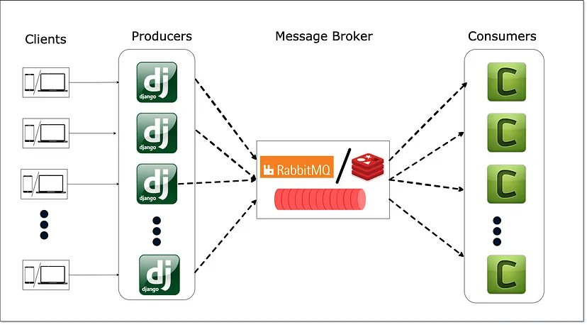
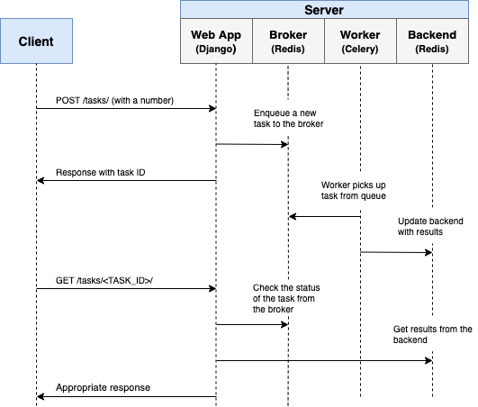

# Django Celery + Channels

- [Django Celery + Channels](#django-celery--channels)
  - [Introduction](#introduction)
    - [Background/Asynchronous Tasks](#backgroundasynchronous-tasks)
    - [Workflow](#workflow)
    - [Configure Celery](#configure-celery)
  - [Creating and Executing tasks](#creating-and-executing-tasks)

## Introduction

Celery is an asynchronous task queue that is used in Python to run tasks asynchronously. Celery can be used to offload time-consuming or CPU-intensive tasks to the background, freeing up the main Django application to handle requests more quickly. This means you can offload tasks from the main request/response cycle within Django. This is particularly useful for long running tasks, such as sending emails, or processing data. And celery can also schedule tasks to run on demand or at regular intervals.


<p align="center">

</p>

Additional packages:

- `django-celery-beat` integrates Celery and Celery Beat into your Django project. It provides a convenient way to define periodic tasks using Django's models and admin interface.
- `django-celery-results` enables to store the results of any given celery task in the Django database


Install the packages:

```bash
pipenv install redis django-celery-beat django-celery-results gevent
```

### Background/Asynchronous Tasks

Again, to improve user experience, long-running processes should be run outside the normal HTTP request/response flow, in a background process.

Examples:

- Running machine learning models
- Sending confirmation emails
- Web scraping and crawling
- Analyzing data
- Processing images
- Generating reports

As you're building out an app, try to distinguish tasks that should run during the request/response lifecycle, like CRUD operations, from those that should run in the background.

### Workflow

Our goal is to develop a Django application that works in conjunction with Celery to handle long-running processes outside the normal request/response cycle.

1. The end user kicks off a new task via a POST request to the server-side.
2. Within the view, a task is added to the queue and the task id is sent back to the client-side.
3. Using AJAX, the client continues to **poll** the server to check the status of the task while the task itself is running in the background. Websockets can also be used to push updates to the client.

<p align="center">

</p>

<p align="center">

</p>

### Configure Celery

1. Create `.env` for Environment variables

```bash
CELERY_BROKER_REDIS_URL="redis://localhost:6379"
```

2. Update `settings.py`

```python

# add our newly installed packages to INSTALLED_APPS
INSTALLED_APPS = [
    ...
    'django_celery_beat',
    'django_celery_results',
    ...
]

# save Celery task results in Django's database
CELERY_RESULT_BACKEND = "django-db"

# This configures Redis as the datastore between Django + Celery
CELERY_BROKER_URL = config('CELERY_BROKER_REDIS_URL', default='redis://localhost:6379')
# if you out to use os.environ the config is:
# CELERY_BROKER_URL = os.environ.get('CELERY_BROKER_REDIS_URL', 'redis://localhost:6379')


# this allows you to schedule items in the Django admin.
CELERY_BEAT_SCHEDULER = 'django_celery_beat.schedulers.DatabaseScheduler'
```

3. Run Migrations

```bash
python manage.py makemigrations
python manage.py migrate
```

4. Configure Celery App

- [https://docs.celeryq.dev/en/stable/django/first-steps-with-django.html](https://docs.celeryq.dev/en/stable/django/first-steps-with-django.html)

```python
#  config\celery.py
import os
from celery import Celery

# set the default Django settings module for the 'celery' program.
# this is also used in manage.py
os.environ.setdefault('DJANGO_SETTINGS_MODULE', 'config.settings')

celery = Celery('config')

# Using a string here means the worker don't have to serialize
# the configuration object to child processes.
# - namespace='CELERY' means all celery-related configuration keys
#   should have a `CELERY_` prefix.
celery.config_from_object('django.conf:settings', namespace='CELERY')

# Load `tasks.py` modules from all registered Django apps
celery.autodiscover_tasks()

# We used CELERY_BROKER_URL in settings.py instead of:
# celery.conf.broker_url = ''

# We used CELERY_BEAT_SCHEDULER in settings.py instead of:
# celery.conf.beat_scheduler = ''django_celery_beat.schedulers.DatabaseScheduler'

```

5. Update Root Config `config\__init__.py`

```python
# This will make sure the app is always imported when
# Django starts so that shared_task will use this app.
from .celery import celery as celery_app  # noqa

__all__ = ('celery_app',)
```

6. Run Django and Celery
We are ready to play with our web application. You will need three terminals. Please start the Django development server in the first one:

```bash
python manage.py runserver
```

In the second terminal, please start the Celery worker:

> Note: Celery 4.0+ does not officially support Windows yet. But it still works on Windows for some development/test purposes. Use `gevent` instead - [https://stackoverflow.com/questions/45744992/celery-raises-valueerror-not-enough-values-to-unpack](https://stackoverflow.com/questions/45744992/celery-raises-valueerror-not-enough-values-to-unpack). `pipenv install gevent`


```bash
celery -A config worker --loglevel=info -P gevent
```

In the third terminal, please start Celery beat:

```bash
celery -A config beat
```

## Creating and Executing tasks

The task should be defined in `<app>/tasks.py` modules as we have configured `celery.autodiscover_tasks()` in `config\celery.py`.

```python
from time import sleep
from celery import shared_task


@shared_task
def send_status(message=""):
    print("Sending status...")
    print(message)
    sleep(2)
    return "RUNNING"
```

> Remember to **restart** the Celery worker after adding new tasks.

Executing the task in the view:

```python
from django.shortcuts import render

from .tasks import send_status


def check_status(request):
    context = {}
    send_status.delay("payload")

    return render(request, 'index.html', context)
```
