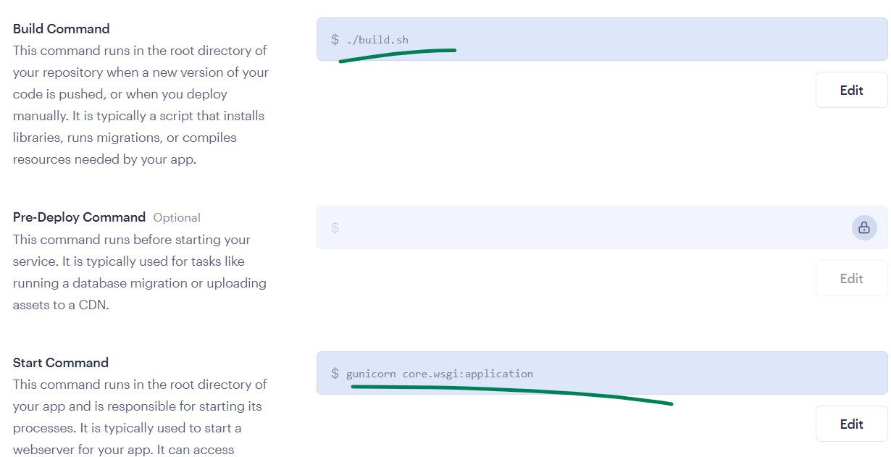
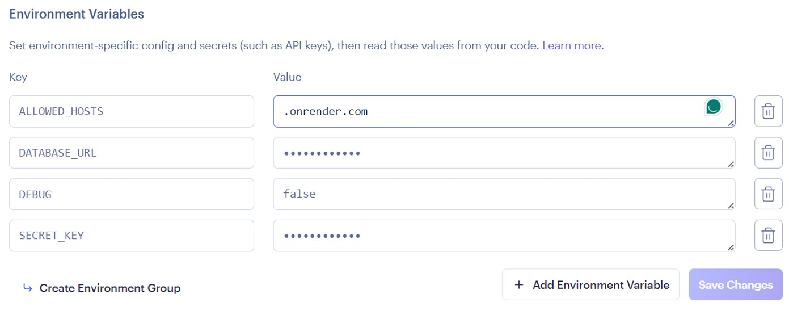

# Django

- [Django](#django)
  - [Setup](#setup)
    - [Crating Virtual Environment with `venv`](#crating-virtual-environment-with-venv)
    - [Crating Virtual Environment with `pipenv`](#crating-virtual-environment-with-pipenv)
  - [Django commands](#django-commands)
  - [Deploy django on "Render"](#deploy-django-on-render)

## Setup

### Crating Virtual Environment with `venv`

1. **Create a virtual environment:**

   ```bash
   python -m venv .venv
   ```

2. **Activate the virtual environment:**

     ```bash
      .\.venv\Scripts\activate
     ```

3. **Deactivate the virtual environment:**

   ```bash
   deactivate
   ```

4. **Install django:**

   ```bash
   pip install django
   ```

### Crating Virtual Environment with `pipenv`

```bash

### ~Desktop
mkdir .venv
pipenv install django
### activate venv
pipenv shell
# or
.\.venv\Scripts\activate
# start django project
django-admin startproject core .
python manage.py makemigrations
python manage.py migrate
python manage.py runserver
```

## Django commands

```bash
### create django project
django-admin startproject core . # . means current directory

### start development server
python manage.py runserver

### Create app folder and files
python manage.py startapp <app-name>

### Preps the database for migration
python manage.py makemigrattions

### Execute migration and update databases
python manage.py migrate

### Create superuser
python manage.py createsuperuser
# or
python manage.py createsuperuser --username admin --email admin@example.com
```

## Deploy django on "Render"

1. Install `gunicon` and `whitenoise`
2. Setup `whitenoise` in `settings.py`
   1. Add `whitenoise.middleware.WhiteNoiseMiddleware` to `MIDDLEWARE`

   ```python
   MIDDLEWARE = [
      "django.middleware.security.SecurityMiddleware",
      "whitenoise.middleware.WhiteNoiseMiddleware",  # <-- new
      #  ....
   ]
   ```

   2. Add `STATICFILES_STORAGE = 'whitenoise.storage.CompressedManifestStaticFilesStorage'`

3. Create `build.sh` file

   ```bash
   #!/usr/bin/env bash
   # exit on error
   set -o errexit

   echo "Running build.sh...."
   echo "Installing requirements...."
   pip install -r requirements.txt

   echo "Running collectstatic...."
   python manage.py collectstatic

   echo "Running migrations...."
   python manage.py migrate
   ```

4. Create `render.yaml` file

   ```yaml
   services:
   - type: web
      name: core
      buildCommand: './build.sh'
      env: python
      startCommand: 'gunicorn core.wsgi:application'
   ```

5. Update `setting.py` with necessary changes

   ```python
   # Environment variables
   SECRET_KEY = os.environ.get('SECRET_KEY')
   DEBUG = os.environ.get('DEBUG', 'False').lower() == 'true'
   ALLOWED_HOSTS = os.getenv('ALLOWED_HOSTS', '127.0.0.1').split(',')
   if 'DATABASE_URL' in os.environ and os.environ['DATABASE_URL']:
      import dj_database_url
      DATABASES['default'] = dj_database_url.config(default=os.environ['DATABASE_URL'])


   # Static files START
   STATIC_URL = "static/"
   STATICFILES_DIRS = [
      BASE_DIR / "static",
   ]
   if not DEBUG:
      STATIC_ROOT = BASE_DIR / "staticfiles"
      STATICFILES_STORAGE = 'whitenoise.storage.CompressedManifestStaticFilesStorage'

   # django-compressor
   if DEBUG:
      COMPRESS_ROOT = BASE_DIR / "static"
      COMPRESS_ENABLED = True
   else:
      COMPRESS_ROOT = STATIC_ROOT
      COMPRESS_ENABLED = False

   STATICFILES_FINDERS = [
      "django.contrib.staticfiles.finders.FileSystemFinder",
      "django.contrib.staticfiles.finders.AppDirectoriesFinder",
      "compressor.finders.CompressorFinder"
   ]

   MEDIA_ROOT = BASE_DIR / "uploads"
   MEDIA_URL = "/media/"

   # Static files END

   # On debug mode, enable debug toolbar
   if DEBUG:
      INSTALLED_APPS += ['debug_toolbar']
      MIDDLEWARE += ['debug_toolbar.middleware.DebugToolbarMiddleware']

   # Enable logging in production
   if not DEBUG:
      # log in console
      LOGGING = {
         "version": 1,
         "disable_existing_loggers": False,
         "handlers": {
               "console": {
                  "level": "INFO",
                  "class": "logging.StreamHandler",
               },
         },
         "loggers": {
               "": {
                  "handlers": ["console"],
                  "level": "INFO",
               },
         },

      }
   ```

6. Create `Web Service` on Render and deploy the project
   1. Select the `Python` environment
   2. Add followings as build and start commands
      - Build command: `./build.sh`
      - Start command: `gunicorn core.wsgi:application`

      <p align="center">
      
      </p>
   3. Add environment variables
      - `SECRET_KEY`
      - `DEBUG`
      - `ALLOWED_HOSTS`
      - `DATABASE_URL`

      <p align="center">
      
      </p>
